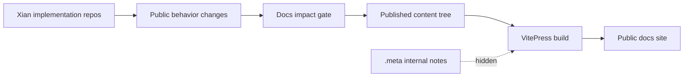

# xian-docs-web

`xian-docs-web` is the public Xian Technology documentation site, built
with [VitePress](https://vitepress.dev/). It owns the published docs
content (concepts, getting-started, smart-contract guides, API references,
tutorials, modules, and solutions) and keeps its repo-internal notes
hidden under `.meta/` so they are not shipped as public pages.

The published site is the operator- and developer-facing source of truth
for the entire Xian stack. When public behavior changes anywhere in the
workspace, the docs change in the same change set (see the docs-impact
gate in `xian-meta/docs/CHANGE_WORKFLOW.md`).

## Content Shape



## Quick Start

```bash
npm ci
npm run dev          # local dev server with hot reload
npm run build        # production build
npm run preview      # preview the production build
```

The site is statically generated; the build output goes to
`.vitepress/dist`.

## Principles

- **Current-state language.** Explain what the stack does and how to use
  it, not how it changed. Avoid `now`, `old`, `new`, `still`, `no longer`
  unless the historical contrast is essential for safe use.
- **Public docs and internal notes are separate.** Published content
  lives in the top-level content tree. Repo-internal architecture and
  backlog notes live under `.meta/` so VitePress does not ship them.
- **Docs travel with implementation changes.** Public-behavior changes
  in any Xian repo include a docs update in the same change set; this
  repo is the destination for that update.
- **Concise, example-driven.** Prefer working examples and workflows
  over internal terminology or changelog prose.

## Key Directories

- Top-level content sections (each has its own `index.md`):
  - `getting-started/` — environment setup, first contract, deployment
    walk-through.
  - `concepts/` — ABCI, consensus, chi, deterministic execution, state
    model, time / blocks, transaction lifecycle, parallel block
    execution, the Xian VM, and the shielded zk stack.
  - `smart-contracts/` — contract authoring guidance.
  - `api/` — REST, GraphQL, websockets, dry-runs.
  - `tools/` — operator and developer tools.
  - `node/` — node operator documentation.
  - `tutorials/` — long-form, end-to-end walk-throughs (token, dice
    game, multi-contract dapp, streaming payments, shielded commands,
    shielded privacy token).
  - `reference/` — flat reference material.
  - `modules/` — reusable installable contract / protocol units.
  - `solutions/` — complete application and operator workflow patterns.
  - `introduction/` — high-level introductions for first-time readers.
- `public/` — static assets served as-is.
- `.vitepress/` — site theme, navigation, sidebar, and build
  configuration.
- `.meta/` — repo-internal notes (`ARCHITECTURE.md`, `BACKLOG.md`,
  `GOLDEN_PATH_IMPLEMENTATION_LOG.md`, `PRODUCT_THESIS_AUDIT_*.md`,
  `README.md`). Hidden from the published site.

## Validation

```bash
npm ci
npm audit --audit-level=high --omit=dev
npm run build
```

`npm run build` is the docs-site smoke gate — broken links, missing
sidebar entries, and VitePress build errors all surface here.

## Related Docs

- [AGENTS.md](AGENTS.md) — repo-specific guidance for AI agents and contributors
- internal repo notes (hidden from the published site):
  - `.meta/README.md`
  - `.meta/ARCHITECTURE.md`
  - `.meta/BACKLOG.md`
  - `.meta/GOLDEN_PATH_IMPLEMENTATION_LOG.md`
- `../xian-meta/docs/CHANGE_WORKFLOW.md` — docs-impact gate that drives updates here
