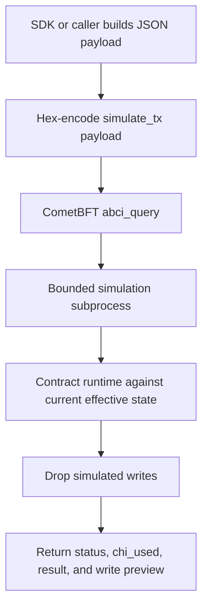

# Estimating Chi

Xian supports dry runs through the `simulate_tx` ABCI query path. This executes
contract logic against the node's current effective state view and then drops
the simulated writes.

Operationally, the node handles dry runs through a bounded subprocess worker so
free simulation does not run inside the main validator execution path.

## Query Path

Low-level path:

```text
/simulate_tx/<hex_encoded_payload>
```

Dashboard form:

```text
GET /api/abci_query/simulate_tx/<hex_encoded_payload>
```

The SDK usually talks to the underlying CometBFT RPC `abci_query` endpoint
directly.



## Payload Shape

The payload is JSON, encoded to hex:

```json
{
  "sender": "sender_public_key",
  "contract": "currency",
  "function": "transfer",
  "kwargs": {
    "amount": 100,
    "to": "recipient_public_key"
  }
}
```

## Response Shape

The current simulator returns:

```json
{
  "payload": {
    "sender": "sender_public_key",
    "contract": "currency",
    "function": "transfer",
    "kwargs": {
      "amount": 100,
      "to": "recipient_public_key"
    }
  },
  "status": 0,
  "state": [
    {
      "key": "currency.balances:sender_public_key",
      "value": "999900"
    }
  ],
  "chi_used": 342,
  "result": "None"
}
```

Key fields:

- `status`: `0` for success, `1` for failure
- `chi_used`: estimated chi consumed
- `state`: preview of writes that would occur
- `result`: safe string representation of the function result or failure

When the node refuses or aborts a dry run, you still get the same envelope with
`status = 1`. Typical operator-controlled failure cases are:

- simulation disabled on this node
- simulation capacity exceeded on this node
- simulation timed out on this node
- simulation chi budget exceeded during readonly execution

## SDK Example

```python
from xian_py import Wallet, Xian

wallet = Wallet()
client = Xian("http://127.0.0.1:26657", wallet=wallet)

result = client.simulate(
    contract="currency",
    function="transfer",
    kwargs={"amount": 100, "to": "recipient_public_key"},
)

print(result["status"])
print(result["chi_used"])
print(result["state"])
```

## Important Caveats

- dry runs do not commit writes
- dry runs are estimates against the node's current state view, not a future state
- nonce/signature admission rules are not the focus of the simulator itself
- state can change between simulation and real submission
- the simulator uses the node's current runtime view, including live in-memory
  overlays that are not yet flushed to disk
- `simulate_tx` is still free compute, so operators should not expose it as an
  unrestricted public validator RPC endpoint
- if you expose dry runs to users, front them with gateway-level protections
  such as rate limiting, request timeouts, concurrency caps, and preferably a
  dedicated service-node or API tier

## Operator Controls

Readonly simulation is node-local and configurable under `[xian]`:

```toml
[xian]
simulation_enabled = true
simulation_max_concurrency = 2
simulation_timeout_ms = 3000
simulation_max_chi = 1000000
```

What these keys do:

- `simulation_enabled`: turn the `simulate_tx` query path on or off
- `simulation_max_concurrency`: maximum concurrent dry runs accepted by this node
- `simulation_timeout_ms`: wall-clock timeout for one dry run worker
- `simulation_max_chi`: readonly chi budget cap used during simulation

See [Runtime Features](/node/runtime-features) for the operator-facing runtime
reference and [Node Profiles](/node/profiles) for the high-level `xian-cli`
profile flow.
