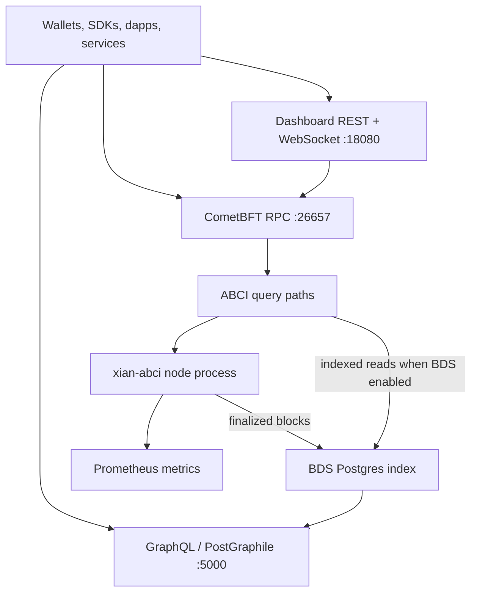

# APIs & Interfaces

Xian exposes several read and interaction surfaces. They are useful for
different jobs and they are not all equally authoritative.

## Main Surfaces

| Surface | What it is for |
|---------|-----------------|
| CometBFT RPC | canonical node RPC for blocks, tx broadcast, tx lookup, and ABCI query |
| ABCI query paths | current contract state, contract metadata, simulation, and optional indexed reads |
| BDS indexed queries | optional ABCI query paths for indexed blocks, transactions, events, state history, token portfolios, shielded feeds, and patch history |
| dashboard REST | optional convenience API for explorer and operator UX |
| dashboard WebSocket | optional real-time subscriptions for dashboards, dapps, and monitors |
| Xian app metrics | Prometheus metrics for runtime, execution, and BDS health |
| CometBFT metrics | Prometheus metrics for consensus, networking, and mempool health |
| GraphQL | optional PostGraphile layer over the BDS Postgres database |



The canonical path is always RPC plus ABCI query against the node itself.
The dashboard proxies that same surface for convenience, and the indexed
surfaces (BDS-backed ABCI reads, GraphQL) are derived views fed from
finalized blocks.

## Which Surface To Use

Use the canonical node surfaces when correctness matters most:

- CometBFT RPC for block/tx lifecycle work
- ABCI query for current state and core Xian queries

Use optional convenience surfaces when you want ergonomics:

- dashboard REST for explorer/operator UIs
- dashboard WebSocket for live block and event subscriptions
- BDS indexed queries for bounded history reads through ABCI query
- GraphQL for richer indexed queries over BDS data

## Exposure Model In The Maintained Stack

The maintained `xian-stack` runtime keeps these surfaces private by default:

- CometBFT RPC
- CometBFT and Xian metrics
- dashboard REST / WebSocket
- GraphQL / PostGraphile

Public exposure is explicit and split by job:

- `public-rpc`: live node RPC, broadcast, tx lookup, raw `abci_query`
- `public-query`: BDS / GraphQL indexed reads only
- `public-metrics`: Prometheus endpoints

`public-query` does not imply `public-rpc`. That separation lets operators keep
analytics and explorer traffic away from the live validator RPC path.

## Current-State Vs Indexed Reads

Keep this split clear:

- raw current-state queries are authoritative immediately after finalization
- BDS-backed indexed reads are derived from finalized blocks and may lag briefly
  while catch-up is running
- GraphQL inherits that same indexed-read behavior because it sits on top of
  BDS

## Typical Patterns

- use RPC + ABCI query from wallets and SDKs
- use dashboard APIs for explorer pages and operator dashboards
- use [BDS indexed queries](/api/bds) or GraphQL for analytics, history-heavy UIs, and shielded wallet
  recovery feeds
- use Prometheus metrics for alerting and fleet monitoring

## Examples

Assuming a stack-managed local node with default template ports:

```text
GET http://localhost:26657/status
GET http://localhost:26657/abci_query?path="/get/currency.balances:alice"
GET http://localhost:26657/abci_query?path="/keys/currency.balances/limit=50"
GET http://localhost:18080/api/status
GET http://localhost:18080/api/abci_query/contract_info/currency
GET http://localhost:18080/api/abci_query/blocks/limit=20/offset=0
GET http://localhost:18080/api/abci_query/shielded_wallet_history/<tag>/limit=50/after_note_index=0
GET http://localhost:9108/metrics
GET http://localhost:26660/metrics
GET http://localhost:5000/graphql
```

When a local endpoint uses an IPv6 literal, bracket the host in the URL, for
example `GET http://[::1]:26657/status` or `GET http://[::1]:18080/api/status`.
