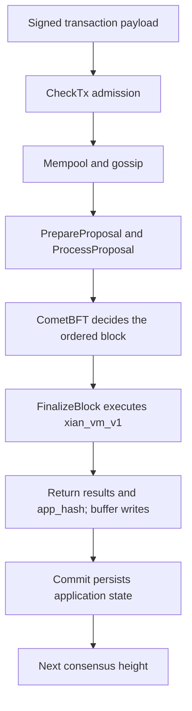

# The ABCI Layer

ABCI is the boundary between CometBFT and the Xian application.

In practice:

- CometBFT orders transactions, runs the validator protocol, and commits blocks
- `xian-abci` validates, executes, queries, snapshots, and exposes the
  application behavior behind that consensus engine

## What CometBFT Owns

CometBFT is responsible for:

- peer networking
- mempool propagation
- block proposal and voting
- final block commit
- canonical RPC for blocks, transactions, and consensus status

CometBFT does not understand contract semantics. It only knows how to drive a
deterministic application through the ABCI contract.

## What `xian-abci` Owns

`xian-abci` is the application implementation for Xian. It handles:

- mempool-side transaction checks
- block execution in `FINALIZE_BLOCK`
- state commit and app-hash production
- read-only query paths
- application snapshot export/import
- optional dashboard HTTP and WebSocket services

It also wires the fixed `xian_vm_v1` execution runtime.

## Transaction Path Across The Boundary

At a high level, one transaction moves through these stages:

1. CometBFT receives the signed payload and calls `CheckTx`. Accepted
   transactions enter the local mempool and can be gossiped to peers.
2. `PrepareProposal` selects transactions; `ProcessProposal` checks the
   proposed transaction sequence before validators vote.
3. CometBFT reaches a consensus decision on the ordered block.
4. `FinalizeBlock` executes that decided block and returns transaction results,
   validator updates, and `app_hash`. Application writes remain buffered.
5. `Commit` persists the application transition. CometBFT can then advance to
   the next height, whose header carries the preceding block's `app_hash`.

That separation is why Xian can evolve contract execution without replacing the
consensus engine itself.

See the [CometBFT ABCI lifecycle](https://github.com/cometbft/cometbft/blob/v0.39.3/spec/abci/abci%2B%2B_methods.md#finalizeblock)
for the consensus/application handoff.

## Query Surfaces

The ABCI side is also where Xian exposes application queries.

Important query families include:

- current contract state and contract metadata
- transaction simulation
- indexed/BDS-backed history reads when BDS is enabled
- performance and runtime health summaries
- application snapshot coordination

The dashboard service sits next to this layer. It does not change consensus; it
simply wraps or enriches CometBFT and ABCI-facing data for operator and
explorer use.

## Why This Boundary Matters

The ABCI split keeps responsibilities clear:

- CometBFT gives Xian finality and validator coordination
- Xian defines the application state machine

That is why Xian can remain Python-authored and contract-focused while
using a mature BFT consensus engine underneath.
