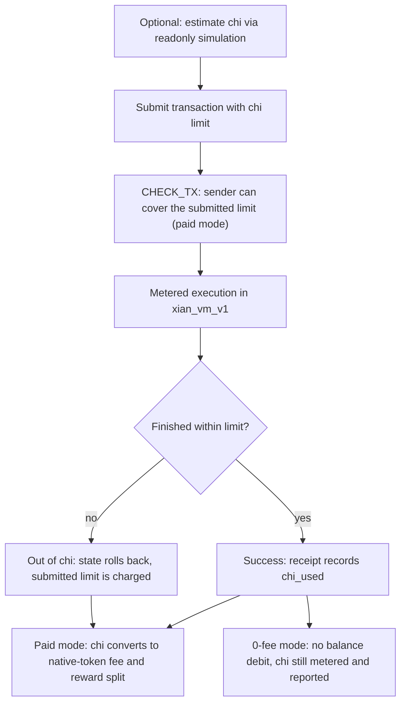

# Chi & Metering

Chi is Xian's execution-energy unit. It is the budget that limits computation,
storage work, and other metered runtime behavior during a transaction.

It is not a separate token. It is the unit Xian uses to price execution.

## How Chi Works

When a transaction is submitted, it carries a chi limit.

- if execution finishes within that limit, the transaction succeeds and the
  receipt records the chi actually used
- if execution exceeds the limit, execution aborts, state changes roll back,
  and the submitted limit is what matters for failure accounting

On normal paid networks, used chi is converted into a native-token fee. On
0-fee networks, chi is still the deterministic execution budget and receipt
unit, but the runtime does not debit the sender's native-token balance for
execution.



## Core Constants

| Constant | Value | Meaning |
|----------|-------|---------|
| `READ_COST_PER_BYTE` | `1` | tracer meter unit per stored byte read |
| `WRITE_COST_PER_BYTE` | `25` | tracer meter units per stored byte written |
| `TRANSACTION_BYTES_COST_PER_BYTE` | `1` | tracer meter unit per submitted transaction byte |
| `RETURN_VALUE_COST_PER_BYTE` | `1` | tracer meter unit per returned byte |
| `CHI_PER_T` | `20` | chi purchased by one unit of the native token |
| base transaction cost | `5` | flat chi charged on every transaction |

## Base Formula

Tracer-backed execution currently uses the familiar compute-to-chi conversion:

```text
chi_used = (raw_meter_cost // 1000) + 5
```

`raw_meter_cost` includes compute, storage, submitted transaction bytes,
returned value bytes, and metered runtime bridge work. The final receipt value
is capped by the chi budget supplied on the transaction.

For `xian_vm_v1`, the execution machine changes, but the same high-level idea
does not: VM work, host operations, storage, transaction bytes, and return
payload size are all metered explicitly against the transaction's chi budget.
The VM has its own host-operation gas schedule instead of reusing every tracer
constant one-for-one.

## What Gets Metered

### Computation

Xian currently meters execution through `xian_vm_v1`, using the VM-native gas
schedule over VM operations and host calls.

The network chooses the execution engine and metering policy. Applications and
validators do not get to improvise their own cost model.

### Storage Reads

Tracer-backed execution charges `1` meter unit per byte of encoded key plus
encoded value. VM-native execution charges reads through the VM host-operation
schedule.

### Storage Writes

Writing state costs `25` meter units per byte of encoded key plus encoded
value under the current VM host-operation schedule.

Writes are intentionally much more expensive than reads because they expand the
durable chain state.

### Cross-Contract Calls

Cross-contract calls meter the called work too. In practice that means a single
transaction can accumulate chi across multiple contracts if it touches multiple
execution paths. The VM also charges a fixed dispatch cost for each
cross-contract call so composable transactions pay for each hop without a
progressive repeated-call surcharge.

### Proof Verification and Other Runtime Bridges

Metered runtime bridges such as hashing, signature checks, and zk verification
also contribute to total chi usage. In the VM-native path, these appear as
explicit host operations instead of implicit Python work.

## Limits

| Limit | Value |
|------|-------|
| runtime raw safety ceiling | `50,000,000,000` raw units |
| maximum write per transaction | `128 KiB` |
| maximum returned value size | `128 KiB` |
| maximum submitted contract source | `64 KiB` |
| maximum sequence or binary allocation | `128 KiB` |
| default chi allocation | `1,000,000` |

Those line/instruction ceilings are tracer-backend safety limits. VM-native
execution uses its own gas schedule rather than those tracer-event counters.
The raw safety ceiling is a runtime overflow guard; ordinary transaction
success is still bounded by the `chi` supplied by the sender.

## Converting Chi To Native Token Cost

In the default `paid_metered` fee mode, chi is priced through the chain's
native token:

```text
token_cost = chi_used / 20
```

Examples:

| Chi used | Token cost |
|----------|------------|
| `100` | `5.0` |
| `1,000` | `50.0` |
| `10,000` | `500.0` |
| `100,000` | `5,000.0` |
| `1,000,000` | `50,000.0` |

## Current Local Reference Measurements

The following values were measured on the rebuilt local BDS node in June 2026
with `paid_metered` fees, `chi_cost = 20`, and fixed-cost cross-contract
dispatch. They are reference points, not protocol guarantees; simulate against
the target network before submitting production transactions.

| Action | Chi used | XIAN fee |
|--------|----------|----------|
| Contract read call | `19` | `0.95` |
| Contract storage write | `30` | `1.50` |
| Native XIAN transfer | `69` | `3.45` |
| `transfer_from` spend | `83` | `4.15` |
| Deploy small contract | `927` | `46.35` |
| Direct DEX core swap | `1,775` | `88.75` |
| DEX helper buy | `2,214` | `110.70` |
| Shielded command execution | `6,715` | `335.75` |
| Shielded DEX swap path | `9,898` | `494.90` |

## 0-Fee Metered Networks

Operators can run a network with `tx_fee_mode = "free_metered"` in the rendered
Xian node config. In this mode:

- transaction execution is still metered
- each transaction still supplies a chi budget
- receipts still report `chi_used`
- the runtime does not debit native-token fees for execution
- fee-derived validator, foundation, and developer rewards are not generated
- admission does not require a native-token balance just to cover chi

This is different from disabling metering. Contracts still run under a fixed
chi budget and can still fail with out-of-chi. Contract-level balances,
allowances, and assertions are unchanged; a token transfer can still fail for
insufficient token balance.

0-fee networks should set explicit resource caps:

```toml
tx_fee_mode = "free_metered"
free_tx_max_chi = 1000000
free_block_max_chi = 20000000
```

`free_tx_max_chi` caps the submitted chi budget for one transaction.
`free_block_max_chi` caps the total submitted chi budget admitted into one
proposed block. These caps are the main spam and capacity controls when fees
are not used as an economic throttle.

## Why Chi Matters For Design

Chi is not only a billing detail. It shapes how you design contracts:

- long or repeated storage writes are expensive
- repeated reads add up
- deep multi-contract flows cost more than simple direct calls
- proof-backed and privacy-preserving flows are expected to cost more than
  trivial public transfers

## Practical Optimization Rules

- minimize storage writes
- cache repeated reads in local variables
- keep stored keys and values compact
- avoid unnecessary cross-contract hops
- simulate before submitting when the SDK supports it

## See Also

- [Estimating Chi](/api/dry-runs)
- [Chi Cost Table](/reference/chi-costs)
- [The Xian VM](/concepts/xian-vm)
