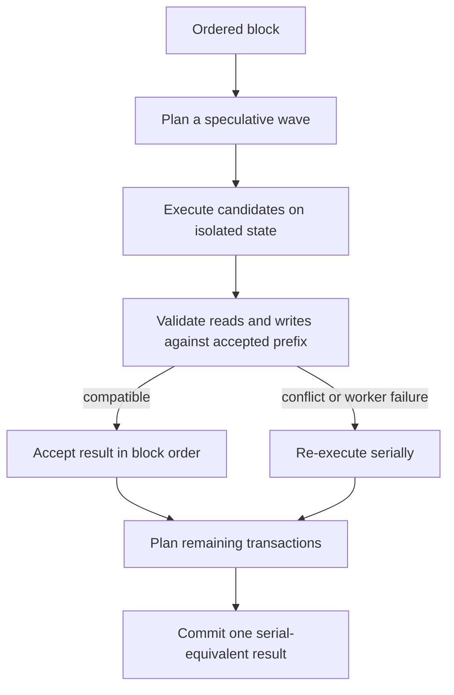

# Parallel Block Execution

Xian can execute independent transactions speculatively in worker processes
while preserving the result of canonical serial block order.

Parallel execution is an optional node optimization. It does not change
contract semantics, transaction order, or consensus results.

## Execution Model

Each worker records the state it read, wrote, and scanned. The controller
accepts results in original block order only when those observations remain
valid after earlier transactions. Conflicting or uncertain results run on the
serial path.

This approach provides process-level parallelism without allowing concurrent
mutation of shared committed state.

## Conflict Rules

A speculative result is rejected when an earlier accepted transaction changes
something that could affect it, including:

- a key it read
- a key or prefix it scanned
- a key it also writes with non-mergeable semantics
- sender or nonce state needed for serial admission

Reward outputs are a narrow exception: independent additive reward deltas can
be merged deterministically. Reads or direct overwrites of the same balance
remain conflicts.

## Operator Controls

Parallel execution is configured in the top-level Xian section of the rendered
`config/xian.toml`. It is disabled by default.

Important keys are:

- `parallel_execution_enabled`
- `parallel_execution_workers`
- `parallel_execution_min_transactions`
- `parallel_execution_max_speculative_waves`
- `parallel_execution_min_wave_acceptance_ratio`
- `parallel_execution_low_acceptance_min_wave_size`
- `parallel_execution_warm_workers`
- `parallel_execution_access_estimates_enabled`

See [Runtime Features](/node/runtime-features) for configuration details.

## Monitoring

The performance status and metrics surfaces expose planning, acceptance, and
fallback counters. The most useful signals are:

- `speculative_accepted`
- `serial_prefiltered`
- `serial_fallbacks`
- `guardrail_fallbacks`
- speculative wave count and acceptance ratio

Independent workloads can benefit substantially. Hot shared state, broad
prefix scans, and repeated transactions from one sender tend to fall back to
serial execution and may lose performance to speculation overhead. Enable the
feature only after testing the target workload, and disable it when fallback
counters dominate.

## Safety Properties

- canonical block order never changes
- speculative workers do not commit state
- accepted results are revalidated against the accepted prefix
- conflicts are executed serially
- executor failure falls back to serial block execution
- validators with different optimization posture must produce the same final
  state and `app_hash`

## Related Pages

- [Transaction Lifecycle](/concepts/transaction-lifecycle)
- [Deterministic Execution](/concepts/deterministic-execution)
- [Runtime Features](/node/runtime-features)
