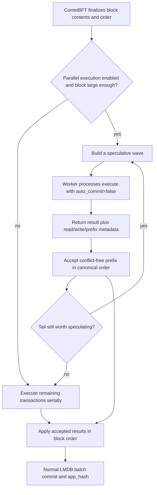

# Parallel Block Execution

Xian can speculatively execute block transactions in parallel without changing
the canonical result of the block.

The important boundary is this:

- `xian-contracting` does not execute multiple contracts concurrently inside a single Python process
- `xian-contracting` now owns the native speculative execution controller
- `xian-abci` wraps that controller for block processing, reward shaping, and
  node-facing metrics
- final accepted state must stay equivalent to normal serial execution in block
  order

That makes parallel execution a node-side optimization, not a change to
consensus semantics.

## Where The Boundary Lives

Inside `xian-contracting`, each in-process execution is guarded by a lock.
That runtime mutates process-global Python import hooks and module caches, so it
does not try to run multiple contract executions concurrently inside one Python
process.

Instead, `xian-contracting` exposes a native speculative controller that uses
separate worker processes for speculative execution. In the block path,
`xian-abci` uses that controller with a worker runtime built from
`ContractingClient`, `Driver`, `TxProcessor`, and the optional rewards handler
against the same committed LMDB state snapshot.

So the model is:

- one block still has one canonical transaction order
- workers speculate independently on the last committed state
- the main process decides which speculative results are safe to accept

## How It Works

At a high level:

1. CometBFT finalizes the block contents and order.
2. If parallel execution is enabled and the block is large enough, the native
   controller in `xian-contracting` builds a speculative wave and sends those
   transactions to a worker pool.
3. Each worker executes its assigned transaction with `auto_commit=false`,
   collects access metadata, and returns a proposed result.
4. The main process checks the speculative results in canonical order and
   accepts the conflict-free prefix of that wave.
5. If the tail conflicts with earlier accepted work, the node either
   respeculates that tail against the updated overlay or falls back to serial
   execution when the remaining tail is no longer worth speculating.
6. Accepted speculative results are applied in canonical order.
7. After the block is complete, the node commits the final block state through
   the normal LMDB batch write path.

The critical point is that speculation happens first, but acceptance still
happens in normal block order.

## Worked Example

Consider a canonical block ordered like this:

1. `tx1`: `currency.transfer(alice -> bob, 10)`
2. `tx2`: `currency.transfer(carol -> dave, 20)`
3. `tx3`: `orders.place(id=1)` writing `orders:1`
4. `tx4`: `orders.summary()` scanning `orders:` with `Hash.all()`

The controller can speculate all four in one wave because nothing about the
front of the queue makes that impossible up front.

The worker results might look like this:

- `tx1` reads and writes Alice and Bob balance keys
- `tx2` reads and writes Carol and Dave balance keys
- `tx3` writes `orders:1`
- `tx4` records a prefix read on `orders:`

Acceptance still walks the block in order:

- `tx1` is accepted
- `tx2` is accepted
- `tx3` is accepted
- `tx4` is rejected from that wave because its prefix read overlaps with the
  earlier accepted write to `orders:1`

At that point, the node does not reorder the block. It keeps `tx1`, `tx2`, and
`tx3` exactly where they are, then handles the tail:

- it can respeculate `tx4` against the updated overlay in a later wave
- or it can execute `tx4` serially if the remaining tail is no longer worth
  speculating

Either way, the final result must still match normal serial execution of
`tx1 -> tx2 -> tx3 -> tx4`.

## What Metadata Is Tracked

The safety model depends on deterministic access tracking.

For each transaction, the runtime records:

- exact reads: keys loaded through normal state reads
- exact writes: keys the transaction wants to set
- prefix reads: collection scans such as `Hash.all()` that depend on every key
  under a prefix
- additive writes: special commutative reward deltas tracked separately from
  normal writes

This metadata comes from the runtime/storage layer:

- `Driver.get(...)` tracks exact reads
- collection scans record prefix reads on the scanned prefix
- successful execution returns the transaction write set
- reward outputs are separated into additive deltas so they can be merged
  safely when they are purely incremental

## When A Speculative Result Is Rejected

The main process falls back to serial execution when a speculative result is no
longer safe relative to earlier accepted transactions.

Current fallback conditions include:

- the same sender already appeared earlier in the accepted block path
- a key this transaction read was written earlier
- a key this transaction writes was read or written earlier
- a tracked prefix scan overlaps with earlier accepted writes
- a normal write overlaps with earlier additive writes
- an additive write overlaps with earlier normal writes
- the worker failed to return a usable speculative result

This is why parallel execution is described as speculative rather than
concurrent mutation.

## Prefiltered vs Fallback

The runtime exposes two different operator-facing counters because they mean
different things:

- `serial_prefiltered`: the controller chose not to speculate a remaining head
  transaction at all, usually because there were no longer at least two safe
  front-of-queue candidates worth putting into a wave
- `serial_fallbacks`: the transaction was part of speculative handling, but the
  accepted-prefix checks or a worker failure forced it back onto the serial path

In practice, same-sender reuse near the front of the remaining queue often
shows up as prefiltering, while read-after-write tails, write conflicts, and
prefix-scan conflicts are more likely to show up as speculative fallback or
later-wave respeculation.

## Why It Is Real Parallelism

This is real parallel execution, but not unsafe shared-state concurrency.

- multiple transactions can execute at the same time in separate worker
  processes
- one in-process `Executor` still executes one transaction at a time
- final acceptance stays serial-equivalent

So Xian now uses multiple CPU cores for speculative contract execution, while
keeping the correctness model tied to canonical block order.

## The Reward-Delta Exception

Normal shared writes are treated conservatively as conflicts.

The current explicit exception is reward accounting. Reward outputs are modeled
as additive deltas, not ordinary overwrites. Two transactions can both add to
the same recipient balance and still be accepted speculatively because the
merge operation is deterministic addition.

But if another transaction reads that balance, or directly overwrites it, the
executor falls back to serial execution.

## Why This Is Safe

This design is consensus-safe because it preserves serial semantics:

- canonical block order never changes
- validators can mix enabled and disabled parallel posture and still converge on
  the same final block result
- speculative workers do not commit their writes to disk
- accepted speculative results are revalidated against earlier accepted writes
- conflicting transactions are re-run serially on the latest state
- if the speculative executor itself fails, the node falls back to ordinary
  serial block execution

In other words, the node is allowed to guess in parallel, but it is only
allowed to commit what is still correct in serial order.

## Representative Throughput

The runtime now includes a dedicated benchmark harness in
`xian-contracting/tests/performance/benchmark_parallel_tps.py`.

Representative local numbers from the current implementation on an 8-core
development machine, using mostly non-conflicting automated transactions:

- `256` transactions, `20,000` contract-loop rounds per transaction:
  serial about `915 TPS`, parallel about `1,655 TPS`, about `1.77x`
- `256` transactions, `50,000` contract-loop rounds per transaction:
  serial about `431 TPS`, parallel about `1,583 TPS`, about `3.68x`

Those numbers are execution-engine throughput, not full end-to-end network TPS.
They are useful for comparing the execution path, not for quoting a guaranteed
validator TPS figure.

## What It Does Not Do

Parallel block execution does not:

- make `xian-contracting` multithreaded in-process
- allow naive concurrent mutation of shared state
- weaken deterministic execution requirements
- let validators accept different speculative winners

All validators still have to end the block with the same final state and the
same `app_hash`.

## Related Pages

- [Transaction Lifecycle](/concepts/transaction-lifecycle)
- [Deterministic Execution](/concepts/deterministic-execution)
- [Runtime Features](/node/runtime-features)
