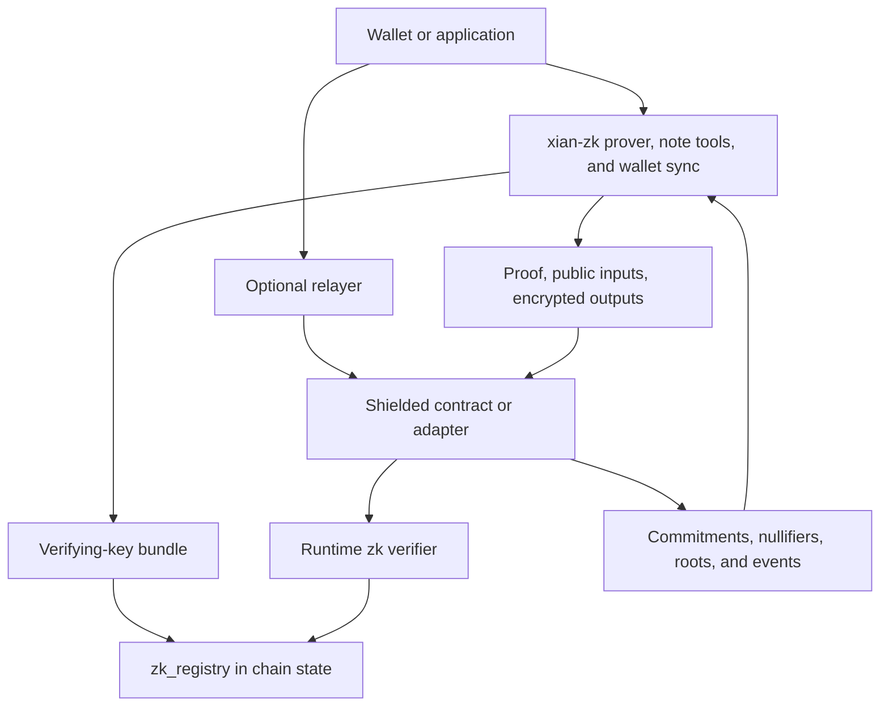

# Shielded & ZK Stack

Xian's shielded and zero-knowledge features are intentionally split across the
runtime, off-chain tooling, and on-chain contracts.

That split is what keeps the validator runtime narrow while supporting
real privacy-sensitive application flows.

## The Main Layers

| Layer | What it does |
|------|---------------|
| runtime verifier | exposes the contract-facing `zk` module and caches registry-backed verifying keys |
| `zk_registry` | stores active verifying-key records in canonical chain state |
| `xian-zk` | off-chain proving toolkit, wallet sync, note helpers, bundle generation, local prover services |
| shielded contracts | implement note pools, shielded commands, and app-specific adapters |
| relayer layer | submits proof-bound private transactions without requiring the wallet to originate the public L1 submission directly |

## Runtime Verifier

The validator runtime exposes a narrow verifier surface:

- `zk.has_verifying_key(vk_id)`
- `zk.verify_groth16(vk_id, proof_hex, public_inputs)`
- `zk.verify_groth16_bn254(vk_hex, proof_hex, public_inputs)`

This is verification only. Proof generation, witness construction, wallet sync,
and bundle management stay off-chain.

## `zk_registry`

Verifying keys are not passed around ad hoc on every contract call. The normal
pattern is:

1. register a verifying key in `zk_registry`
2. bind the relevant `vk_id` inside the application contract
3. have the runtime load and cache the active key by id

This keeps contracts smaller and verification cheaper and more predictable.

## Shielded Note Model

The private asset design is note-based.

A shielded note flow revolves around:

- note commitments
- recent accepted Merkle roots
- nullifiers for spent inputs
- encrypted output payloads for wallet recovery

The maintained contract package for this is the shielded-note token in
`xian-contracts`.

The standard lifecycle is:

1. public funds are deposited into shielded notes
2. shielded transfers spend old notes and create new ones without revealing
   transfer value publicly
3. withdrawals destroy shielded value and release a public amount to a visible
   recipient

## Shielded Commands

`shielded-commands` extends the same root/nullifier model to anonymous command
execution.

Instead of only moving private value, a proof can also bind:

- the target adapter contract
- the payload digest
- the relayer
- the chain id
- the expiry
- the relayer fee
- an optional proof-bound public spend budget

That lets a hidden sender authorize an on-chain action without exposing the
normal public sender account as the actor behind that action.

## Adapter Contracts

Adapters are the application-specific bridge between proof-backed authorization
and ordinary public contract behavior.

Maintained examples include:

- shielded DEX adapter
- shielded scheduler adapter

The adapter pattern keeps the privacy logic and the app-specific business logic
separate.

## What Is Private And What Is Public

| Usually private | Public |
|-----------------|--------------|
| note ownership secrets | contract deployment and operator configuration |
| shielded transfer amounts inside the note pool | nullifiers, commitments, and accepted roots |
| note plaintexts and viewing-key gated payload contents | relayer identity and relayer fee |
| the hidden sender behind a relayed note transfer or command | withdrawal recipients and withdrawal amounts |
| some wallet recovery metadata until disclosed or indexed by tag | adapter target and public side effects of adapter execution |

This is privacy-preserving application logic, not invisible chain activity.

## Wallet Model

The wallet-side model separates spend and view authority.

Important pieces are:

- `owner_secret` for spending inside the shielded pool
- viewing private/public keys for note recovery and controlled disclosure
- payload discovery tags for efficient wallet sync
- wallet snapshots and seed backups for recovery
- indexed `shielded_wallet_history` feeds for light-wallet style sync

That model is implemented in `xian-zk`, with SDK support in `xian-py` and
`xian-js`.

## Relayer Boundary

The relayer improves network-origin privacy by letting another service submit
the public transaction.

It does not turn Xian into an anonymity network.

The relayer learns things such as:

- submission timing
- relayer-bound proof material
- public target and fee data
- transport metadata unless another anonymity layer is used

Treat it as a trusted submission hop, not as magic privacy.

## Trust Model

Zero-knowledge proofs make the *prover* untrusted, but the shielded stack
rests on a few trust assumptions. Be explicit about them:

- **The native verifier is a consensus requirement.** Proof verification runs
  in-protocol, so every validator must have the native backend. `xian-abci`
  refuses to start without it rather than risk a fork.
- **Trusted setup.** Groth16 has a per-circuit setup whose toxic waste, if not
  destroyed by a multi-party ceremony, lets the holder forge proofs. Dev bundles
  are test-only and single-party bundles are for testnets; a real network needs
  an MPC ceremony.
- **Registry owner.** Whoever owns `zk_registry` chooses the active verifying
  keys, so that role should be governance-controlled (DAO / multisig / timelock,
  via the registry's two-step ownership transfer).
- **The algebraic hash is binding.** Commitments, nullifiers, and Merkle nodes
  use Poseidon over BN254; the native implementation and the in-circuit gadget
  are kept provably identical so a proof means what the contract thinks it means.

These are the things to verify before trusting a deployment with real value.

## Where To Learn The Practical Flow

- [ZK Standard Library](/smart-contracts/stdlib/zk)
- [xian-zk](/tools/xian-zk)
- [Building a Shielded Privacy Token](/tutorials/shielded-privacy-token)
- [Building Shielded Commands](/tutorials/shielded-commands)
