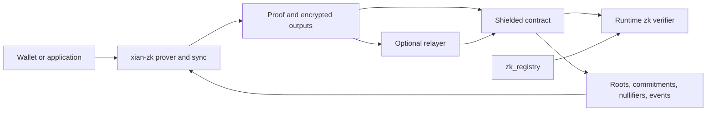

# Shielded and ZK Stack

Xian splits proof verification, key governance, proving, wallet sync, and
application logic across explicit layers.

| Layer | Responsibility |
| --- | --- |
| native runtime | verify Groth16/BN254 proofs through the contract `zk` module |
| `zk_registry` | store active verifying keys and their protocol metadata |
| `xian-zk` | create proofs, manage bundles, build notes, and sync wallets off-chain |
| shielded contracts | enforce roots, nullifiers, commitments, escrow, and application rules |
| optional relayer | submit a proof-bound public transaction for the hidden user |



## Verification and Registry

Contracts normally verify by registry ID:

```python
zk.has_verifying_key(vk_id)
zk.get_vk_info(vk_id)
zk.verify_groth16(vk_id, proof_hex, public_inputs)
```

Application contracts should bind both the `vk_id` and expected `vk_hash`,
plus circuit family, statement version, tree depth, and input/output bounds
where relevant. This prevents a registry update from silently changing the
accepted statement.

Proof generation, witnesses, proving keys, and wallet secrets remain
off-chain.

## Note Flow

The maintained shielded-token and shielded-command contracts use a note model:

1. a public deposit creates encrypted shielded notes
2. a proof spends notes from an accepted Merkle root
3. nullifiers prevent repeat spending
4. output commitments and encrypted payloads create recoverable new notes
5. a withdrawal destroys shielded value and creates public value for a visible
   recipient

`shielded-commands` binds the target adapter, payload digest, relayer, chain
ID, expiry, fee, and optional public spend budget into the proof. Adapters then
perform the visible application action, such as a DEX or scheduler call.

## Privacy Boundary

| Hidden or view-key protected | Public on-chain |
| --- | --- |
| note ownership secrets and plaintexts | commitments, nullifiers, and accepted roots |
| shielded transfer amounts | deposits and public withdrawal amounts |
| hidden sender behind a relayed action | relayer, adapter target, payload, and public side effects |

A relayer reduces sender linkage at the transaction layer. It still observes
submission timing, proof-bound public data, and transport metadata. It is not
a network anonymity layer.

## Trust and Operations

- Every validator on a chain with the `zk` feature needs the native verifier;
  startup fails closed when it is unavailable.
- Groth16 requires an accepted setup per circuit. Development and single-party
  bundles are for non-value testing only.
- The `zk_registry` owner can change accepted verifying keys and should be
  controlled through reviewed governance with two-step ownership transfer.
- Wallet seed backups protect spend/view authority; richer snapshots also
  preserve notes and sync cursors.
- BDS `shielded_wallet_history` provides resumable indexed wallet sync but is
  eventually consistent with finalized state.

## Related Pages

- [ZK Contract API](/smart-contracts/stdlib/zk)
- [xian-zk](/tools/xian-zk)
- [Shielded Privacy Token](/tutorials/shielded-privacy-token)
- [Shielded Commands](/tutorials/shielded-commands)
