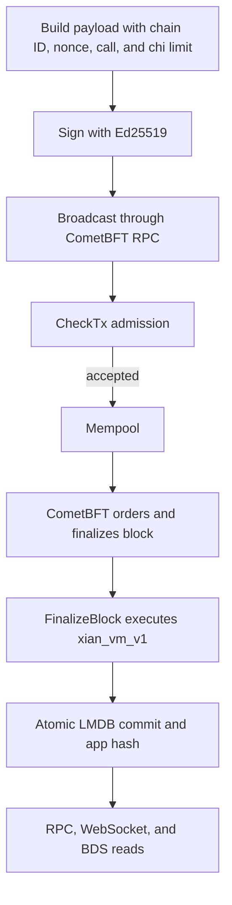

# Transaction Lifecycle

A Xian transaction moves through signing, mempool admission, consensus,
deterministic execution, atomic commit, and optional indexing.

## Payload and Signature

The signed payload includes:

- sender, chain ID, and nonce
- target contract and exported function
- keyword arguments
- submitted chi limit

The chain ID prevents cross-network replay. The nonce orders transactions from
one sender and prevents reuse on the same chain.

SDKs support `async`, `checktx`, and `commit` broadcast modes. `checktx`
returns mempool admission; it does not prove final execution success. Use a
receipt wait when the application needs finality.

## CheckTx

Before mempool admission, the application checks payload shape, signature,
chain ID, nonce, and fee policy. Paid mode requires enough native-token balance
to cover the submitted chi limit. Free-metered mode enforces configured
transaction and block chi caps.

A CheckTx rejection does not enter the mempool or change chain state.

## Consensus and Execution

CometBFT fixes transaction order and the block timestamp. During
`FinalizeBlock`, every validator executes the same ordered calls through
`xian_vm_v1`.

For each transaction, the runtime:

1. injects `ctx` and block metadata
2. dispatches the exported function
3. meters VM operations, storage, and host calls
4. buffers writes, events, return value, and fee/reward effects
5. discards application writes and events on failure

Optional parallel execution may speculate in worker processes, but accepted
results must remain equivalent to serial block order. Conflicts run serially.

## Commit

Successful transaction effects and required fee accounting are assembled into
one block transition. Xian commits state, nonce data, height, block time, and
the state-root marker atomically in LMDB. The resulting `app_hash` is returned
to CometBFT for the next block header.

The LMDB marker is authoritative on restart; auxiliary JSON metadata is only a
repairable convenience copy.

## Results

The decoded execution payload includes:

| Field | Meaning |
| --- | --- |
| `hash` | transaction hash |
| `status` | `0` success, `1` failure |
| `chi_used` | metered chi charged/reported |
| `result` | encoded function result or error |
| `state` | committed writes, including fee effects where applicable |
| `events` | committed contract events |

SDK receipts wrap this together with the original transaction, RPC metadata,
and success/error helpers.

## Failure Boundaries

| Failure | State/effects |
| --- | --- |
| CheckTx rejection | no mempool entry, no state, no fee |
| assertion or runtime error | application writes/events roll back; paid mode charges consumed chi |
| out of chi | application writes/events roll back; failed execution reports a bounded cost up to the submitted limit |

## Indexing

CometBFT RPC and transaction search expose finalized data. Dashboard WebSockets
provide live non-durable notifications. BDS indexes blocks asynchronously, so
history/event rows can appear shortly after finality.

## Related Pages

- [Parallel Block Execution](/concepts/parallel-block-execution)
- [Chi and Metering](/concepts/chi)
- [BDS Indexed Queries](/api/bds)
