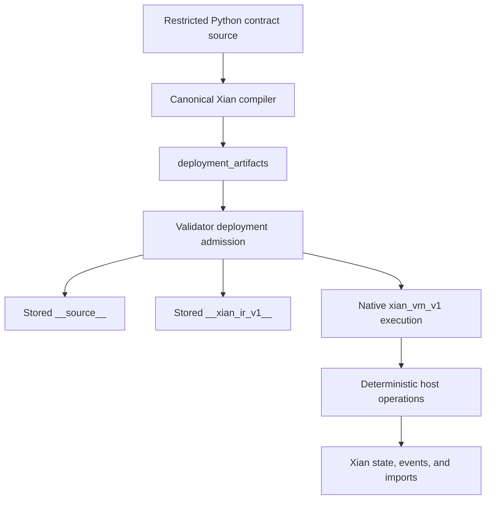

# The Xian VM

The Xian VM is the execution layer that lets Xian keep Python as the contract
authoring language without tying consensus forever to CPython bytecode.

## The Two Layers To Keep Separate

There are always two distinct questions in Xian:

1. What language does the developer write?
2. What machine executes that program on validators?

Developers write a restricted Python subset. The network then chooses an
execution model for that authored contract. Current Xian nodes use the fixed
`xian_vm_v1` execution model.

## Execution Mode

| Mode | What executes |
|------|----------------|
| `xian_vm_v1` | validated Xian VM artifacts under a native runtime |

The contract language stays the same. The currently supported node runtime is
fixed to the VM artifact path.

## What `xian_vm_v1` Actually Uses

Under `xian_vm_v1`, deployment is source-authored and artifact-backed.

The important stored artifacts are:

- `__source__`: canonical human-facing source used by explorers, dashboards,
  and inspection tooling
- `__xian_ir_v1__`: the persisted Xian VM IR used by the native runtime

Client tooling builds `deployment_artifacts` before submission. Those artifacts
include canonical source, VM IR, and hashes that the runtime validates before
persisting source and IR. Legacy `runtime_code` and `runtime_code_sha256`
deployment fields are rejected.

## Execution Policy

VM-native execution is the fixed node execution runtime.

On the supported branch:

- `xian_vm_v1` is the only supported node runtime
- bytecode, gas schedule, and authority are internal VM constants
- submitted contracts must provide validated deployment artifacts

This keeps the execution contract explicit without exposing alternate engines
or an operator-selectable execution policy section.

## What The Native Runtime Does

The native runtime is not a second unrestricted Python interpreter. It executes
validator-derived Xian VM IR and delegates explicit host operations back to the
Xian runtime boundary.

That host boundary includes things such as:

- `Variable` and `Hash` reads and writes
- `ForeignVariable` and `ForeignHash` reads
- event emission
- contract import and export calls
- hashing and signature verification bridges
- `zk.*` verification syscalls

Those operations are deterministic runtime calls, not arbitrary operating-system
syscalls.

## What Stays The Same For Contract Authors

Contract authors work with the familiar Xian model:

- `@construct` and `@export`
- `Variable`, `Hash`, and foreign state helpers
- `ctx`, `now`, events, and imports
- chi budgeting and deterministic rollback semantics

In other words, `xian_vm_v1` changes the execution machine, not the basic
developer-facing contract model.

## Why The Xian VM Matters

The Xian VM gives the platform a cleaner long-term machine contract:

- execution semantics become Xian-defined instead of CPython-bytecode-defined
- metering can be attached directly to VM operations and host calls
- deployment can be validated from canonical artifacts
- replay and parity testing become easier to reason about
- performance-sensitive paths can move further into native code without forcing
  a new contract language on developers

## Scope

The VM-native runtime covers real authored contract behavior,
including storage flows, decimals, datetime helpers, hashing, Ed25519
verification, imports, events, and the shielded contract helpers needed by the
existing shielded stack.

That means the Xian VM is not just a design note. It is the supported
execution path for current node deployments.

## Related Pages

- [Deterministic Execution](/concepts/deterministic-execution)
- [Chi & Metering](/concepts/chi)
- [Runtime Features](/node/runtime-features)
- [Contract Submission Internals](/reference/submission-internals)
