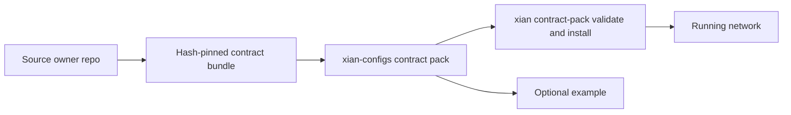

# Contract Packs

Contract packs are optional reusable on-chain contract or protocol units that
can be installed onto a running Xian network.

They answer: which contract set is being installed, which exact sources are
pinned, and which install recipes are supported?

For the broader terminology around templates, profiles, deploy bindings,
bundles, contract packs, and examples, see [Config Taxonomy](/node/config-taxonomy).

Use:

```bash
cd ~/xian/xian-cli
uv run xian contract-pack list
uv run xian contract-pack show dex
uv run xian contract-pack validate dex
uv run xian contract-pack install dex --recipe local-demo --stack-dir ../xian-stack
```

## Available Contract Packs

- [DEX Contract Pack](/contract-packs/dex)
- [NFT Contract Pack](/contract-packs/nft)
- [Stable Protocol Contract Pack](/contract-packs/stable-protocol)

## Relation To Examples

A contract pack is an installable contract/protocol unit. An example is a full
workflow that may reference templates, contract packs, services, app code, and
docs.


