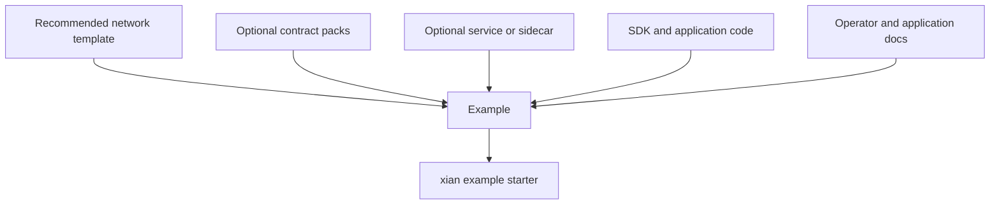

# Examples

Examples are guided application or operator workflows. They can reference
network templates, contract packs, services, app code, and documentation.

If you need to distinguish examples from contract packs, bundles, templates,
profiles, and deploy bindings, see [Config Taxonomy](/node/config-taxonomy).

Use:

```bash
cd ~/xian/xian-cli
uv run xian example list
uv run xian example show dex-demo
uv run xian example starter dex-demo
```

## Available Examples

- [Credits Ledger](/examples/credits-ledger)
- [Registry / Approval](/examples/registry-approval)
- [Workflow Backend](/examples/workflow-backend)
- [DEX Demo](/examples/dex-demo)
- [NFT Marketplace](/examples/nft-marketplace)
- [x402 Exact Payment](/examples/x402-exact)

## Contract Packs Vs Examples

Use a contract pack when you want to install a reusable contract/protocol set.

Use an example when you want the surrounding workflow: recommended template,
install order, service expectations, app code, and docs.


