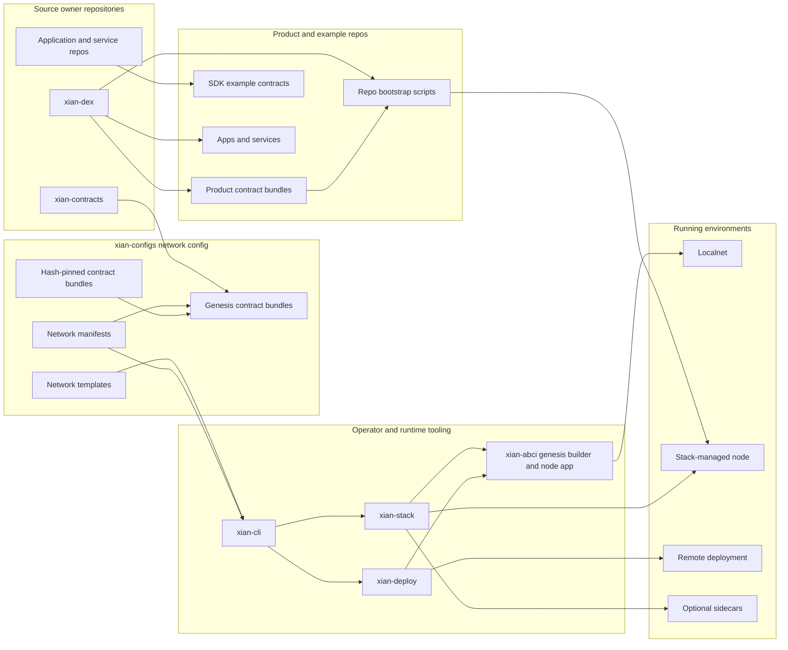
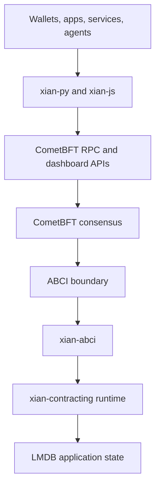

# Architecture Overview

Xian is organized as a maintained set of focused repositories that together
cover contract authoring, deterministic execution, node operations, SDKs,
applications, AI-assisted workflows, public docs, and optional higher-level
services.

## Core Runtime Repositories

| Repo | Main role |
|------|-----------|
| `xian-contracting` | contract compiler, sandbox, storage model, metering, standard library bridges, local testing |
| `xian-abci` | CometBFT application, block execution, query layer, snapshots, dashboard service |
| `xian-configs` | canonical network manifests, system contract bundles, and network templates |
| `xian-stack` | Docker images, Compose topology, localnet, monitoring, optional sidecars |
| `xian-cli` | operator workflow surface for keys, manifests, node init/start/stop/health |
| `xian-deploy` | remote Linux deployment playbooks for released node images and prepared node homes |
| `xian-governance-web` | validator governance operations console for proposals, voting, state patches, and chain status |

## Network, Product, Example, And Sidecar Structure

The stack has three separate responsibilities:

- `xian-configs` owns reproducible network-level assets
- source owner repositories own active product, contract, app, and example code
- tooling and runtime repositories consume those assets to create networks, run
  nodes, or deploy product contracts after genesis

The current maintained inventory is:

| Asset type | Count | Current location |
|------------|-------|------------------|
| Canonical network manifests | 3 | `xian-configs/networks/local`, `devnet`, `testnet` |
| Reusable network templates | 3 | `xian-configs/templates/*.json` |
| Genesis contract bundles | 3 | `xian-configs/contracts/contracts_local.json`, `contracts_devnet.json`, `contracts_testnet.json` |
| Product repos | 3 | `xian-dex`, `xian-stable-protocol`, `xian-nft` |
| SDK example contract sets | 4 | `xian-py/examples/*/contracts` |

The important terms are:

| Term | Meaning |
|------|---------|
| Source owner repo | The active development home for a product or contract set, such as `xian-dex` for the DEX contracts and frontend. |
| Genesis contract bundle | A `contracts_*.json` file that tells genesis construction which contracts are included before a chain starts. |
| Product repo | An optional application or protocol surface installed after a chain exists. Product repos are not genesis inputs and are not shipped in node images. |
| Example contract | A small reference contract source used by SDK examples or e2e workflows. |
| Contract bundle | A hash-pinned manifest for a deployable set of contract source files. |
| Localnet | A local network instance started by `xian-stack`, usually from canonical assets in `xian-configs`. |
| Sidecar | An optional runtime service attached to a node or indexed API. It is not part of consensus and does not change genesis. |

`xian-cli` is the operator-facing control plane over network setup and generic
contract deployment helpers. It reads network manifests, templates, profiles,
and system contract-bundle metadata from `xian-configs`. `xian-stack` is the
local Docker runtime that turns those assets into running nodes. `xian-deploy`
is the remote deployment equivalent for prepared host material. `xian-abci`
owns the genesis builder and runtime application behavior.

The DEX is the clearest example of the split. `xian-dex` owns active DEX
development, its pinned `contract-bundle.json`, its web app, and its bootstrap
script. The base `local`, `devnet`, and `testnet` genesis bundles do not
automatically make every network a DEX network.

The same rule applies to the stable protocol and NFT marketplace. Their
installable on-chain snapshots and bootstrap scripts live in one owning product
repo each.

Prefer pinned snapshots and manifest hashes for cross-repo consumption. Avoid
symlinks between repositories for canonical assets because they are
brittle in CI, Docker builds, remote deployments, archives, and release
artifacts.

## Contract, Protocol, And Product Repositories

| Repo | Main role |
|------|-----------|
| `xian-contracts` | maintained contract packages, including shielded-note and shielded-command contracts |
| `xian-dex` | DEX product repo: canonical AMM contracts, SnakX frontend, and hash-pinned DEX bundle manifest |
| `xian-dex-automation` | deterministic DEX event automation sidecar with rule evaluation and optional swap execution |
| `xian-stable-protocol` | stable-protocol product repo: Xian-native overcollateralized stable-vault contracts and bootstrap tooling |
| `xian-nft` | NFT product repo: XSC-0005 contracts, PixelSnek marketplace, and bootstrap tooling |
| `xian-bridge` | cross-chain bridge service for monitored source-chain deposits and matching Xian-side transfers |
| `xian-tg-bot` | plugin-first Telegram bot framework for Xian notifications, commands, and service integrations |

## Developer, Wallet, And Agent Tooling Repositories

| Repo | Main role |
|------|-----------|
| `xian-py` | Python SDK for reads, submissions, watchers, indexed feeds, and shielded relayer clients |
| `xian-js` | TypeScript client, provider contract, relayer clients, and browser dapp example |
| `xian-wallet-browser` | browser extension wallet and reusable wallet domain layer |
| `xian-wallet-mobile` | Expo / React Native mobile wallet application for Xian accounts and transactions |
| `xian-linter` | standalone lint service/package |
| `xian-playground-web` | browser playground for authoring, linting, deploying, and calling contracts |
| `xian-ide-web` | Monaco-based browser IDE for writing, testing, deploying, and interacting with contracts |
| `xian-contracting-hub-web` | curated contract catalog and deployment UI |
| `xian-mcp-server` | local MCP/HTTP bridge for AI-assisted Xian workflows |
| `xian-intentkit` | self-hosted agent platform fork with Xian-specific skills and stack integration |
| `xian-ai-guides` | context guides for LLM-generated Xian contracts, BDS queries, and tests |
| `xian-ai-skills` | drop-in agent skill packs for Xian SDK usage, node operations, and contract development |

## Docs, Standards, Website, And Workspace Repositories

| Repo | Main role |
|------|-----------|
| `xian-docs-web` | public VitePress documentation site and source of truth for developer/operator docs |
| `xian-technology-web` | public xian.technology brand and information website |
| `xian-meta` | shared repository conventions, change workflow, and cross-repo design contracts |
| `xian-xips` | Xian standards and improvement proposals, including XSC specifications and reference material |
| `.github` | organization profile and shared community-health files |

## Execution Path

At the protocol core, Xian looks like this:

CometBFT owns consensus, networking, and block ordering. `xian-abci` owns the
application behavior behind that consensus boundary. `xian-contracting` owns
contract semantics, storage, metering, and the standard-library bridge used by
contracts.

## Contract Execution Layers

There are two separate concerns to keep distinct:

1. Contract authors write restricted Python source.
2. The network chooses how that source is executed.

Today Xian supports `xian_vm_v1`, which executes validated Xian VM artifacts
through a native runtime and explicit execution policy.

That means Python remains the contract language, while the execution machine is
allowed to evolve without asking developers to rewrite contracts in a new
language.

## VM and ZK Building Blocks

Two important subsystems live inside the broader runtime architecture.

### Xian VM

`xian-contracting` can lower contracts into versioned VM artifacts for
`xian_vm_v1`. Those artifacts are validated during deployment and stored
alongside human-facing source so the native runtime can execute a stable,
Xian-defined machine contract instead of depending on CPython bytecode layout.

### Shielded / ZK Stack

The native verifier surface is intentionally narrow:

- `zk.verify_groth16(...)`
- `zk.verify_groth16_bn254(...)`
- `zk.has_verifying_key(...)`

The proving and wallet side stays off-chain in `xian-zk`, while the on-chain
layer lives in `xian-contracts` through `shielded-note-token`,
`shielded-commands`, and adapter contracts.

## Optional Services

Several services are useful in practice but are not part of consensus:

- dashboard HTTP and WebSocket APIs
- BDS-backed indexed reads and recovery tooling
- PostGraphile-based GraphQL over the BDS database
- the stack-managed shielded relayer
- stack-managed `xian-intentkit`

These services improve operator UX, analytics, wallet sync, and application
integration, but validators do not need them to agree on state.

## How The Pieces Fit In Practice

- contract authors usually start with `xian-contracting` and `ContractingClient`
- app developers use `xian-py`, `xian-js`, wallets, and the dashboard or indexed
  APIs
- node operators use `xian-cli`, `xian-stack`, `xian-abci`, and canonical assets
  from `xian-configs`
- privacy-sensitive applications additionally use `xian-zk`,
  `zk_registry`, shielded contracts, and optionally the relayer surface

That combination is the practical Xian architecture: one contract language,
multiple execution runtimes, and a surrounding stack that treats decentralized
infrastructure like a real software platform instead of an isolated VM.
