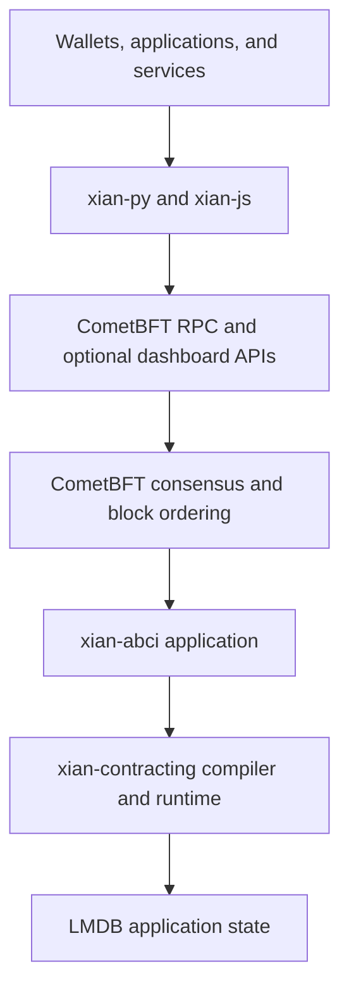

# Architecture Overview

Xian separates consensus, deterministic application execution, contract
semantics, operator tooling, and application integrations into focused sibling
repositories.

## Execution Path

CometBFT owns peer networking, consensus, block ordering, and finality.
`xian-abci` implements the deterministic application behind the ABCI boundary.
It validates transactions, executes blocks, commits state, answers application
queries, and coordinates snapshots. `xian-contracting` defines the contract
language, compiler, storage model, metering, and standard-library bridges.

## Core Repositories

| Repository | Responsibility |
| --- | --- |
| `xian-contracting` | restricted Python contract language, canonical compiler, native VM, local test client |
| `xian-abci` | CometBFT application, transaction processing, queries, state, snapshots, BDS, metrics, optional dashboard |
| `xian-configs` | network manifests, templates, genesis contract bundles, launch assets |
| `xian-cli` | operator-facing network, node, recovery, and client commands |
| `xian-stack` | Docker images, Compose topology, localnet, monitoring, optional services |
| `xian-deploy` | remote Linux deployment playbooks |

`xian-configs` contains checked-in `local`, `devnet`, `testnet`, and draft
`mainnet` manifests. These are configuration assets, not evidence that a public
network is running. The current codebase has no active public testnet or
mainnet.

## Contract Execution

Contract authors submit restricted Python source. Validators normalize, lint,
and compile that source with the canonical compiler, then store:

- `__source__`: normalized source for inspection
- `__xian_ir_v1__`: canonical IR executed by the native `xian_vm_v1` runtime

Clients cannot choose the executable IR; submitted deployment artifacts are
rejected. The native VM performs deterministic computation and calls explicit
host operations for storage, events, imports, cryptography, and ZK
verification.

## Network Assets and Products

Network assets and optional products have different owners:

- `xian-configs` owns network manifests, templates, and genesis bundles.
- Product repositories such as `xian-dex`, `xian-stable-protocol`, and
  `xian-nft` own their contracts, applications, bundle manifests, and
  post-genesis bootstrap scripts.
- `xian-cli` validates generic contract bundles and creates local profiles.
- `xian-stack` runs nodes and optional services; it does not own product code.

Keep cross-repo inputs hash-pinned or manifest-pinned. Do not rely on symlinks
between sibling repositories for release or network assets.

## SDKs and Optional Services

- `xian-py` and `xian-js` provide application-facing clients and signing
  helpers.
- `xian-wallet-browser` and `xian-wallet-mobile` are wallet products built on
  `xian-js`.
- BDS, GraphQL, the dashboard, the shielded relayer, DEX automation, and
  IntentKit are optional services outside consensus.
- The shielded stack uses the runtime verifier, the on-chain `zk_registry`,
  shielded contracts in `xian-contracts`, and off-chain proving and wallet
  tools from the `xian-zk` package inside `xian-contracting`.

## Related Pages

- [Transaction Lifecycle](/concepts/transaction-lifecycle)
- [The ABCI Layer](/concepts/abci)
- [The Xian VM](/concepts/xian-vm)
- [Node Architecture](/node/architecture)
