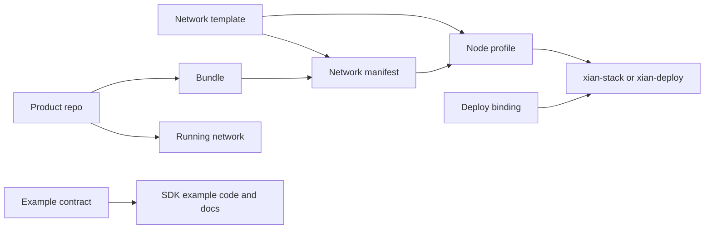

# Config Taxonomy

Xian configuration has a small public taxonomy:

| Term | Role | Where it lives |
| --- | --- | --- |
| Network template | Starter defaults for creating a network and node profiles | `xian-configs/templates/*.json` |
| Network manifest | The canonical definition of a real network | `xian-configs/networks/<name>/manifest.json` |
| Node profile | Node-local runtime intent generated from a template and manifest | generated by `xian-cli` |
| Deploy binding | Host-specific deployment input for Ansible | `xian-deploy` inventories and vars |
| Bundle | Hash-pinned artifact set | contract bundles, genesis bundles, operator bundles |
| Product repo | Optional application or protocol surface installed after genesis | owning repo such as `xian-dex` |
| Example contract | Small reference contract source consumed by SDK examples or e2e tests | owning SDK or product repo |

Packages are normal language or release packages. They are not a Xian config
type.



## Layer Ownership

Each lifecycle layer maps to a distinct ownership cell with its own scope,
mutability, and secret posture. The boundaries are deliberate: only deploy
bindings carry secrets, only network manifests are shared across all nodes of a
chain, and only runtime files are derived state.

| Layer | Owner | Scope | Mutability | Secrets |
| --- | --- | --- | --- | --- |
| Template | `xian-configs/templates/` (shared) | Reusable preset | Edited rarely as a library | No |
| Network manifest | `xian-configs/networks/<name>/` or local `./networks/<name>/` | Per-chain | Frozen once the chain exists | No |
| Node profile | Local `./nodes/<name>.json` | Per-node | Operator edits freely | No (key references only) |
| Deploy binding | `xian-deploy/inventories/<env>/` | Per-host or environment | Per-deployment | Yes (vault) |
| Runtime | `/srv/xian/...`, CometBFT home, containers | Per-process | Derived only | Yes (mounted) |

Collapsing any of these layers forces its concerns into a layer with a
different lifecycle, owner, or secret posture. The clearest example: merging
node profile and deploy binding would force credentials into a document
operators want to check into source control.

## Precedence

Precedence is phase-specific. There is no single global chain where every later
layer may override every earlier layer. Each command resolves only the fields it
owns, then writes the next artifact.

| Phase or question | Value resolution |
| --- | --- |
| Create a new network manifest | explicit `xian network create` flag, then selected template default, then built-in default |
| Generate local genesis state | explicit `xian network create` genesis flag, then selected genesis bundle constructor default |
| Generate a node profile | explicit `xian network create` or `xian network join` flag, then selected template profile default, then network manifest default where that field is network-scoped, then built-in profile default |
| Resolve network identity, chain ID, and canonical genesis | network manifest, unless a command exposes an explicit node-local override |
| Start or inspect a local node | explicit lifecycle command flag, then node profile, then network manifest where applicable, then runtime default |
| Deploy a profile remotely | node profile for runtime intent; Ansible inventory or vault for host paths, published ports, secrets, resource limits, and topology |
| Rendered runtime files and containers | generated output only; regenerate from the profile plus deploy bindings instead of editing by hand |

Once a manifest or profile has been written, it is an artifact. Later template
changes do not mutate existing manifests or profiles. Deploy bindings also do
not supersede profile runtime intent; they place that profile on a host.

## Templates

Templates are reusable starter defaults. They answer: "What kind of network or
node profile should I create?"

Current templates:

- `single-node-dev`: minimal local development node.
- `single-node-indexed`: local single-node network with BDS, dashboard, and
  monitoring enabled.
- `consortium-5`: five-validator shared-network starter.

Templates are not live networks and are not deploy-time presets.

## Manifests

Network manifests define real networks: chain ID, genesis source, release image
mode, seed policy, privacy artifact catalogs, and related network facts.

Templates can create new manifests, but once a manifest exists it is the source
of truth for that network.

When `xian network create` generates a local `genesis.json`, genesis-only flags
such as `--validator-selection-mode` affect the generated contract constructor
state before the chain starts. They are not node profile fields. A joined network
inherits its already-fixed genesis from the manifest, and an existing chain
changes validator policy through governance.

## Profiles

Node profiles are generated node-local runtime configs. They carry service
posture, block policy, images, metrics, P2P defaults, genesis references, state
sync inputs, and other runtime intent.

For remote deployment, the profile is the runtime source of truth. Inventory
does not restate the profile. Host placement still belongs to deploy bindings,
so Ansible inventories own published ports, host paths, database credentials,
resource limits, and topology even when a profile includes local stack bind
defaults.

Remote deploy secrets belong in a private inventory, vault, or secret-manager
handoff. `xian-deploy` rejects empty or weak BDS passwords, writes generated
runtime secret files, including DSNs that may contain credentials, on the
target host with private permissions, and keeps those values out of rendered
Compose YAML.

## Deploy Bindings

Deploy bindings are host-specific Ansible inputs: host paths, published ports,
database credentials, node-home archives, resource limits, and the deploy
topology.

Deploy bindings answer: "Where and how should this profile run on this host?"

## Bundles

Bundles pin exact artifacts by hash. Common bundles include genesis contract
bundles, product-repo contract bundles, generated node-home/operator bundles,
recovery bundles, and privacy proof/key bundles.

A bundle is mechanical. It pins bytes; another manifest or command gives those
bytes workflow meaning.

## Products

Products are optional application or protocol surfaces with one owning repo.
They are installed after a chain exists; they are not genesis inputs and are not
shipped inside node images.

The product repo owns its contracts, bundle, app, service code, tests, docs, and
bootstrap script. `xian-configs` does not catalog products. Operators use
network tooling to create or join the chain, then run the product repo's
bootstrap flow against the running network.

For example:

```bash
uv run --project ../xian-cli xian contract bundle validate ../xian-dex/contract-bundle.json
cd ../xian-dex
uv run python scripts/bootstrap_dex.py --recipe local-demo
```

## Example Contracts

Example contracts are small app-facing contract sources used by SDK examples and
e2e workflows without a catalog manifest.

Use an example contract when repo-local app code needs a stable contract source
path:

```bash
xian-py/examples/x402_exact/contracts/x402_settlement.s.py
```

Product repos own product bootstrap. SDK repos own their example app code and
walkthroughs.

## Rule Of Thumb

Use a template to create.

Use a manifest to identify a network.

Use a profile to run a node.

Use deploy bindings to place that node on a host.

Use a bundle to pin exact artifacts.

Use a product repo to own a full optional application or protocol surface.

Use an example contract for small reference contract source consumed by SDK
examples.
