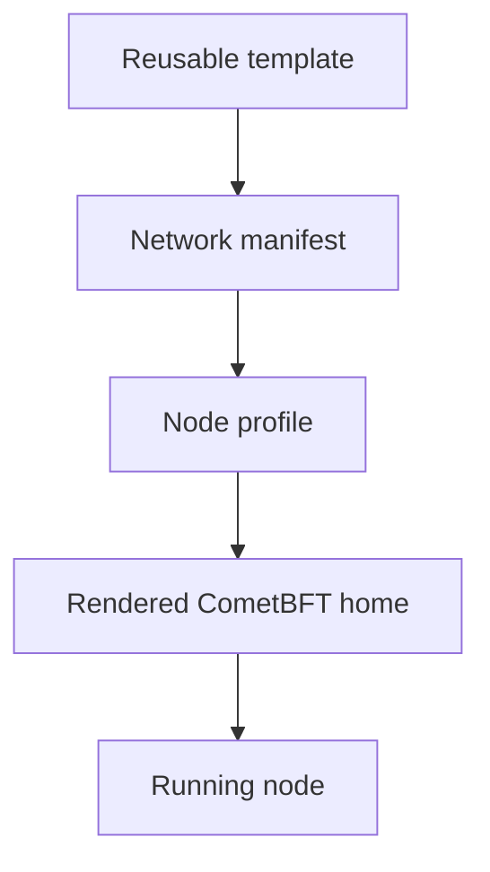

# Configuration

Xian node configuration has three layers:

1. a network manifest defines network-wide identity and defaults
2. a node profile records operator-local intent
3. `xian node init` renders the CometBFT home used at runtime



Use [Config Taxonomy](/node/config-taxonomy) for precedence and ownership
rules.

## Network Manifests

Canonical assets live in `xian-configs/networks/<name>/manifest.json`.
Manifests may define:

- chain identity and genesis source or bundle
- seeds and persistent peers
- snapshot bootstrap and trust material
- block-production policy
- pinned node images and release provenance
- runtime features and privacy artifact policy

The checked-in `local`, `devnet`, and `testnet` manifests are development or
rehearsal assets. The `xian-mainnet-1` manifest is a draft launch asset. None
of them implies that a public endpoint is live.

Templates under `xian-configs/templates/` are reusable starting points, not
networks.

## Node Profiles

Profiles are JSON files normally created under `nodes/` by `xian-cli`. They
select local paths, keys, images, peers, pruning, block policy, fee mode,
logging, simulation, parallel execution, and optional services.

See [Node Profiles](/node/profiles) for the profile contract. Prefer changing a
manifest or profile and re-rendering over hand-editing generated files.

## Rendered Home

The effective runtime home contains:

```text
config/config.toml
config/xian.toml
config/genesis.json
config/state-patches/
config/priv_validator_key.json
config/node_key.json
data/priv_validator_state.json
```

`config.toml` controls CometBFT. `xian.toml` controls Xian application
settings. Genesis, validator state, and keys must not be changed casually on an
existing network.

`xian_vm_v1` is the only supported execution runtime. Execution mode, VM
bytecode, and gas schedule are not operator-selectable configuration.

## Runtime Settings

Top-level Xian settings cover:

- pruning and retained block history
- application metrics and logging
- readonly simulation limits
- transaction fee mode and free-metered chi caps
- speculative parallel execution
- pending nonce reservation

The `[bds]` section configures the optional Postgres indexer, pool, catch-up,
and spool behavior. See [Runtime Features](/node/runtime-features).

## Snapshot and State Sync

These are separate mechanisms:

- `snapshot_url` restores a prepared node-home or Xian application-state
  archive. Signed manifests can pin the archive hash, chain ID, and signer.
- CometBFT state sync uses trusted RPC servers, height, hash, and trust period
  to join through the consensus protocol.

Use [Recovery Plans](/node/recovery-plans) for supported recovery paths.

## Public Exposure

The maintained stack binds RPC, query services, and metrics to loopback by
default. Public publishing requires both a command flag and its environment
gate:

| Surface | Flag | Environment gate |
| --- | --- | --- |
| CometBFT RPC | `--public-rpc` | `XIAN_PUBLIC_RPC_ENABLED=1` |
| dashboard/BDS/GraphQL | `--public-query` | `XIAN_PUBLIC_QUERY_ENABLED=1` |
| metrics | `--public-metrics` | `XIAN_PUBLIC_METRICS_ENABLED=1` |

`--public-query` does not publish the live RPC or mempool. Put any published
surface behind appropriate firewall, TLS, authentication, rate limits, and
monitoring.

## Common Local Endpoints

| Surface | Default |
| --- | --- |
| CometBFT P2P | `26656` |
| CometBFT RPC | `http://127.0.0.1:26657` |
| CometBFT metrics | `http://127.0.0.1:26660/metrics` |
| Xian metrics | `http://127.0.0.1:9108/metrics` |
| dashboard | `http://127.0.0.1:18080` (`single-node-dev`; backend default `8080`) |
| GraphQL | `http://127.0.0.1:5000/graphql` |
| GraphiQL browser UI | `http://127.0.0.1:5000/graphiql` |
| Prometheus | `http://127.0.0.1:9090` |
| Grafana | `http://127.0.0.1:3000` |

The local development template enables all services in this endpoint table.
Other profiles may not. Run `xian node endpoints <name>` for the effective
catalog. Bracket IPv6 literals in URLs, for example `http://[::1]:26657`.
