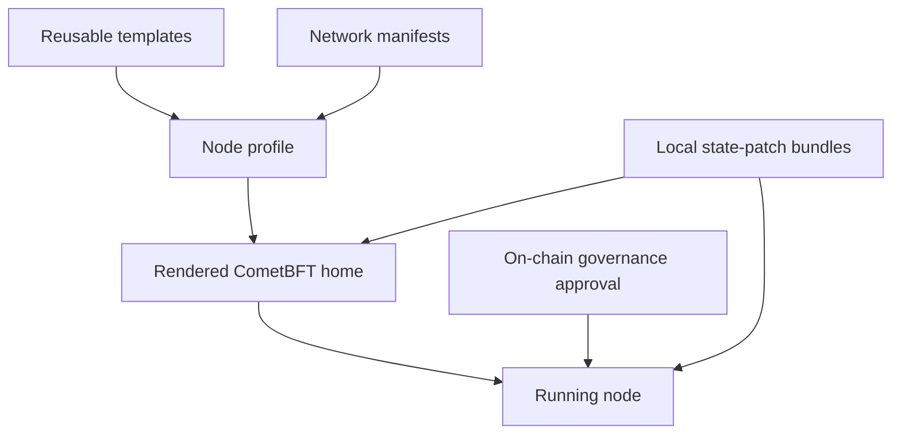

# Configuration

Xian node configuration is easiest to understand as three layers:

1. network manifests and templates
2. node profiles
3. the rendered CometBFT home

The higher layers describe operator intent. The rendered home is what the node
actually runs.

If you are deciding between templates, profiles, deploy bindings, bundles,
products, and solutions, start with [Config Taxonomy](/node/config-taxonomy).
Its precedence table is the canonical reference for which layer wins during
manifest/profile creation, local runtime, and remote deployment.



## Network Manifests And Templates

Network manifests describe network-wide defaults such as:

- chain and network identity
- genesis declaration
- canonical P2P seeds and persistent peers
- snapshot bootstrap URLs
- image posture
- block policy defaults
- optional pinned release images and their provenance metadata
- optional shielded/privacy packaging metadata such as approved privacy artifact
  catalogs and shielded history commitments

Canonical manifests live under `xian-configs/networks/<name>/manifest.json`.
Reusable starter templates live under `xian-configs/templates/`.

The important distinction is:

- templates are reusable starting points
- manifests describe a specific network

For canonical published networks, the manifest can also pin:

- `node_release_manifest`: the exact repo refs and build inputs that produced
  the published node images
- `privacy_artifact_catalog`: a checksum-pinned catalog of approved shielded
  registry manifests for that network
- `shielded_history_policy`: the compatibility and retention commitment for the
  `shielded_wallet_history` feed
- `privacy_submission_policy`: operator-facing relayer and disclosure posture

## Node Profiles

Node profiles are operator-local JSON files, usually created by `xian-cli`
under `./nodes/<name>.json`.

Profiles capture node-local intent such as:

- moniker and validator key reference
- stack checkout path
- image mode and optional pinned images copied from a manifest
- P2P seeds and persistent peers
- optional node-local genesis override
- BDS and other service posture
- pruning
- dashboard and monitoring settings
- application logging settings
- readonly simulation settings
- parallel execution settings
- advanced runtime defaults and overrides

See [Node Profiles](/node/profiles) for the high-level JSON contract.

## Rendered CometBFT Home

`xian node init` materializes the final runnable home, typically under the
`xian-stack` checkout.

Important contents include:

- `config/config.toml`
- `config/genesis.json`
- `config/state-patches/`
- `config/priv_validator_key.json`
- `config/node_key.json`
- `data/priv_validator_state.json`

From here on, the rendered config is the effective runtime truth.

## Important Config Sections

### `[xian]`

This section carries the main Xian runtime toggles, including:

- pruning
- metrics
- application logging
- readonly simulation
- transaction fee mode and 0-fee chi caps
- parallel execution
- local pending-nonce reservation behavior

`xian_vm_v1` is the only supported node runtime. Execution mode, bytecode,
gas schedule, and authority are internal VM constants, not operator-selectable
settings.

### `[xian.bds]`

This section is relevant when `bds_enabled = true` and the optional indexed
stack is enabled.

It contains BDS/Postgres-related settings such as:

- connection info
- pool sizing
- statement timeout
- queue and catch-up settings
- application name
- spool location and warning thresholds

## Release Provenance In Manifests

When a network pins published node images, `node_release_manifest` is the
machine-readable provenance block that explains how those images were built.

The release manifest surface includes:

- exact repo refs for the main runtime components
- digest-pinned Python and Go base images
- the CometBFT version plus a checksum-pinned source archive URL
- the s6-overlay version plus architecture-specific SHA256 values

The network manifest carries both the selected image and the pinned release
inputs that produced that image.

## Snapshot Bootstrap Vs State Sync

There are two different snapshot concepts in the stack.

### Snapshot Bootstrap

`snapshot_url` is an operator bootstrap path. It restores a prepared node-home
archive.

This URL can point either to:

- a snapshot archive directly, in which case the operator must supply an
  explicit expected SHA256
- a signed snapshot manifest JSON, in which case the node validates the
  manifest signature, `chain_id`, and embedded archive hash against trusted
  Ed25519 public keys before restoring the archive

### CometBFT State Sync

CometBFT `[statesync]` settings are protocol-level sync controls that require:

- trusted RPC servers
- trust height
- trust hash
- trust period

For Xian application snapshots, the trusted CometBFT app hash is the state-root
Merkle commitment. During import, Xian recomputes that root from the downloaded
contract state and nonce state before accepting the snapshot.

These are not the same mechanism.

## State Patch Bundles

Governed forward state patches are local bundle files stored under:

```text
<cometbft-home>/config/state-patches
```

They are not ordinary config keys. The runtime loads them only when the
on-chain governance state approves the matching bundle hash and activation
height.

## Metrics, Logging, Simulation, And Parallel Execution

The rendered config is where all node-local runtime posture is finally
materialized.

In practice:

- application metrics live under `[xian]`
- Xian application logging lives under `[xian]`
- readonly simulation lives under `[xian]`
- transaction fee mode lives under `[xian]`
- speculative parallel execution lives under `[xian]`
- the execution engine policy lives under `[xian.execution.engine]`

See [Runtime Features](/node/runtime-features) for the operator-facing meaning
of those settings.

## Stack-Managed Exposure Defaults

The maintained `xian-stack` backend defaults to fail-closed host publishing:

- CometBFT P2P remains public-facing by default on `26656`
- CometBFT RPC defaults to `127.0.0.1:26657`
- CometBFT metrics defaults to `http://127.0.0.1:26660/metrics`
- Xian app metrics defaults to `http://127.0.0.1:9108/metrics`
- dashboard process defaults to `127.0.0.1:8080`; maintained stack templates
  publish it on host port `18080`
- PostGraphile defaults to `http://127.0.0.1:5000/graphql`
- `xian-dex-automation` defaults to `127.0.0.1:38280` when enabled
- the shielded relayer defaults to `127.0.0.1:38180` when enabled

IPv6 loopback can be used for local stack binds and host-published services.
Use raw host literals in bind and publish settings, for example `::1`; use
bracketed literals in URLs, for example `http://[::1]:26657/status`. The IPv6
wildcard `::` is a non-loopback bind and should be treated like explicit public
exposure.

Public exposure is explicit through the stack backend:

- `--public-rpc` or `XIAN_PUBLIC_RPC_ENABLED=1`
- `--public-metrics` or `XIAN_PUBLIC_METRICS_ENABLED=1`
- `--public-query` or `XIAN_PUBLIC_QUERY_ENABLED=1`

`public-query` is intentionally separate from `public-rpc`. It publishes the
read-only indexed surface for BDS / GraphQL. It does not also expose the live
node RPC.

## Network Manifest Shape

Manifests use object families for related configuration:

```json
{
  "schema_version": 1,
  "name": "testnet",
  "chain_id": "xian-testnet-1",
  "genesis": {
    "kind": "bundle",
    "bundle": "testnet",
    "genesis_time": "2026-03-30T00:00:00.000000Z"
  },
  "p2p": {
    "seeds": [],
    "persistent_peers": []
  }
}
```

`genesis.kind = "source"` points at a materialized `genesis.json` by URL or
file path. `genesis.kind = "bundle"` tells tooling to render deterministic
genesis from a named contract bundle such as `local`, `devnet`, or `testnet`.
When tooling generates a source genesis from a bundle, it may also record
`genesis_build` provenance beside the manifest.

This example shows the checked-in canonical testnet manifest shape. When you
target a public RPC endpoint, use the chain ID reported by `/status`
(`result.node_info.network`) for transaction payloads.

When RPC, dashboard, seed, or persistent-peer addresses contain IPv6 literals,
write URL-style hosts in bracketed form, such as `http://[::1]:26657` or
`nodeid@[::1]:26656`.

For local workflows, `xian-stack` generates `.stack-secrets.env` on first
use. That file holds local BDS and PostGraphile passwords and should stay
untracked. For BDS-enabled runs, PostGraphile uses its own dedicated read-only
database role instead of the primary BDS owner account. The stack config also
disables generated PostGraphile mutations by default, omits simple collection
fields in favor of connection-style pagination, caps request body size, and sets
a statement timeout on that read-only role. It also waits for the core BDS
read-model tables before starting PostGraphile, so a partial schema is not
exposed during node startup.

## Common Local Endpoints

These are the usual local endpoints a node runner may see. Not every service is
enabled on every node or profile.

| Surface | Default local endpoint | When it exists |
|---------|------------------------|----------------|
| CometBFT P2P | `26656` | node runtime |
| CometBFT RPC | `http://127.0.0.1:26657/status` | node runtime |
| CometBFT metrics | `http://127.0.0.1:26660/metrics` | CometBFT Prometheus metrics enabled |
| Xian metrics/perf | `http://127.0.0.1:9108/metrics` | Xian application metrics enabled |
| Dashboard process | `http://127.0.0.1:8080` | dashboard service enabled |
| Dashboard stack host | `http://127.0.0.1:18080` | maintained stack templates that publish the dashboard on a separate host port |
| BDS GraphQL | `http://127.0.0.1:5000/graphql` | BDS and PostGraphile enabled |
| Prometheus | `http://127.0.0.1:9090` | monitoring enabled |
| Grafana | `http://127.0.0.1:3000` | monitoring enabled |
| DEX automation | `http://127.0.0.1:38280` | `xian-dex-automation` enabled |
| Shielded relayer | `http://127.0.0.1:38180` | shielded relayer enabled |

The same endpoints can be rendered on IPv6 loopback when the relevant bind or
publish host is `::1`; URL literals must be bracketed, for example
`http://[::1]:18080`.

Related frontend dev servers are separate from the node runtime. The DEX UI
uses `http://127.0.0.1:5173/` in `xian-dex/web`; the browser IDE uses Vite's
dev-server port selection and prints the actual URL when started.

Those port numbers describe the service sockets, not a guarantee that the
service is Internet-facing. In the maintained stack, only CometBFT P2P is
public by default. Prometheus and Grafana stay loopback-only unless public
monitoring is explicitly enabled and authenticated external access is confirmed
with the stack or deploy monitoring guard variables documented in
[Starting, Stopping & Monitoring](/node/managing#dashboard-and-graphql).
