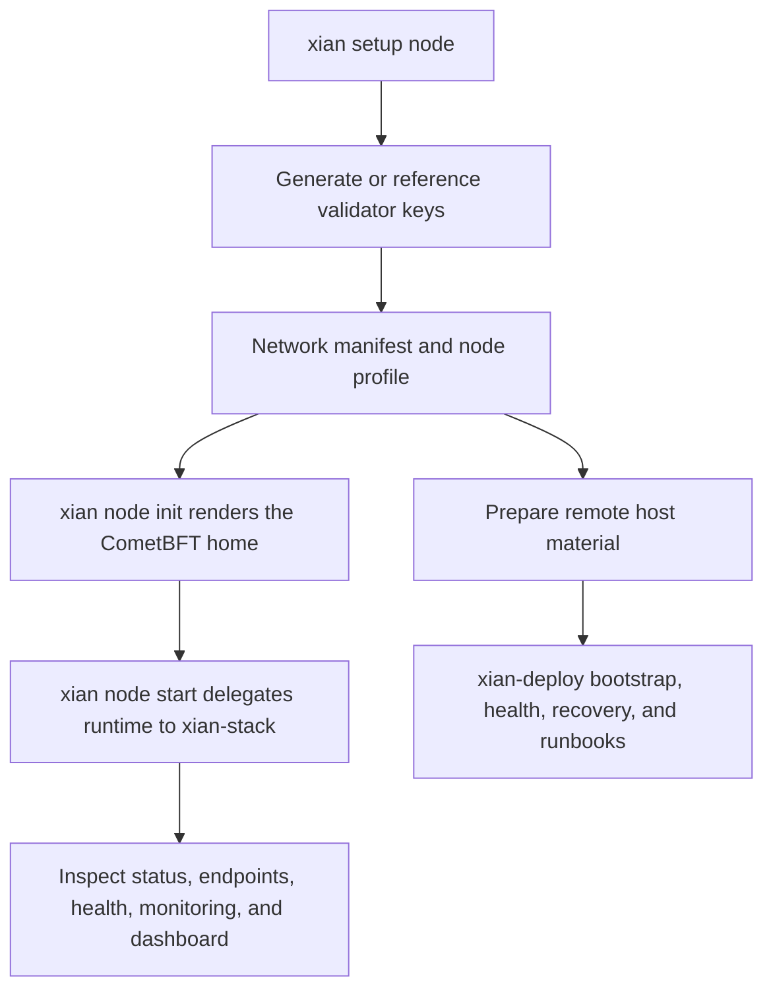

# Node Operations

This section documents the current operator path for running Xian nodes from
the maintained repos:

- `xian-cli` owns operator workflows such as key generation, network join, node
  initialization, start, stop, status, snapshot restore, and doctor checks.
- `xian-deploy` owns the Linux-focused remote deployment path, including remote
  health checks, state-snapshot restore, and state-sync bootstrap playbooks.
- `xian-stack` owns the Docker images, Compose topology, backend lifecycle
  script, localnet, and optional dashboard/BDS services.
- `xian-abci` owns the deterministic node process, config rendering primitives,
  CometBFT-facing behavior, and application snapshot serving/loading.
- `xian-configs` owns canonical network bundles and contract bundles.

## Recommended Flow

The supported workflow is:

1. Run `xian setup node` to choose local setup or network join
2. Choose validator key mode and the `basic` or `indexed` runtime preset
3. Let the wizard create or join the network, write the node profile, and
   materialize the local CometBFT home
4. Start and stop the runtime through `xian-stack`
5. Use `xian node status`, `xian node endpoints`, `xian node health`,
   monitoring, and the optional dashboard for inspection



For remote Linux hosts, keep the local `xian-cli` network/profile flow, then
use `xian-deploy` for bootstrap, deployment, remote health, and recovery
runbooks.

Typical commands:

```bash
uv run xian setup node --mode local --network local-dev --name validator-1 \
  --preset basic --key-mode generate --start --yes
uv run xian node status validator-1
uv run xian node endpoints validator-1
uv run xian node health validator-1
uv run xian node stop validator-1
```

For joining an existing canonical network with indexed services and monitoring
defaults:

```bash
uv run xian setup node --mode join --network testnet --name validator-1 \
  --preset indexed --key-mode existing \
  --validator-key-ref ./keys/validator-1/validator_key_info.json \
  --stack-dir ../xian-stack --start --yes
```

Mainnet operators should pass the operator-supplied mainnet manifest with
`--network-manifest`; the current checked-in canonical manifests cover local,
devnet, and testnet.

When the joined network manifest pins published node images, `xian node start`
pulls those immutable images by default through `xian-stack`. Use
`--node-image-mode local_build` during setup when you need a dev override
against the local workspace instead.

The lower-level flow is still available:

1. Generate validator key material with `xian-cli`
2. Create or join a network manifest/profile manually
3. Materialize the local CometBFT home with `xian node init`
4. Start and stop the runtime through `xian-stack`
5. Use `xian node status`, `xian node endpoints`, `xian node health`, and the optional dashboard for inspection

## Runtime Topologies

Xian currently supports two runtime topologies in `xian-stack`:

- `integrated`: one container per node, with `xian-abci` and `CometBFT`
  supervised together by `s6-overlay`
- `fidelity`: separate `xian-abci` and `CometBFT` containers, closer to an
  orchestrated production layout

The dashboard is optional in both cases and runs as its own service. BDS and
GraphQL are optional indexed-read services on top of the node, not part of the
deterministic validator path.

## What This Section Covers

- [Architecture](/node/architecture): how the runtime pieces fit together
- [System Requirements](/node/requirements): host, Docker, and workspace needs
- [Installation & Setup](/node/installation): supported setup path
- [Configuration](/node/configuration): manifests, profiles, homes, and ports
- [Config Taxonomy](/node/config-taxonomy): templates, profiles, deploy
  bindings, bundles, products, solutions, and when to use each one
- [Runtime Features](/node/runtime-features): execution-engine policy, tracer
  modes, readonly simulation, parallel execution, and the current runtime keys
- [Pruning & Retention](/node/pruning): block-history pruning policy,
  `blocks_to_keep` sizing, and recovery implications
- [Local DEX Bootstrap](/node/local-dex-bootstrap): opt-in local deployment of
  `con_pairs`, `con_dex`, and a demo liquid pair for DEX UI and event testing
- [xian-dex-automation](/tools/xian-dex-automation): optional deterministic
  DEX event automation sidecar for stack-managed nodes
- [5-Validator Localnet E2E](/node/localnet-e2e): the canonical whole-stack local
  validation run across validators, BDS, governance, DEX, logging,
  shielded-note flows, VM-native validation, and `make release-safety`
- [Protocol Governance & State Patches](/node/protocol-governance): the
  first-class forward patching model, local bundle directory, and emergency
  boundary
- [Governance Web Console](/node/governance-web): validator-facing proposal,
  voting, vote audit, and state-patch hash verification UI
- [Recovery Plans](/node/recovery-plans): the guided operator rollback /
  restore workflow when forward patching is not enough
- [Node Profiles](/node/profiles): the JSON contract used by `xian-cli`
- [Starting, Stopping & Monitoring](/node/managing): operational commands,
  monitoring surfaces, and incident runbooks
- [Snapshots & Reindex](/node/managing): application snapshots, BDS replay,
  BDS rebuilds, and snapshot import/export workflows
- [Validators](/node/validators): validator-specific setup and expectations
