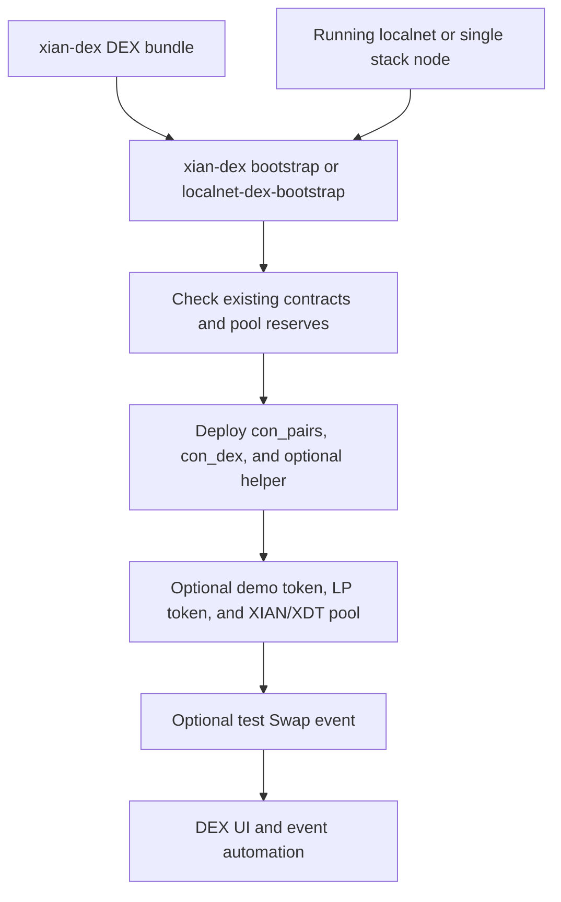

# Local DEX Bootstrap

The base Xian contract bundles do not deploy the DEX automatically. Local DEX
support is an explicit post-start bootstrap step so local automation, the DEX
web app, and event-trigger tests can rely on known contract names without
turning every network into a DEX network by default.

## What It Deploys

The DEX bootstrap deploys these canonical contracts when they are missing:

- `con_pairs`: pair factory, pair state, reserves, and LP mint/burn routing
- `con_dex`: router for liquidity and swaps
- `con_dex_helper`: optional helper for single-pair buy/sell flows

For local development it can also deploy:

- `con_dex_demo_token`: demo XDT token
- `con_dex_demo_lp`: LP token for the local XIAN/XDT pair
- a seeded `currency` / `con_dex_demo_token` pool

The bootstrap is idempotent. Rerunning it skips contracts that already exist and
skips the demo pool when it already has reserves. Both the `xian-dex`
bootstrap script and the stack-local helper read the pinned repo-owned bundle
from `xian-dex/contract-bundle.json` by default.



## Multi-Node Localnet

From `xian-stack`:

```bash
make localnet-init
make localnet-up
make localnet-dex-bootstrap
```

Equivalent manual flow:

```bash
make localnet-up
make localnet-dex-bootstrap
```

The command reads `.localnet/network.json`, uses the generated local founder
wallet, and deploys to the first localnet RPC endpoint.

## Single Local Stack Node

For a stack-managed single node, such as a local IntentKit test node on
`127.0.0.1:26657`, pass the RPC endpoint explicitly:

```bash
XIAN_DEX_BOOTSTRAP_RPC_URL=http://127.0.0.1:26657 make localnet-dex-bootstrap
```

The script derives the local deployer key from
`.cometbft/config/priv_validator_key.json`. For a different deployer wallet,
set `XIAN_DEX_DEPLOYER_PRIVATE_KEY`.

Machine-facing form:

```bash
python3 ./scripts/backend.py localnet-dex-bootstrap \
  --rpc-url http://127.0.0.1:26657
```

## Useful Options

Top up an existing demo pool:

```bash
LOCALNET_DEX_TOP_UP_LIQUIDITY=1 make localnet-dex-bootstrap
```

Emit one small swap event after deployment:

```bash
LOCALNET_DEX_EMIT_TEST_SWAP=1 make localnet-dex-bootstrap
```

Control local demo amounts:

```bash
LOCALNET_DEX_DEMO_TOKEN_SUPPLY=1000000 \
LOCALNET_DEX_LIQUIDITY_CURRENCY_AMOUNT=10000 \
LOCALNET_DEX_LIQUIDITY_DEMO_TOKEN_AMOUNT=10000 \
LOCALNET_DEX_TEST_SWAP_AMOUNT=10 \
make localnet-dex-bootstrap
```

The bootstrap parses these numeric values as exact decimal contract values. Use
plain decimal strings such as `0.1` or `2500.75` when overriding them.

Use a different hash-pinned DEX bundle:

```bash
XIAN_DEX_BUNDLE=../xian-dex/contract-bundle.json make localnet-dex-bootstrap
```

For a normal DEX install, run the product repo bootstrap directly:

```bash
cd ../xian-dex
uv run python scripts/bootstrap_dex.py --recipe local-demo
```

For development only, override the raw DEX contract source directory:

```bash
XIAN_DEX_CONTRACTS_DIR=../xian-dex/src make localnet-dex-bootstrap
```

## Automation Prerequisites

DEX event automation needs more than the contract code:

- `con_pairs` and `con_dex` must exist at the canonical names expected by the
  DEX web app and Xian tooling.
- At least one pair must exist and have liquidity.
- Event-driven workflows should run against a node with indexed/event read
  surfaces enabled when the workflow needs historical confirmation.

The bootstrap provides the local contracts and a demo liquid pair. It does not
replace production deployment policy, and it does not make AI agents
deterministic trade executors by itself.

DEX transactions emitted by the bootstrap use Xian VM datetime deadline
payloads, so the same local setup is suitable for testing MCP DEX helper flows
against the supported VM runtime.

After bootstrapping the contracts, start the deterministic sidecar with
`--dex-automation` or a node profile created with `--enable-dex-automation`.
The sidecar starts in dry-run mode; enable `wallet.execute` only after
the rule output is correct.
