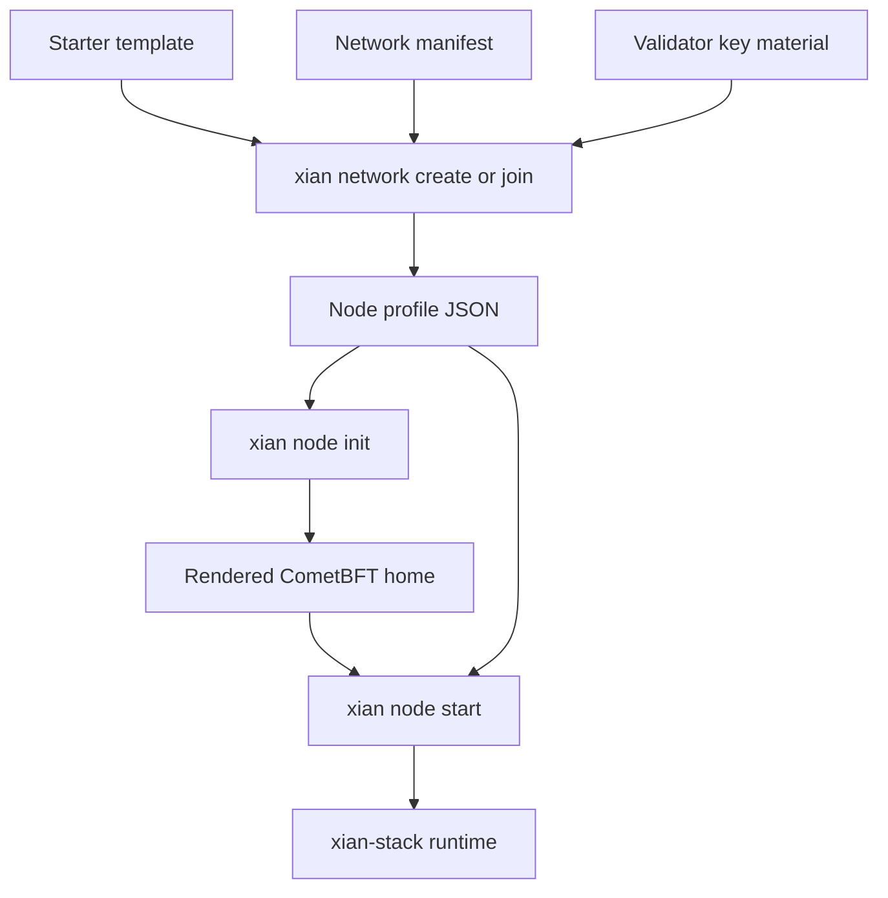

# Node Profiles

Node profiles are the operator contract shared by `xian-cli`, `xian-stack`,
and `xian-deploy`.

They are written as JSON and validated on read. The current schema is explicit:

```json
{
  "schema_version": 1,
  "name": "validator-1",
  "network": "testnet",
  "moniker": "validator-1",
  "validator_key_ref": "./keys/validator-1/validator_key_info.json",
  "node_image_mode": "registry",
  "node_integrated_image": "ghcr.io/xian-technology/xian-node@sha256:...",
  "node_split_image": "ghcr.io/xian-technology/xian-node-split@sha256:...",
  "node_release_manifest": null,
  "stack_dir": "../xian-stack",
  "p2p": {
    "seeds": [],
    "persistent_peers": []
  },
  "genesis": null,
  "snapshot_url": null,
  "snapshot_signing_keys": [],
  "home": null,
  "pruning_enabled": false,
  "blocks_to_keep": 100000,
  "block_policy_mode": "on_demand",
  "block_policy_interval": "0s",
  "transaction_trace_logging": false,
  "app_log_level": "INFO",
  "app_log_json": false,
  "app_log_rotation_hours": 1,
  "app_log_retention_days": 7,
  "simulation_enabled": true,
  "simulation_max_concurrency": 2,
  "simulation_timeout_ms": 3000,
  "simulation_max_chi": 1000000,
  "tx_fee_mode": "paid_metered",
  "free_tx_max_chi": 1000000,
  "free_block_max_chi": 20000000,
  "parallel_execution_enabled": false,
  "parallel_execution_workers": 4,
  "parallel_execution_min_transactions": 8,
  "operator_profile": "indexed_development",
  "monitoring_profile": "local_stack",
  "services": {
    "bds": {
      "enabled": true
    },
    "dashboard": {
      "enabled": false,
      "host": "127.0.0.1",
      "port": 8080
    },
    "monitoring": {
      "enabled": true
    },
    "intentkit": {
      "enabled": false,
      "network_id": "xian-testnet",
      "host": "127.0.0.1",
      "port": 38000,
      "api_port": 38080
    },
    "dex_automation": {
      "enabled": false,
      "host": "127.0.0.1",
      "port": 38280,
      "config": null
    },
    "shielded_relayer": {
      "enabled": false,
      "host": "127.0.0.1",
      "port": 38180
    }
  },
  "advanced": {
    "cometbft": {
      "allow_cors": true,
      "prometheus": true,
      "proxy_app": "unix:///tmp/abci.sock"
    },
    "statesync": {
      "enabled": false,
      "rpc_servers": [],
      "trust_height": 0,
      "trust_hash": "",
      "trust_period": "168h0m0s"
    },
    "metrics": {
      "enabled": true,
      "host": "127.0.0.1",
      "port": 9108,
      "bds_refresh_seconds": 5.0
    },
    "pending_nonce": {
      "reservation_ttl_seconds": 60.0,
      "max_per_sender": 128
    },
    "parallel_execution": {
      "max_speculative_waves": 4,
      "min_wave_acceptance_ratio": 0.25,
      "low_acceptance_min_wave_size": 8,
      "warm_workers": true,
      "access_estimates_enabled": true
    }
  }
}
```

## Important Fields

| Field | Meaning |
|------|---------|
| `validator_key_ref` | path to `validator_key_info.json` or `priv_validator_key.json` |
| `stack_dir` | explicit `xian-stack` checkout used by the runtime backend |
| `node_image_mode` | `registry` for pinned published images or `local_build` for workspace-built images |
| `node_*_image` | immutable integrated/split image references used when `node_image_mode=registry` |
| `node_release_manifest` | optional embedded provenance block copied from `xian-stack/release-manifest.json`, including the exact component Git refs, digest-pinned base images, and checksum-pinned external build inputs used for a canonical published image |
| `p2p.seeds` | CometBFT seed peers for node discovery |
| `p2p.persistent_peers` | CometBFT persistent peers maintained by this node |
| `genesis` | optional node-local genesis override; usually inherited from the network manifest |
| `operator_profile` | the intended operator posture inherited from the selected starter template |
| `monitoring_profile` | the monitoring posture inherited from the selected starter template |
| `snapshot_url` | optional remote bootstrap source; may point to a snapshot archive directly or to a signed snapshot manifest |
| `snapshot_signing_keys` | trusted Ed25519 public keys used when `snapshot_url` points to a signed snapshot manifest |
| `home` | explicit CometBFT home override |
| `block_policy_mode` | `on_demand`, `idle_interval`, or `periodic` |
| `block_policy_interval` | interval used for idle/periodic block policies |
| `transaction_trace_logging` | enables per-transaction debug summaries during block execution |
| `app_log_level` | Xian application log level written to stderr and rotated files |
| `app_log_json` | emits Xian application logs as structured JSON instead of plain text |
| `app_log_rotation_hours` | rotation interval for Xian application logs |
| `app_log_retention_days` | retention window for rotated Xian application logs |
| `simulation_enabled` | enables readonly transaction simulation on this node |
| `simulation_max_concurrency` | maximum concurrent readonly simulations accepted by this node |
| `simulation_timeout_ms` | wall-clock timeout for one readonly simulation worker |
| `simulation_max_chi` | readonly chi budget cap used during simulation |
| `tx_fee_mode` | transaction fee policy, either `paid_metered` or `free_metered` |
| `free_tx_max_chi` | maximum submitted chi budget for one transaction when `tx_fee_mode=free_metered` |
| `free_block_max_chi` | maximum total submitted chi budget accepted into one proposed block when `tx_fee_mode=free_metered` |
| `parallel_execution_enabled` | enables speculative parallel block execution for this node |
| `parallel_execution_workers` | worker count for speculative execution on this node; defaults to `4` and must be greater than zero when parallel execution is enabled |
| `parallel_execution_min_transactions` | minimum block size before speculative execution is attempted |
| `services.bds.enabled` | enables Blockchain Data Service indexing and the BDS-backed read stack |
| `services.dashboard` | optional dashboard enable flag and local stack bind defaults; remote published ports are deploy bindings |
| `services.monitoring.enabled` | starts Prometheus and Grafana through the `xian-stack` backend |
| `services.intentkit` | optional stack-managed `xian-intentkit` enable flag, network slot, and published ports |
| `services.dex_automation` | optional stack-managed `xian-dex-automation` enable flag, bind settings, and optional config path |
| `services.shielded_relayer` | optional stack-managed shielded relayer enable flag and bind settings |
| `advanced` | lower-level runtime settings with sensible defaults; override only when you need direct control |

## High-Level And Advanced Runtime Settings

Profiles are the declarative source for node runtime settings. The high-level
fields cover the choices most operators set deliberately: P2P peers, pruning,
block policy, logging, simulation, transaction fee mode, parallel execution,
and sidecar services.

The `advanced` object carries lower-level knobs that normally work well with
defaults. Keep it in the profile when you want a complete local contract, and
override only the nested keys you intentionally tune. Important families are:

| Advanced family | Meaning |
|-----------------|---------|
| `advanced.cometbft` | CORS, Prometheus, and ABCI proxy-app settings |
| `advanced.statesync` | CometBFT state sync trust and RPC settings |
| `advanced.metrics` | Xian application metrics bind settings and BDS refresh cadence |
| `advanced.pending_nonce` | local pending-nonce reservation limits |
| `advanced.parallel_execution` | speculative execution guardrails beyond the high-level enable/worker/min-tx fields |

The base profile default binds Xian application metrics to `127.0.0.1`.
Stack/container starter templates override this to `0.0.0.0` inside the
container so Docker publishing can reach the process; the stack or deploy host
bind variables still decide whether metrics are reachable outside the host.

## How Profiles Are Created

Profiles are usually created with:

```bash
uv run xian network join validator-1 --network testnet --template single-node-indexed ...
```

or by `network create` when bootstrapping a fresh local network.

For mainnet, use `--network-manifest` with the accepted `xian-mainnet-1`
operator bundle manifest. The checked-in mainnet manifest is a launch
preparation asset, not a signal that public endpoints are live.

Use `xian network template list` to inspect the canonical starter shapes before
creating or joining a network.



The current canonical templates standardize these postures:

- `single-node-dev`: `operator_profile=local_development`,
  `monitoring_profile=none`
- `single-node-indexed`: `operator_profile=indexed_development`,
  `monitoring_profile=local_stack`
- `consortium-5`: `operator_profile=shared_network`,
  `monitoring_profile=bds`

## Scope

Profiles are intentionally node-local. Network-wide defaults belong in the
manifest; node-specific overrides belong in the profile.

For canonical networks, the normal flow is:

- the network manifest pins published image digests
- the network manifest also embeds the release-manifest provenance for those images
- `xian network join` copies those pinned image references into the node profile
- `xian network join` also copies the release-manifest provenance block into the node profile
- `xian node start` pulls those images by default

That means a canonical node profile can answer both questions locally:

- which immutable image digests should this node run?
- which exact repo refs and build toolchain produced those images?

Use `node_image_mode=local_build` when you intentionally want the profile to
run whatever the local `xian-stack` workspace builds instead.

The block policy only changes whether chain time advances while the chain is
idle. Contract `now` comes from the finalized consensus block timestamp.

Readonly simulation and speculative parallel execution are both node-local
operator posture. They do not change consensus rules, but they do change how a
node exposes free compute and how it schedules block execution work locally.

`tx_fee_mode` is network-level runtime policy carried by each node profile.
Every validator on the same chain should render the same fee-mode settings.
Use `free_metered` only with explicit transaction and block chi caps.

When `snapshot_url` points to a signed snapshot manifest instead of a raw
archive, the profile must also carry one or more trusted
`snapshot_signing_keys`. The node validates the manifest signature, `chain_id`,
and archive hash before restoring the referenced snapshot.

Application logging is also node-local. It changes how much execution context
the node records and how those logs are formatted and retained under
`.cometbft/xian/logs`.

`xian-intentkit` posture is also node-local. The profile stores it under
`services.intentkit`: enable flag, selected Xian network slot, and local
published ports. The stack adapter generates the actual `xian-intentkit` env
file from those profile fields plus the resolved RPC endpoint and chain ID of
the node.

`xian-dex-automation` posture is node-local too. The profile stores only the
`services.dex_automation` enable flag, local host/port, and optional config
path. The stack adapter generates the default config and service-wallet key file under
`xian-stack/.artifacts/dex-automation/` when no explicit config is supplied.
