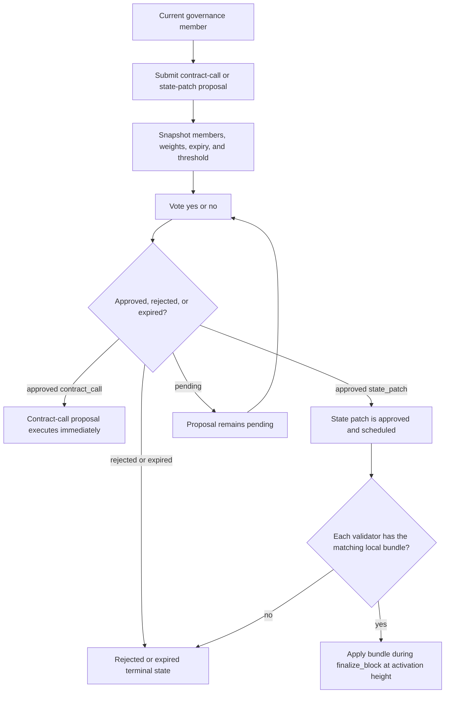

# Protocol Governance & State Patches

Xian treats forward state patching as the primary remediation path for protocol
mistakes that do not require rewriting finalized history.

The current model has two parts:

- on-chain approval through the canonical `governance` contract
- local validator possession of the exact approved patch bundle

That split is deliberate. Governance decides what should happen and when it
should activate. Validators still need the exact bundle locally so every node
applies the same deterministic state change at the same block.

## Current Canonical Contract

The maintained contract source is `xian-configs/contracts/governance.s.py`.

It currently supports two proposal kinds:

- `state_patch`
- `contract_call`

The contract is parameterized by:

| Key | Default / bundled value |
| --- | --- |
| `approval_threshold_numerator` | `4` |
| `approval_threshold_denominator` | `5` |
| `proposal_expiry_days` | `7` |
| `min_patch_delay_blocks` | `20` |
| `emergency_threshold_numerator` | `1` |
| `emergency_threshold_denominator` | `1` |
| `emergency_patch_delay_blocks` | `5` |

`contracts_testnet.json` pins those values explicitly. The maintained local and
devnet bundles currently rely on the same contract defaults.

## Membership and Voting Weight

The governance contract does not own its own member list. It imports a
membership contract through `membership_contract_name`.

On current canonical networks, that contract is `masternodes`.

Governance uses:

- `get_members()` for the member snapshot
- `is_member(account)` to authorize proposals
- `member_weight(account)` and `total_member_weight()` when the membership
  contract exports weighted voting helpers

That means current protocol governance is effectively validator governance, and
active validator power can become protocol-governance weight.

## Proposal Lifecycle

All proposals follow this flow:

1. A current member submits either `propose_contract_call(...)` or
   `propose_state_patch(...)`.
2. Governance snapshots the current member list and per-member weight.
3. Governance stores:
   - proposer
   - kind
   - summary
   - creation time
   - expiry time
   - required yes count
   - required yes weight
4. The proposer automatically casts the first `yes` vote.
5. Each later `vote(proposal_id, support)` updates the proposal and may
   finalize it immediately.



Important current behavior:

- thresholds are snapshotted when the proposal is created
- voting weights are snapshotted when the proposal is created
- a member added later cannot vote on an already-open proposal
- a weight change after proposal creation does not change the open proposal's
  required threshold

## Approval and Rejection Rules

Approval is weight-driven first.

A proposal is approved as soon as:

- `yes_weight >= required_yes_weight`

Early rejection can also happen before expiry:

- if the remaining uncast weight can no longer reach the required yes weight
- if `no_votes > member_count_snapshot - required_yes_votes`

If neither side finalizes early, the proposal stays pending until:

- it reaches the approval threshold, or
- `expire_proposal(proposal_id)` is called after `expires_at`

Proposal statuses currently used are:

- `pending`
- `approved`
- `executed`
- `rejected`
- `expired`

## Contract Call Proposals

`propose_contract_call(...)` stores:

- `target_contract`
- `target_function`
- `kwargs`
- optional `summary`

On approval, governance immediately executes:

```python
importlib.call(target_contract, target_function, kwargs)
```

So contract-call governance is synchronous at approval time. There is no later
activation height or delayed execution stage.

Practical consequence:

- `contract_call` proposals move from `pending` straight to `executed` once the
  threshold is met

## State Patch Proposals

`propose_state_patch(...)` stores:

- `patch_id`
- `bundle_hash`
- `activation_height`
- optional `summary`
- optional `uri`
- `emergency` flag

Additional rules:

- `patch_id` must be unique
- `bundle_hash` is required
- `activation_height` must be in the future
- `activation_height` must satisfy the minimum block delay

Delay rules:

- normal patches use `min_patch_delay_blocks`
- emergency patches use `emergency_patch_delay_blocks`

On approval, governance does not execute the patch immediately. Instead it:

- marks the patch `approved`
- records `approved_at`
- schedules the patch by `(activation_height, patch_id)`

Patch statuses currently used are:

- `proposed`
- `approved`
- `applied`

## Emergency Patches

Emergency patches are still forward patches. They are not historical rewrites.

The emergency flag changes two things:

- the required approval threshold switches to the emergency ratio
- the minimum activation delay switches to the emergency patch delay

In the current bundled configuration, that means:

- emergency approval requires 100% yes weight
- emergency patches may activate after 5 blocks instead of 20

Use the emergency path only when the chain is still live and validators already
have the exact approved bundle locally.

## Local Bundle Directory

Validators load local patch bundles from:

```text
<cometbft-home>/config/state-patches
```

In the maintained stack this is typically:

```text
../xian-stack/.cometbft/config/state-patches
```

The runtime loads this inventory at startup. If a bundle file is malformed, the
node fails fast instead of silently skipping patch execution later.

## Bundle Format

Current bundle shape:

```json
{
  "version": 1,
  "patch_id": "metering-fix-20260327",
  "activation_height": 123456,
  "chain_id": "xian-mainnet-1",
  "summary": "Correct meter output for edge-case branch",
  "uri": "ipfs://...",
  "changes": [
    {
      "key": "con_example.value",
      "value": "patched",
      "comment": "correct stored value"
    }
  ]
}
```

Current runtime rules:

- `patch_id` must be a safe lowercase identifier
- `activation_height` must be positive
- `changes` must be non-empty
- duplicate keys are rejected
- direct `.__code__` writes are rejected
- contract source changes must be supplied as `contract_name.__source__`

When a bundle patches `.__source__`, the runtime derives and applies the
matching canonical `.__code__` artifact automatically.

## Activation Path

At the activation height, the runtime applies every approved scheduled patch
for that block during `finalize_block`.

Validators only apply a patch when:

- the patch is approved on-chain for that height
- the local bundle exists
- the local bundle hash matches the approved `bundle_hash`

Applied patch metadata is written back into governance-managed patch state,
including:

- `applied_at_nanos`
- `applied_block_height`
- `applied_block_hash`
- `execution_hash`

## Query Surfaces

These current ABCI query paths expose the patch pipeline without requiring BDS:

```text
GET /api/abci_query/state_patch_bundles
GET /api/abci_query/scheduled_state_patches/<height>
```

They reflect:

- the node's local bundle inventory
- the node's current on-chain view of approved scheduled patches

When BDS is enabled, historical applied patch data is also indexed through:

```text
GET /api/abci_query/state_patches
GET /api/abci_query/state_patches_for_block/123
GET /api/abci_query/state_patch/<execution_hash>
GET /api/abci_query/state_changes_for_patch/<execution_hash>
```

## Emitted Events

The governance contract currently emits:

- `ProposalSubmitted`
- `ProposalVoted`
- `ProposalApproved`
- `ProposalExecuted`
- `StatePatchScheduled`

Those are the canonical event names for proposal lifecycle indexing.

## Normal Operator Flow

Use this path when the chain is still progressing and the problem can be fixed
forward.

1. Build the patch bundle and distribute the exact file to validators.
2. Verify that validators report the same local `bundle_hash`.
3. Submit `propose_state_patch(...)` with:
   - `patch_id`
   - `bundle_hash`
   - `activation_height`
   - optional `summary`
   - optional `uri`
   - optional `emergency`
4. Reach the required threshold.
5. Wait for the activation block.
6. Let every validator apply the approved local bundle at that height.

This is the preferred remediation path for:

- correcting bad protocol state
- deterministic storage migrations
- replacing deployed contract source deterministically
- fixing logic mistakes after an upgrade while consensus is still live

## What Forward Patching Does Not Solve

Forward patching reduces the need for rollbacks, but it does not solve every
recovery scenario.

If the bug itself breaks consensus progression, on-chain governance may not be
enough because the chain may not advance far enough to approve or activate the
fix.

Typical boundary case:

- a bug introduces nondeterministic execution
- validators diverge during block processing
- the chain stalls or splits before governance can finalize a remedy

In that case, the operator response is still:

1. stop validators from continuing divergent execution
2. agree on the fixed runtime and recovery plan off-chain
3. restart validators on the same deterministic runtime
4. use governed forward patching afterward if the recovered chain state still
   needs correction

For the operator-side JSON recovery plan flow, see
[Recovery Plans](/node/recovery-plans).
