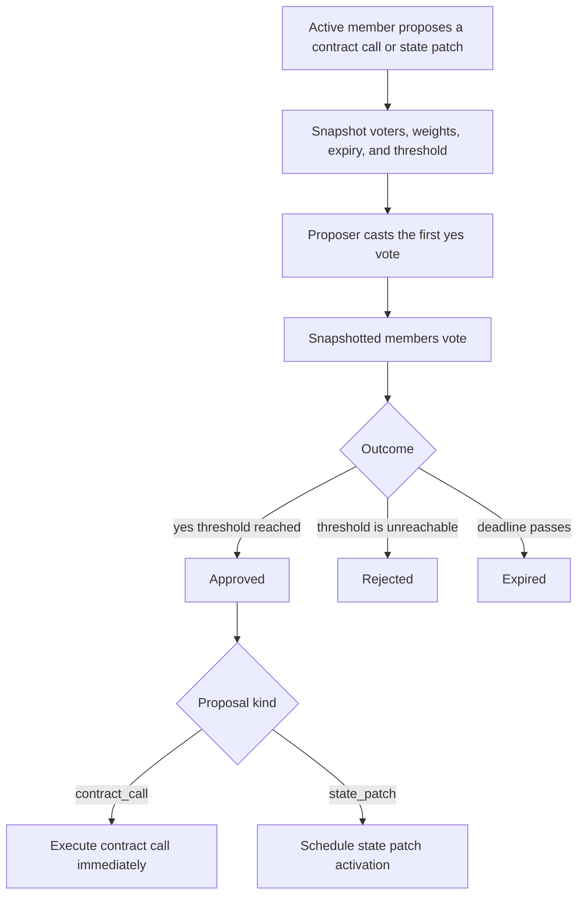

# Protocol Governance and State Patches

The canonical `governance` contract supports two proposal kinds:

- `contract_call`: execute an approved contract call immediately
- `state_patch`: schedule a deterministic forward state patch

Governance decides what may happen. Every validator must also possess the exact
approved patch bundle before its activation height.

## Membership and Thresholds

Governance imports the configured membership contract, normally `validators`,
and snapshots members and voting weights when a proposal is created. Later
membership or power changes do not alter that proposal.

Checked-in local/dev/test bundles use:

| Setting | Value |
| --- | ---: |
| approval threshold | 4/5 weighted power |
| proposal expiry | 7 days |
| normal patch delay | 20 blocks |
| emergency threshold | unanimous weighted power |
| emergency patch delay | 5 blocks |

The draft mainnet rehearsal bundle begins with a one-validator bootstrap
threshold. Accepted launch configuration is authoritative.

## Proposal Lifecycle



Contract calls execute through
`importlib.call(target_contract, target_function, kwargs)`.

## State Patch Proposal

A patch proposal identifies:

- unique `patch_id`
- exact `bundle_hash`
- future `activation_height`
- summary and optional URI
- whether emergency threshold/delay applies

Approval schedules the patch; it does not apply it immediately.

## Local Bundle

Place bundles in:

```text
<cometbft-home>/config/state-patches/
```

Minimal shape:

```json
{
  "version": 1,
  "patch_id": "metering_fix_1",
  "activation_height": 123456,
  "chain_id": "xian-local-1",
  "summary": "Correct deterministic state",
  "changes": [
    {"key": "con_example.value", "value": "patched"}
  ]
}
```

Bundle validation rejects unsafe IDs, non-positive heights, empty changes,
duplicate keys, and direct writes to derived VM artifacts. To replace contract
code, patch `contract_name.__source__`; the runtime derives canonical
`__xian_ir_v1__`.

## Activation

During `finalize_block` at the activation height, the runtime applies a patch
only when:

- governance approved it for that height
- the local bundle exists
- the local bundle hash matches the approved hash

A validator missing the exact bundle fails closed at activation. Distribute and
verify bundles on every validator before the vote reaches approval.

After application, governance records the block, time, block hash, and
execution hash. BDS can index the applied changes for historical inspection.

## Operator Procedure

1. Build and independently review the patch.
2. Verify its chain ID, activation height, changes, and hash.
3. Distribute the same file to every validator.
4. Confirm local inventories report the same hash.
5. Submit and vote on the proposal.
6. Monitor the activation block and compare app hashes across validators.
7. Archive the proposal, bundle, hash, transaction, and application evidence.

Use emergency mode only when the chain is progressing and validators already
have the bundle. It shortens the delay but remains a forward patch; it does not
rewrite finalized history.

## When Governance Is Not Enough

If the chain cannot finalize or validators disagree on app hash, an on-chain
proposal may be unable to complete. Stop divergent execution, agree on trusted
state and runtime off-chain, and use a reviewed [Recovery Plan](/node/recovery-plans).
Apply a governed forward patch after recovery if state correction is still
needed.

## Query Paths

```text
/state_patch_bundles
/scheduled_state_patches/<height>
/state_patches/limit=50/offset=0
/state_patch/<execution_hash>
/state_changes_for_patch/<execution_hash>
```

The first two are direct node queries. Historical applied-patch paths require
BDS.
