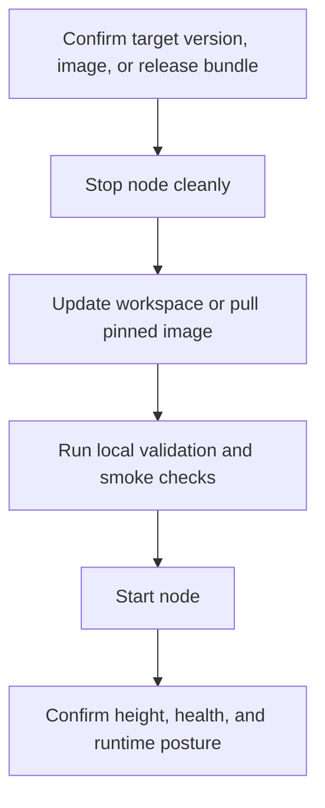

# Upgrading

Xian upgrades should preserve runtime alignment across the validator set. The
details vary slightly by execution engine, but the operator goal is always the
same: move validators onto the same supported runtime without introducing
application divergence.

## Safe Upgrade Sequence

1. confirm the target version, image, or release bundle the network intends to
   run
2. stop the node cleanly
3. update the workspace or pull the pinned immutable image
4. validate the runtime locally
5. start the node again and confirm status, height, and runtime health



Example sibling-workspace flow:

```bash
cd ~/xian/xian-stack
make validate
make smoke-cli

cd ../xian-cli
uv run xian node stop validator-1
uv run xian node start validator-1
uv run xian node status validator-1
uv run xian node health validator-1
```

## What Must Stay Aligned

Always keep aligned:

- `xian-abci` and `xian-contracting`
- canonical network manifests and pinned release images, when the network uses
  them
- the execution engine selected by the network

For tracer-backed networks, also keep aligned:

- tracer mode
- supported CPython minor version

For `xian_vm_v1`, also keep aligned:

- native runtime support for the selected `bytecode_version`
- native runtime support for the selected `gas_schedule`
- native authority posture

## Preflight Checks

Before upgrading a validator fleet, use the maintained safety nets:

- `make validate`
- `make smoke`
- `make smoke-cli`
- localnet runs when the change touches execution, networking, or rollout logic

If the target network uses VM-native execution, validate the VM path rather than
assuming tracer-backed behavior is enough.

## Config And State Safety

- keep backups or restorable snapshots before high-risk upgrades
- prefer schema-validated manifest/profile rewrites through `xian-cli`
- avoid hand-editing canonical manifests on live validators
- keep governed state-patch bundles separate from normal upgrade artifacts

## After Restart

After the node comes back:

- confirm it is healthy and not stuck
- confirm it is on the expected height and chain
- confirm the runtime posture matches the intended execution engine
- confirm any optional service-node components recover cleanly if they are part
  of your deployment
