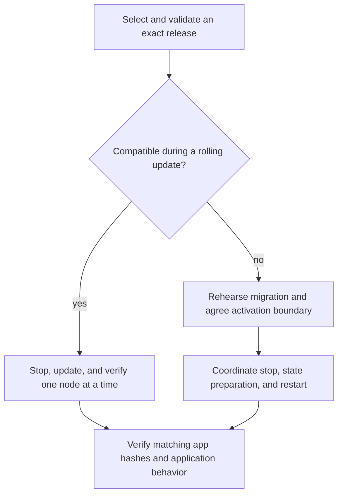

# Upgrading

Choose the upgrade procedure with the network's operators before changing a
validator. A compatible runtime update and a hardfork require different
coordination. This documentation describes the `xian_vm_v1` codebase; an
existing network running an earlier runtime is not automatically compatible.

## Choose the Procedure

| Change | Procedure |
| --- | --- |
| Compatible image or operational update | Validate first, then restart nodes in the agreed maintenance order |
| Compiler, execution, metering, state format, or consensus-rule change | Coordinated network upgrade with an agreed activation boundary |
| Move an earlier network to `xian_vm_v1` | Rehearse contract and state migration before scheduling the cutover |

The `xian-deploy` upgrade playbook rolls hosts one at a time. Use that flow only
when the old and target versions can participate in the same network during
the rollout. It does not coordinate a hardfork activation height.

## Prepare the Release

Use one accepted release bundle for the fleet. Record:

- exact repository revisions and immutable node image digests
- compiler, VM, runtime-types, and CometBFT versions
- network manifest, genesis, and effective shared configuration
- the expected state at the transition and the restart procedure

The `xian_vm_v1` name alone is not a compatibility guarantee: two releases can
use that name while differing in compiler output, VM behavior, or metering.
Fee mode and free-metered transaction/block caps must also agree across nodes.

Validate the exact release before the maintenance window:

```bash
cd ~/xian/xian-stack
make validate
make smoke-cli
```

Use [5-Validator Localnet E2E](/node/localnet-e2e) and its release gate when
execution or network behavior changes. A test against current workspace
checkouts does not validate different revisions pinned in a release manifest.

## Compatible Runtime Update

1. Confirm that mixed versions are supported during the rollout.
2. Validate the target release and prepare backups before stopping a node.
3. Stop the node cleanly and capture its committed height and application hash.
4. Select the accepted image and matching profile/configuration.
5. Start the node and verify chain identity, catch-up, and runtime versions.
6. Continue with the next validator only after the current node is healthy.


```mermaid
flowchart TD
  Target["Select and validate an exact release"]
  Kind{"Compatible during a rolling update?"}
  Rolling["Stop, update, and verify one node at a time"]
  Rehearse["Rehearse migration and agree activation boundary"]
  Cutover["Coordinate stop, state preparation, and restart"]
  Verify["Verify matching app hashes and application behavior"]

  Target --> Kind
  Kind -->|yes| Rolling --> Verify
  Kind -->|no| Rehearse --> Cutover --> Verify
```

The lifecycle commands are:

```bash
xian node stop validator-1
# Select the agreed release image and configuration before restarting.
xian node start validator-1
xian node status validator-1
xian node health validator-1
```

## Migrating an Earlier Network

`xian_vm_v1` executes persisted canonical IR in `__xian_ir_v1__`. Stored source
alone is not an executable contract on this runtime, and startup does not
compile an earlier network's source-only contracts automatically.

Before scheduling a migration:

1. Inventory deployed contracts and their dependencies from a representative
   export of the existing network.
2. Compile every contract with the target compiler. Resolve unsupported syntax
   and check expected contract behavior on the target VM.
3. Prepare a deterministic state conversion that preserves the agreed balances,
   nonces, ownership, contract storage, validator state, and pending governance
   actions. Populate the target contract artifacts as part of that conversion.
4. Compare independent migration outputs and record the expected application
   hash. Re-run the conversion from the same input to verify repeatability.
5. Start a multi-validator rehearsal from the converted state. Exercise actual
   application flows, restart, snapshot restore, and indexed-history recovery.
6. Agree the stop boundary, which state is authoritative, and the conditions for
   restarting or aborting before executing the production procedure.

Do not redeploy all contracts through ordinary submission as a substitute for
state migration: submission runs constructors and initializes contract state.
The generic snapshot/import helpers restore their supported data formats;
they do not decide how an earlier runtime's contract state should be converted.

The draft mainnet manifest is a launch/rehearsal asset. It is not a migration
plan for an existing network. The network's accepted plan must explicitly
resolve chain identity, retained history, and the transition height.

## Backups and Recovery

Preserve a recoverable set of node configuration, validator signing state,
CometBFT data, and Xian application state at the agreed boundary. BDS history
requires its own database backup or a verified archival source for rebuilding.
An application-state snapshot alone is not a full node-home backup.

Rehearse restoring the artifacts on an isolated node before relying on them.
After the target runtime has committed blocks, switching the image back is not
by itself a rollback procedure. Use an agreed [Recovery Plan](/node/recovery-plans)
if coordinated restoration is required.

## Verify the Transition

Check more than container health:

- expected chain identity, height progression, and runtime versions
- matching `app_hash` values from multiple validators at the same height
- representative transfers, contract calls, events, and governance queries
- validator participation and peer connectivity
- BDS indexed height and recovery of optional services

Application state at height `H` is represented by the `app_hash` in block
`H + 1`. Compare hashes at matching heights rather than comparing each node's
latest response while the chain is advancing.
