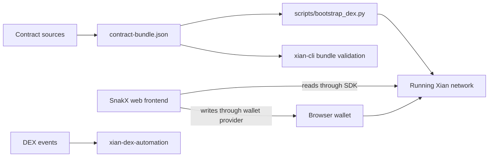

# Xian DEX

`xian-dex` owns the DEX product: the canonical AMM contracts, the SnakX web
frontend, and the hash-pinned contract bundle that downstream consumers
deploy and verify against.

Contracts and frontend ship together as one tightly-coupled system.
Operator automation that watches DEX events and reacts to them lives in
[`xian-dex-automation`](/tools/xian-dex-automation), not in the product repo.

- Owning repo: `xian-dex`
- Contract bundle: `xian-dex/contract-bundle.json`
- Bootstrap script: `xian-dex/scripts/bootstrap_dex.py`
- Web app: SnakX (`xian-dex/web/`)
- Companion service: [`xian-dex-automation`](/tools/xian-dex-automation)

## Lifecycle

- Install phase: post-genesis
- Included in genesis: no
- Shipped with node image: no
- Installer: `xian-dex/scripts/bootstrap_dex.py`



## On-Chain Contracts

The bundle deploys four contracts in a pinned order:

| Contract | Role |
|----------|------|
| `con_pairs` | pair factory, reserve bookkeeping, and LP mint/burn (total-supply) logic |
| `con_dex` | router-style liquidity and swap entrypoints |
| `con_dex_helper` | convenience helper around the router for single-pair buy/sell flows |
| `con_lp_token` | XSC-0001-compatible LP token template; each pair binds its own instance, which holds the per-account LP balances and approvals |

Behavior worth knowing before integrating:

- Pair balance crediting is router-driven; unsolicited token transfers into
  `con_pairs` are not attributed to any pair.
- The standard swap fee path is 30 bps. Router-owner-approved signers can be
  flagged with `set_zero_fee_trader(...)` for zero-fee routing through the
  router; direct pair swaps stay on the standard fee path.
- Every pair binds an XSC-0001 LP token contract. The factory owner registers
  the canonical LP token with `registerLpToken(tokenA, tokenB, lpToken)` before
  the pair exists. `createPair(tokenA, tokenB)` and router auto-creation during
  `addLiquidity` use the registered token; an optional `lpToken` argument is
  accepted only when it matches that registration.
- An account's LP balance and allowances live in that pair's bound
  `con_lp_token` instance — read `<lpToken>.balances` / `<lpToken>.approvals`,
  not `con_pairs`. To remove liquidity, approve the router (`con_dex`) on the LP
  token (`<lpToken>.approve(amount, to="con_dex")`) and then call
  `removeLiquidity(...)`. Resolve the per-pair LP token from
  `con_pairs.pairs[pair_id, "lpToken"]` (or `con_pairs.lpTokenFor(pair_id)`).
- Fee-on-transfer tokens must be flagged with
  `set_fee_on_transfer_token(...)`; plain swap routes reject flagged tokens
  and require the supporting-fee router path instead.
- Tokens exposing `get_metadata().precision` route with precision-aware
  amount normalization.
- `con_dex_helper` requires an explicit absolute `deadline` value.

## SnakX Web Frontend

The SnakX frontend (`web/`, Vite + React + TypeScript) talks to the canonical
contract names through `@xian-tech/client` for reads and the injected browser
wallet provider for writes:

| Route | Purpose |
|-------|---------|
| `/swap` | quote and execute swaps with live price impact, slippage, deadline, and approval handling |
| `/pools` | searchable, sortable list of every pair with reserves and mid-prices |
| `/pools/:id` | pair detail: live candlestick chart (1m–1W, built on the node's `/dex_candles` BDS endpoint), reserves, prices, LP balance, and pool share |
| `/liquidity` | add/remove liquidity, new-pair creation, router and LP-token approvals |
| `/portfolio` | all token balances plus every LP position |

```bash
cd xian-dex/web
npm install
npm run dev
```

## Installing The DEX

Products are installed from their owning repo after a chain exists. Validate
the hash-pinned bundle with the generic `xian-cli` helper, then run the
repo-owned bootstrap against a healthy node:

```bash
uv run --project ../xian-cli xian contract bundle validate contract-bundle.json
XIAN_NODE_URL=http://127.0.0.1:26657 \
XIAN_WALLET_PRIVATE_KEY="$XIAN_PRIVATE_KEY" \
  uv run python scripts/bootstrap_dex.py --recipe local-demo
```

The `core` recipe deploys only the DEX contracts; `local-demo` also seeds a
demo token and liquidity for local testing. For a stack-managed localnet, see
[Local DEX Bootstrap](/node/local-dex-bootstrap).

## Reading DEX State From SDKs

```python
from xian_py import Xian

with Xian("http://127.0.0.1:26657") as client:
    pair = client.contract("con_pairs").call(
        "pairFor", tokenA="currency", tokenB="demo_token",
    )
    quote = client.contract("con_dex").call(
        "getAmountsOut", amountIn=10, src="currency", path=[pair],
    )
```

```ts
import { XianClient } from "@xian-tech/client";

const client = new XianClient({ rpcUrl: "http://127.0.0.1:26657" });
const pair = await client.contract("con_pairs").call("pairFor", {
  tokenA: "currency",
  tokenB: "demo_token",
});
```

## Status

`candidate`. Contracts are usable and covered by package-local tests, but
still deserve deeper hardening before being treated as a polished production
drop-in.

## Related Pages

- [Products overview](/products/)
- [xian-dex-automation](/tools/xian-dex-automation)
- [Local DEX Bootstrap](/node/local-dex-bootstrap)
