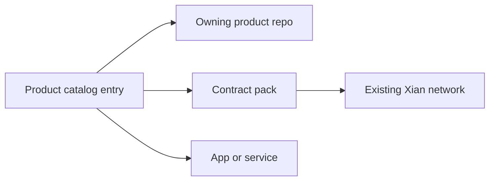

# Products

Products are optional Xian application or protocol surfaces installed after a
chain exists. They are not genesis contracts and are not copied into node
images.

Each product has one owning repo. The product repo owns active development,
tests, apps, services, and bootstrap scripts. `xian-configs/products/<name>`
records the product boundary and links to pinned contract packs, examples, and
runtime components.

Use:

```bash
cd ~/xian/xian-cli
uv run xian product list
uv run xian product show dex
```

## Available Products

- [Xian DEX](/products/dex)
- [Stable Protocol](/products/stable-protocol)
- [Xian NFT](/products/nft)

## Relation To Contract Packs

A product is the full repo-owned surface. A contract pack is the installable
on-chain payload for that product.


