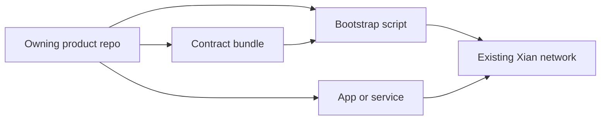

# Products

Products are optional Xian application or protocol surfaces installed after a
chain exists. They are not genesis contracts and are not copied into node
images.

Each product has exactly one owning repo. The product repo owns active
development, tests, apps, services, contract bundles, and bootstrap scripts.

::: info Product ownership
`xian-configs` owns system-level network assets: manifests, genesis, templates,
and canonical system contracts. Product repos own their deployable app or
protocol surfaces, while `xian-cli` provides generic contract helpers. Install
every product from its owning repo as shown below.
:::

## Available Products

| Product | Owning repo | On-chain contracts | App / service |
|---------|------------|--------------------|----------------|
| [Xian DEX](/products/dex) | `xian-dex` | `con_pairs`, `con_dex`, `con_dex_helper`, `con_lp_token` | SnakX web frontend; [`xian-dex-automation`](/tools/xian-dex-automation) companion service |
| [Stable Protocol](/products/stable-protocol) | `xian-stable-protocol` | `con_stable_token`, `con_oracle`, `con_savings`, `con_vaults`, `con_psm` | bootstrap + governance handoff flows |
| [Xian NFT](/products/nft) | `xian-nft` | `con_xsc005`, `con_xsc005_nft` | PixelSnek marketplace |

## Installing A Product

The pattern is the same for every product: validate the repo-owned
hash-pinned bundle with the generic `xian-cli` helper, then run the product
repo's bootstrap script against a healthy network.

```bash
uv run --project ../xian-cli xian contract bundle validate ../xian-dex/contract-bundle.json
cd ../xian-dex
uv run python scripts/bootstrap_dex.py --recipe local-demo
```

## Relation To Product Bundles

A product is the full repo-owned surface. The repo-owned contract bundle is the
hash-pinned on-chain payload for that product: it pins source hashes, contract
roles, deployment order, and default chi budgets.



## Products vs. Tools vs. System Contracts

- **System contracts** (`currency`, `governance`, `rewards`, …) are part of
  canonical network state, defined in `xian-configs`, and exist from genesis.
- **Products** are optional on-chain surfaces with their own apps, installed
  post-genesis from their owning repos.
- **[Tools & SDKs](/tools/)** (`xian-cli`, `xian-py`, `xian-js`, wallets, …)
  do not own on-chain state; they operate networks and build against them.
