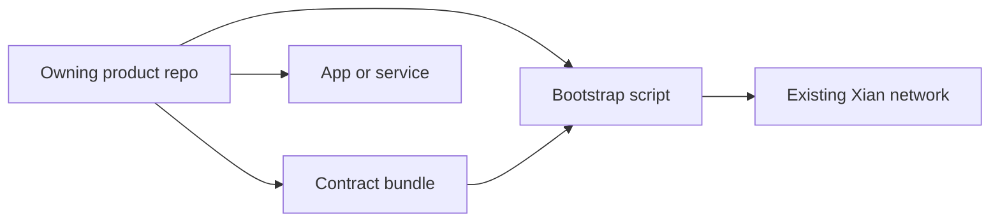

# Products

Products are optional Xian application or protocol surfaces installed after a
chain exists. They are not genesis contracts and are not copied into node
images.

Each product has one owning repo. The product repo owns active development,
tests, apps, services, contract bundles, and bootstrap scripts. `xian-configs`
does not catalog products; it stays focused on network-level setup.

Use the product repo plus generic `xian-cli` contract helpers:

```bash
uv run --project ../xian-cli xian contract bundle validate ../xian-dex/contract-bundle.json
cd ../xian-dex
uv run python scripts/bootstrap_dex.py --recipe local-demo
```

## Available Products

- [Xian DEX](/products/dex)
- [Stable Protocol](/products/stable-protocol)
- [Xian NFT](/products/nft)

## Relation To Product Bundles

A product is the full repo-owned surface. The repo-owned contract bundle is the
hash-pinned on-chain payload for that product.


