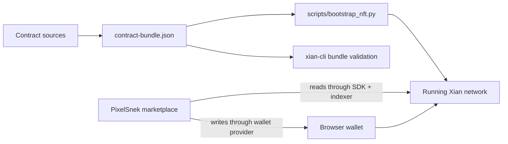

# Xian NFT

`xian-nft` owns the NFT product: the XSC-0005 checker and reference
collection contracts, the PixelSnek marketplace web app, and the bootstrap
tooling for installing the product after a Xian chain exists.

- Owning repo: `xian-nft`
- Contract bundle: `xian-nft/contract-bundle.json`
- Bootstrap script: `xian-nft/scripts/bootstrap_nft.py`
- Web app: PixelSnek marketplace

## Lifecycle

- Install phase: post-genesis
- Included in genesis: no
- Shipped with node image: no
- Installer: `xian-nft/scripts/bootstrap_nft.py`



## On-Chain Contracts

| Contract | Role |
|----------|------|
| `con_xsc005` | XSC-0005 interface checker exposed through `is_XSC005` |
| `con_xsc005_nft` | reference collection and marketplace contract: minting, listing, buying, royalties, approvals, likes, ownership proofs, chunked content, and PixelGrid support |

The reference collection implements the full
[XSC-0005 standard](/smart-contracts/standards/xsc-0005), including the
PixelGrid extension for fully on-chain pixel art with palettes and animation
frames. Its marketplace accepts only the seeded chain `currency` contract for
settlement; listings that name arbitrary interface-compatible contracts fail
closed before any purchase can occur.

## PixelSnek Marketplace

The marketplace (Vite + React + TypeScript + Tailwind + daisyUI) covers the
full XSC-0005 surface:

- explore page with hot listings, featured collections, and live activity
- collection browsing, registration of any XSC-0005 collection by contract
  address, and auto-discovery of new collections via indexer events
- token detail with buy, list, cancel, transfer, burn, like, and
  prove-ownership actions; list and buy settle in native XIAN (`currency`)
- minting into any collection you operate, including an in-browser
  pixel-grid editor with palette and animation-frame support
- per-token and collection-wide approval management
- profiles, global activity feed, and operator tools for collection metadata

```bash
cd xian-nft
npm install
npm run dev   # http://localhost:5180
```

The app reads through `@xian-tech/client` plus the node's indexer endpoints
and writes through the injected browser wallet provider. When the configured
node does not expose the indexer surface, the app shows an indexer-down
banner and degrades gracefully.

## Installing The NFT Product

Validate the hash-pinned bundle with the generic `xian-cli` helper, then run
the repo-owned bootstrap against a healthy node:

```bash
uv run --project ../xian-cli xian contract bundle validate contract-bundle.json
uv run --group deploy python scripts/bootstrap_nft.py
```

## Related Pages

- [Products overview](/products/)
- [XSC-0005: Non-Fungible Token](/smart-contracts/standards/xsc-0005)
