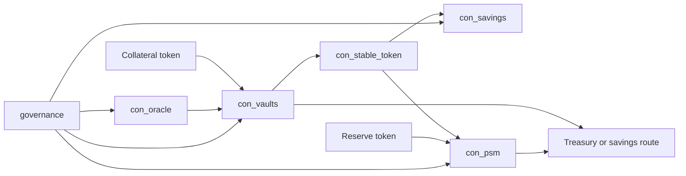

# Stable Protocol

`xian-stable-protocol` owns the overcollateralized stable-vault product: an
on-chain CDP-style stablecoin with a savings vault, a peg-stability module,
a governed oracle, and an executable bootstrap path that wires the system
together.

- Owning repo: `xian-stable-protocol`
- Contract bundle: `xian-stable-protocol/contract-bundle.json`
- Bootstrap script: `xian-stable-protocol/scripts/bootstrap_protocol.py`

## Lifecycle

- Install phase: post-genesis
- Included in genesis: no
- Shipped with node image: no
- Installer: `xian-stable-protocol/scripts/bootstrap_protocol.py`

## Protocol Shape



## On-Chain Contracts

| Contract | Role |
|----------|------|
| `con_stable_token` | controller-minted fungible stable asset |
| `con_oracle` | governed multi-reporter oracle with freshness and quorum controls |
| `con_savings` | share-based savings vault whose share price increases when fees are routed in |
| `con_vaults` | CDP engine: vault types, borrowing, debt-share accrual, partial liquidation, auctions, and bad-debt handling |
| `con_psm` | peg-stability module that mints and redeems against reserve assets with configurable fees |

Design highlights:

- overcollateralized vaults mint the stable asset; vault debt accrues a
  stability fee through per-type rate accumulators and debt shares
- liquidation supports partial cure, auction cancellation, and owner cure;
  auction settlement records bad debt honestly when collateral cannot cover
  system debt
- a surplus buffer and recapitalization path keep protocol losses explicit
- governance changes are explicit and delayed, executed through Xian's
  `validators` and `governance` contracts after handoff

## Installing The Protocol

Validate the hash-pinned bundle with the generic `xian-cli` helper, then run
the repo-owned bootstrap against a healthy node:

```bash
uv run --project ../xian-cli xian contract bundle validate contract-bundle.json
uv run python scripts/bootstrap_protocol.py --skip-sample-tokens
```

The bootstrap deploys any missing protocol contracts, enables `con_vaults`
and `con_psm` as stable-token controllers, configures oracle reporters and an
initial price feed, sets fee-routing addresses, seeds a default vault type
when none exists, and starts governance handoff by default. The operator
wallet must match the configured initial governor during bootstrap.

### Required Wiring

The protocol is not correctly wired unless fee destinations are configured:

```python
con_stable_token.set_controller(account='con_vaults', enabled=True)
con_stable_token.set_controller(account='con_psm',    enabled=True)

con_vaults.set_savings_contract(target_contract='con_savings')
con_vaults.set_treasury_address(address='treasury')
con_psm.set_treasury_address(address='treasury')
```

Without these, fees fall back to the configured governor — valid contract
behavior, but not the intended production setup.

### Governance Handoff

Bootstrap *starts* the transfer to the chain `governance` contract.
Acceptance happens through ordinary governance proposals that call
`accept_governance()` on each protocol contract. If handoff was skipped for
local testing (`--no-start-governance-handoff`), start it later by re-running
the bootstrap script.

## Status

Strong reference implementation with a real Xian-stack bootstrap path. It is
not a fully automated production protocol. Production hardening work is
tracked in the repo's `docs/ROADMAP.md`.

## Related Pages

- [Products overview](/products/)
- [Protocol Governance & State Patches](/node/protocol-governance)
