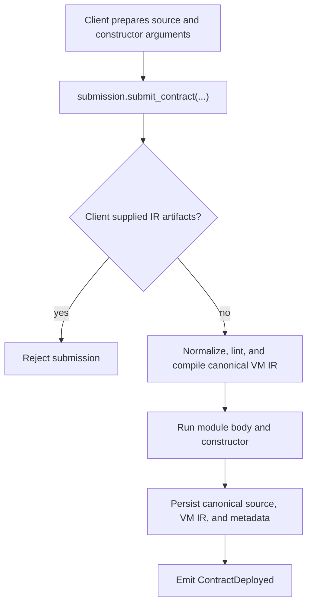

# Contract Submission Internals

Contract deployment in Xian is an ordinary on-chain action routed through the
built-in `submission` contract.

## High-Level Flow

## Source Submission

Xian deployments are source-backed.

`xian_vm_v1` requires submitted source for native deployment. Validators derive
the stored VM IR with the canonical Rust compiler and reject submitted
`deployment_artifacts`.

## Important Constraints

- user contracts must use the `con_` prefix
- contract names must use lowercase ASCII letters, digits, and underscores
- imports resolve to deployed contracts, not Python packages
- constructor args are supplied as a dictionary
- source must pass the linter
- source is compiled by the authoritative Rust compiler on every validator
- compiler admission allows at most 128 KiB source, 50,000 syntax nodes,
  nesting depth 64, 100,000 tokens total, and 4,096 tokens per logical line
- child deployments use the same submission surface

## What Gets Stored

Every deployed contract stores metadata such as:

- `__source__`
- `__owner__`
- `__developer__`
- `__deployer__`
- `__initiator__`
- `__submitted__`

For execution artifacts:

- `__xian_ir_v1__` is the persisted VM IR for `xian_vm_v1`

`__source__` is the human-facing canonical source. It is normalized before
storage.

## Deployment Context

During child module-body execution and `@construct`, the child sees:

- `ctx.this = <child contract>`
- `ctx.caller = <immediate deployer>`
- `ctx.signer = <original external signer>`
- `ctx.owner = <final owner>`
- `ctx.entry = <outer transaction entrypoint>`
- `ctx.submission_name = <child contract>`

That is true for direct deployment and for factory-style child deployment.

## Metering Notes

Deployment is metered too. The cost is not only the final state writes.

Deployment accounting includes:

- submission analysis, source normalization, and VM compilation work
- stored source and VM IR size
- metadata writes
- constructor execution

This is why contract deployment is materially more expensive than a trivial
state update.

## Why Submission Is Security-Sensitive

Submission defines the long-lived executable identity behind a contract name.

That is why the submission path participates in:

- lint enforcement
- canonical source and VM IR generation and validation
- contract metadata ownership and developer attribution

The same contract also owns the narrow metadata mutation surface for:

- `submission.change_developer(...)`
- `submission.change_owner(...)`

Ordinary contracts do not get a generic low-level metadata mutation escape
hatch. Runtime owner and developer changes are intentionally routed through the
built-in `submission` contract path.
