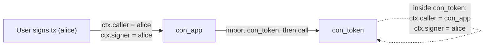

# Imports Overview

Contracts can depend on other deployed contracts.

## Two Patterns

- static import: `import currency`
- dynamic import: `importlib.import_module("con_example")`
- dynamic function call: `importlib.call("con_example", "transfer", {"amount": 10, "to": "bob"})`
- dynamic probes: `importlib.exists("con_example")`, `importlib.has_export("con_example", "transfer")`
- flexible targets: `importlib.owner_of(...)` and `importlib.enforce_interface(...)` accept either a contract name string or an imported contract module
- contract metadata: `importlib.contract_info(...)` returns canonical runtime metadata for a deployed contract
- code verification: `importlib.code_hash(...)` returns the canonical SHA3-256 hash of stored contract source or the stored Xian VM IR artifact

## How A Cross-Contract Call Behaves

When contract A calls into contract B, the runtime keeps the original signer
stable while moving the immediate caller along the call chain:

That is why token contracts check `ctx.caller`: when another contract calls
`transfer`, the spender is the calling contract, not the human signer. See
[Context Variables](/smart-contracts/context) for the full rules.

## Important Restriction

This is contract import resolution, not Python package importing. Imports are
resolved against deployed contracts in state.

## Related Tools

- `importlib.import_module(...)`
- `importlib.exists(...)`
- `importlib.has_export(...)`
- `importlib.call(...)`
- `importlib.enforce_interface(...)`
- `importlib.owner_of(...)`
- `importlib.contract_info(...)`
- `importlib.code_hash(...)`
