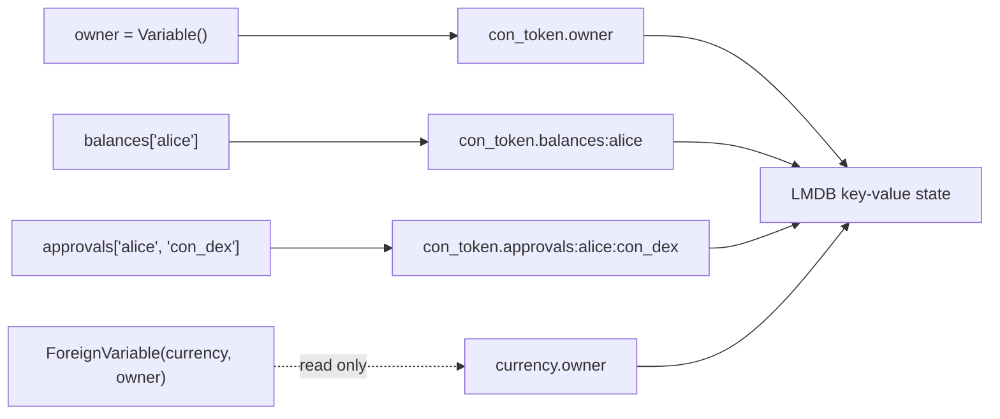

# Storage Overview

Xian contract state is exposed through four ORM-style primitives:

- `Variable`
- `Hash`
- `ForeignVariable`
- `ForeignHash`

All of them ultimately map to deterministic key-value storage in LMDB.

Every declaration resolves to flat keys of the form
`contract.variable` or `contract.variable:key1:key2:...`, which is also the
shape you use when reading state through `/get/<state-key>`.

## What to Use

| Primitive | Use |
|-----------|-----|
| `Variable` | one stored value |
| `Hash` | keyed or multi-dimensional data |
| `ForeignVariable` | read another contract's variable |
| `ForeignHash` | read another contract's hash |

## Key Facts

- `Variable` uses `.set()` and `.get()`, and also supports top-level dict/list
  helpers for mutable values
- `Hash` uses index syntax like `balances["alice"]`
- hash keys can be multi-dimensional
- foreign storage is read-only by design
- values are encoded deterministically for consensus safety

Use the pages in this section for the exact behavior of each primitive.
