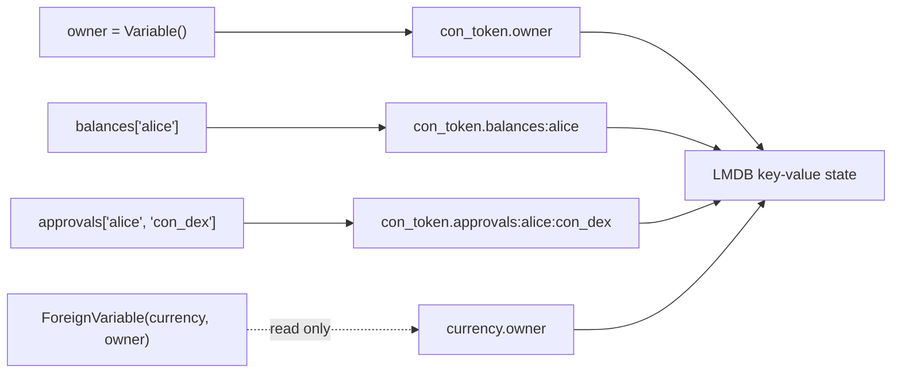

# Storage Overview

Xian contract state is exposed through four ORM-style primitives:

- `Variable`
- `Hash`
- `ForeignVariable`
- `ForeignHash`

All of them ultimately map to deterministic key-value storage in LMDB.


```mermaid
flowchart LR
  V["owner = Variable()"] --> KV1["con_token.owner"]
  H1["balances['alice']"] --> KV2["con_token.balances:alice"]
  H2["approvals['alice', 'con_dex']"] --> KV3["con_token.approvals:alice:con_dex"]
  FV["ForeignVariable(currency, owner)"] -.read only.-> KV4["currency.owner"]
  KV1 --> LMDB["LMDB key-value state"]
  KV2 --> LMDB
  KV3 --> LMDB
  KV4 --> LMDB
```

Every declaration resolves to flat keys of the form
`contract.variable` or `contract.variable:key1:key2:...`, which is also the
shape you use when reading state through `/get/<state-key>`.

## What to Use

| Primitive | Use |
|-----------|-----|
| `Variable` | one stored value |
| `Hash` | keyed or multi-dimensional data |
| `ForeignVariable` | read another contract's variable |
| `ForeignHash` | read another contract's hash |

## Key Facts

- `Variable` uses `.set()` and `.get()`, and also supports top-level dict/list
  helpers for mutable values
- `Hash` uses index syntax like `balances["alice"]`
- hash keys can be multi-dimensional
- foreign storage is read-only by design
- values are encoded deterministically for consensus safety

Use the pages in this section for the exact behavior of each primitive.

## Dynamic foreign reads

Create a foreign reference inside a function when its target is known only at
call time. The native VM supports hash indexing, hash `.all(*prefix)` scans,
and variable `.get()` reads:

```python
@export
def standard_of(contract: str):
    metadata = ForeignHash(foreign_contract=contract, foreign_name="metadata")
    return metadata["standard"]
```

Use `foreign_contract` and `foreign_name` keyword arguments. Each target must be
one ASCII identifier (letters, digits, underscores; no leading digit), not a
composed state key. Missing values return `None`. References are local values;
they cannot be stored on-chain or passed through external contract calls.
Aliases retain their target, and each read observes current transaction state.

Foreign references remain read-only: assignment, clearing, cloning into them,
and mutating helpers are rejected. A fetched list or dictionary is a copy;
changing a local copy does not change the foreign state. Reads and scans incur
the VM's normal storage operation and byte charges and obey the transaction's
chi budget.
