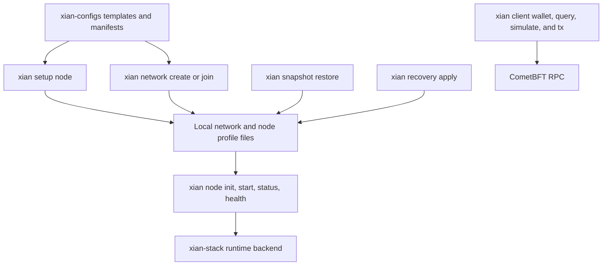

# xian-cli

`xian-cli` is the command-line control plane for Xian. It has two distinct
roles:

- operator workflows such as node setup, network manifests, profile handling,
  health checks, snapshots, contract bundle validation, and recovery
- client automation through `xian client ...`, backed directly by `xian-py`

If you are writing Python application code, use [`xian-py`](/tools/xian-py).
If you are writing shell scripts, CI jobs, or one-off operational commands,
use `xian-cli`.

## Installation

Published package:

```bash
uv tool install xian-tech-cli
xian --help
```

The installed command is `xian`.

## Command Layout

Top-level namespaces:

- `xian keys ...`
- `xian setup ...`
- `xian network ...`
- `xian node ...`
- `xian snapshot ...`
- `xian recovery ...`
- `xian doctor ...`
- `xian contract build-artifacts ...`
- `xian contract bundle ...`
- `xian client ...`

The `client` namespace is the JSON-first surface for wallet, query, and
transaction automation.

## Operator Workflows

Use the non-`client` namespaces when you are shaping manifests and profiles or
inspecting a running node.

High-value flows include:

- `xian setup node ...` for a guided local node setup or network join
- `xian network create ...` for local or private network manifests
- `xian network join ...` for generating a local node profile from a canonical
  network manifest
- `xian node init|start|stop|status|health|endpoints ...` for local lifecycle
  and inspection
- `--validator-selection-mode` on local genesis creation when a fresh chain
  should start in `manual`, `auto_top_n`, or `hybrid` validator-selection mode
- `--enable-intentkit` and `--enable-dex-automation` on `network create` /
  `network join` when the node should manage those optional sidecars
- `xian snapshot restore ...` and `xian recovery apply ...` for restore and
  recovery workflows
- `xian contract build-artifacts ...` when you need to inspect `xian_vm_v1`
  artifacts from contract source
- `xian contract bundle validate ...` when you need to verify hash-pinned
  contract bundle sources before bootstrap



`--dry-run` is available on `setup node`, `network create`, `network join`, and
recovery-plan application so you can validate inputs and inspect the planned
artifact paths before anything is written to disk.

## Guided Node Setup

Use `xian setup node` when you want the CLI to ask for the setup path, network,
node name, validator key mode, runtime preset, local validator-selection policy,
and start behavior. The same command also accepts advanced runtime flags such as
`--tx-fee-mode` when you need a non-default network policy:

```bash
uv run xian setup node
```

Use `--plan` to see the generated lower-level commands and paths:

```bash
uv run xian setup node --mode join --network testnet --name validator-1 --plan
```

Use `--yes` for non-interactive setup. Scripted runs do not start the node
unless `--start` is supplied:

```bash
uv run xian setup node --mode join --network testnet --name validator-1 \
  --preset indexed --key-mode existing \
  --validator-key-ref ./keys/validator-1/validator_key_info.json \
  --start --yes
```

The `basic` preset maps to `single-node-dev`; the `indexed` preset maps to
`single-node-indexed` and enables BDS, dashboard, and monitoring. See
[Installation & Setup](/node/installation#guided-node-setup) for the full
wizard reference.

## Local Genesis Validator Selection

`--validator-selection-mode` is a genesis-time setting for fresh local networks.
It seeds the `validators.selection_mode` constructor argument when
`xian network create` renders a local genesis from a contract bundle.

```bash
uv run xian setup node --mode local --network local-dev --name validator-1 \
  --preset basic --key-mode generate \
  --validator-selection-mode hybrid \
  --plan
```

The lower-level command exposes the same setting:

```bash
uv run xian network create local-dev --chain-id xian-local-1 \
  --bootstrap-node validator-1 \
  --generate-validator-key \
  --validator-selection-mode auto_top_n
```

Allowed values are:

| Value | Use |
| --- | --- |
| `manual` | validator admission is controlled directly by governance votes |
| `auto_top_n` | eligible registered validators are ranked by bonded stake during rebalancing |
| `hybrid` | governance approves candidate eligibility, then rebalancing ranks approved candidates by bonded stake |

The flag is intentionally not part of `network join`, and it is rejected with an
external `--genesis-source`. Joined networks already have a canonical genesis.
Existing chains change validator policy through `validators.update_policy`
governance rather than through node-local setup flags.

`xian-cli` is also manifest-aware. When a canonical network manifest includes
pinned node images and release provenance, `network join` carries that posture
into the generated local profile. The broader network-manifest metadata,
including shielded/privacy operator policy, stays available as first-class
manifest data instead of being reduced to ad hoc local flags.

## Node Status And Health

Use `xian node status <name>` for the human-facing runtime summary. It includes
the age of the latest observed block so a stalled node is obvious even when the
RPC is still technically reachable.

Use `xian node health <name>` for machine-readable checks. On profiles with BDS
enabled it surfaces the effective snapshot bootstrap source plus BDS lag, spool,
and database posture.

## When To Use `xian client`

Use `xian client ...` when you need:

- deterministic CLI output for scripts
- wallet generation in local tooling or CI
- direct balance, nonce, block, or receipt queries
- contract calls and simulations from shell automation
- signed transaction submission without writing Python code

Do not use it as a replacement for application SDKs if you are already writing
Python or TypeScript services. In those cases, use `xian-py` or `xian-js`.

## Connection Defaults

Most `xian client` commands accept:

- `--node-url`
- `--chain-id`

Environment fallbacks:

- `XIAN_NODE_URL`
- `XIAN_CHAIN_ID`

Example:

```bash
export XIAN_NODE_URL=http://127.0.0.1:26657
export XIAN_CHAIN_ID=xian-local-1
```

After that, you can omit both flags in most commands.

## Wallet Commands

Generate a new Ed25519 wallet:

```bash
xian client wallet generate
```

Example output:

```json
{
  "address": "0f2b...abcd",
  "public_key": "0f2b...abcd"
}
```

If you explicitly need the private key in output:

```bash
xian client wallet generate --include-private-key
```

Write the private key to a file:

```bash
xian client wallet generate --private-key-out ./wallet.key
```

By default, the private key is not printed.

## Query Commands

Get the next nonce for an account:

```bash
xian client query nonce <address>
```

Get a balance:

```bash
xian client query balance <address>
xian client query balance <address> --contract currency
```

Get a transaction receipt:

```bash
xian client query tx <tx_hash>
```

Get a block:

```bash
xian client query block --height 42
xian client query block --block-hash <hash>
```

All query commands emit JSON and are safe to pipe into tools like `jq`.

## Calls And Simulation

Readonly contract call:

```bash
xian client call currency balance_of \
  --kwargs-json '{"address":"<address>"}'
```

Transaction simulation:

```bash
xian client simulate currency transfer \
  --kwargs-json '{"amount":1,"to":"<recipient>"}'
```

`--kwargs-json` must decode to a JSON object.

## Transaction Submission

The `tx` namespace signs and submits transactions.

Available commands:

- `xian client tx send`
- `xian client tx submit-source`
- `xian client tx transfer`

### Supplying A Private Key

Choose exactly one of:

- `--private-key`
- `--private-key-env`
- `--private-key-file`

Examples:

```bash
xian client tx transfer \
  --private-key-file ./wallet.key \
  <recipient> 1.25
```

```bash
export XIAN_PRIVATE_KEY=<hex>
xian client tx transfer \
  --private-key-env XIAN_PRIVATE_KEY \
  <recipient> 1.25
```

Using environment variables or files is usually better than passing private
keys directly on the command line, because direct flags are easier to expose in
shell history and process lists.

### Transfer Example

```bash
xian client tx transfer \
  --node-url http://127.0.0.1:26657 \
  --private-key-env XIAN_PRIVATE_KEY \
  bob \
  1.25
```

### Generic Contract Transaction

```bash
xian client tx send \
  --node-url http://127.0.0.1:26657 \
  --private-key-env XIAN_PRIVATE_KEY \
  currency \
  approve \
  --kwargs-json '{"to":"con_dex","amount":7}'
```

### Submit Contract Source

```bash
xian client tx submit-source \
  --node-url http://127.0.0.1:26657 \
  --private-key-env XIAN_PRIVATE_KEY \
  ./contracts/con_counter.s.py
```

## Submission Controls

Useful submission flags:

- `--chi`
- `--nonce`
- `--mode async|checktx|commit`
- `--wait-for-tx`
- `--timeout-seconds`
- `--poll-interval-seconds`
- `--chi-margin`
- `--min-chi-headroom`

These map directly onto the `xian-py` submission model.

Practical guidance:

- use `--mode checktx` for fast admission confirmation
- use `--wait-for-tx` when your script depends on final receipt data
- omit `--chi` unless you have a reason to override the SDK estimate

## Automation Practices

For shell automation:

- set `XIAN_NODE_URL` once per job or script
- prefer `--private-key-env` or `--private-key-file`
- keep `--kwargs-json` stable and explicit
- parse output with `jq`
- treat non-zero exit codes as command failure

Example:

```bash
tx_hash="$(
  xian client tx transfer \
    --private-key-env XIAN_PRIVATE_KEY \
    bob 5 \
  | jq -r '.tx_hash'
)"

xian client query tx "$tx_hash" | jq .
```

## Relationship To `xian-py`

`xian-cli` does not reimplement blockchain client logic. The `xian client ...`
commands are thin wrappers around `xian-py`.

Use:

- `xian-cli` for shell scripts, CI, and operator automation
- `xian-py` for Python applications, services, watchers, and long-running
  integrations
