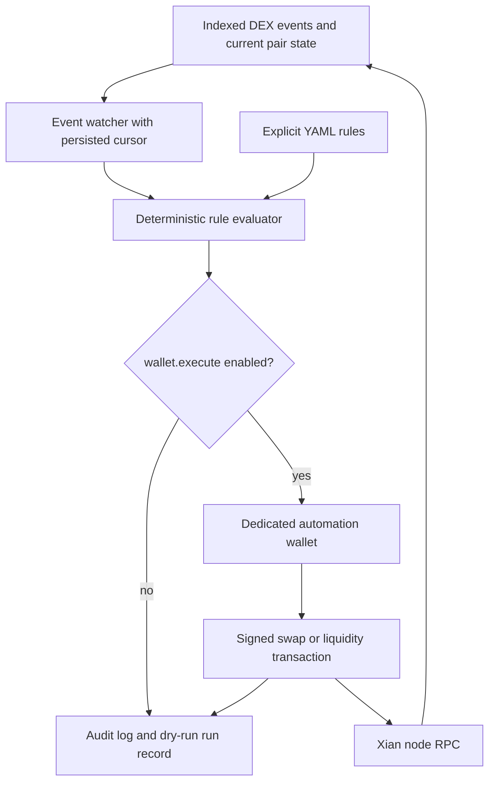

# xian-dex-automation

`xian-dex-automation` is the deterministic automation service for Xian DEX
events. It watches DEX pair events, evaluates explicit rules, and can submit
trades from a dedicated automation wallet.

Use it when the desired behavior is already known, for example:

- if pair 1 moves by at least 1%, swap a fixed amount
- if liquidity changes beyond a threshold, rebalance a limited wallet
- if a DEX event happens, execute a specific transaction with strict slippage

Use [`xian-intentkit`](/tools/xian-intentkit) instead when an AI agent should
interpret a goal, decide what tools to call, write a report, post a message, or
perform a workflow that intentionally involves model judgment.

## Architecture Choice

The recommended shape is a hybrid:

- Python executor built on [`xian-py`](/tools/xian-py)
- local admin UI served by the Python service
- future browser setup UI built on [`xian-js`](/tools/xian-js) for wallet-approved funding or strategy setup
- DEX frontend kept focused on human trading and liquidity management

The executor should be Python because it needs to run unattended, persist
cursors, watch events, retry network reads, keep an audit log, and sign
transactions with a service wallet.

The built-in admin UI is for local operators. It lets them inspect status,
generate or rotate a dedicated service-wallet key file, import a service key,
edit rules, edit the YAML config, check wallet metadata, and manually evaluate
pairs. It does not connect to the user's browser wallet and it does not return
private key material through the API. Key changes force execution back to
dry-run mode.

A future consumer setup UI should be browser-based because users already have
their wallet in the browser extension. That UI can help users fund the
automation wallet or, later, deposit into a strategy contract.

## Wallet Model

The service cannot use a user's browser wallet in the background. Browser
wallets are interactive and require the user to approve each transaction.

The current model is a dedicated automation wallet:

1. create a separate Xian wallet
2. fund it with only the amount the automation may trade
3. set its private key in `XIAN_DEX_AUTOMATION_PRIVATE_KEY`, a configured key
   file, or `XIAN_DEX_AUTOMATION_PRIVATE_KEY_FILE`
4. keep dry-run mode enabled until the rule output is correct
5. set `wallet.execute: true` only when the automation should trade



The user's main wallet never leaves the wallet extension or mobile wallet.

For a broader consumer product, the safer long-term model is an on-chain
strategy or vault contract. The user connects a browser wallet, deposits a
bounded budget, configures hard limits on-chain, and the Python keeper can only
trigger actions the contract allows.

## Current Service Interface

Configuration is YAML-first:

```yaml
network:
  rpc_url: "http://127.0.0.1:26657"

dex:
  router_contract: "con_dex"
  pairs_contract: "con_pairs"

wallet:
  private_key_env: "XIAN_DEX_AUTOMATION_PRIVATE_KEY"
  private_key_file: null
  private_key_file_env: "XIAN_DEX_AUTOMATION_PRIVATE_KEY_FILE"
  execute: false

rules:
  - id: "demo-price-move"
    trigger:
      type: "price_move"
      pair_id: 1
      direction: "either"
      threshold_bps: 100
      cooldown_seconds: 300
    action:
      type: "swap_exact_in"
      src: "currency"
      amount_in: "1"
      max_slippage_bps: 100
```

The API exposes:

- `GET /`
- `GET /health`
- `GET /rules`
- `PUT /rules/{rule_id}`
- `DELETE /rules/{rule_id}`
- `GET /runs`
- `GET /wallet`
- `PATCH /wallet`
- `POST /wallet/generate`
- `POST /wallet/import`
- `GET /config.yaml`
- `PUT /config.yaml`
- `POST /evaluate/{pair_id}`

`POST /evaluate/{pair_id}` is useful for testing a rule against current chain
state. In dry-run mode it records what would happen without submitting a
transaction.

## Validation

The `xian-dex-automation` repo ships CI for the deterministic parts of the
service:

```bash
uv run --extra dev ruff check .
uv run --extra dev pytest
uv run --extra dev python -m compileall src tests
```

Those tests include API coverage, frontend contract checks for the built-in UI,
wallet key-file management, rule persistence, storage, and rule evaluation.

For a real local node with the DEX bootstrap already applied, run the opt-in
live test:

```bash
XIAN_DEX_AUTOMATION_LIVE_RPC_URL=http://127.0.0.1:26657 \
XIAN_DEX_AUTOMATION_LIVE_PAIR_ID=1 \
uv run --extra dev pytest tests/test_live_node.py -q
```

The live test evaluates the configured pair in dry-run mode and confirms the
service can read on-chain DEX state through `xian-py`.

## Stack-Managed Node Extension

When the `xian-dex-automation` repo is checked out next to `xian-stack`,
operators can enable it from a node profile:

```bash
uv run xian network create local-dex --chain-id xian-local-1 \
  --template single-node-indexed \
  --generate-validator-key \
  --enable-dex-automation \
  --init-node
uv run xian node start local-dex
uv run xian node endpoints local-dex
```

Or directly through the stack backend:

```bash
cd xian-stack
python3 ./scripts/backend.py start --no-service-node --dex-automation
python3 ./scripts/backend.py endpoints --no-service-node --dex-automation
```

The default UI/API URL is `http://127.0.0.1:38280`. `xian-stack` generates
`.artifacts/dex-automation/config.yaml` and
`.artifacts/dex-automation/wallet.key` on first start. The generated wallet is
a local service wallet; execution remains disabled until the operator enables
`wallet.execute`.

## Local DEX Requirement

The DEX contracts must exist on the target network. For local testing, deploy
the DEX contracts and demo pool first:

```bash
cd xian-stack
make localnet-dex-bootstrap
```

See [Local DEX Bootstrap](/node/local-dex-bootstrap).

## How It Differs From The DEX Website

The DEX website is the human interface for swaps and liquidity. It should stay
focused on active wallet-connected actions.

`xian-dex-automation` is the unattended executor. Its admin UI configures the
service process, but the long-running event watcher and signer still stay in
the service process rather than inside the browser.
