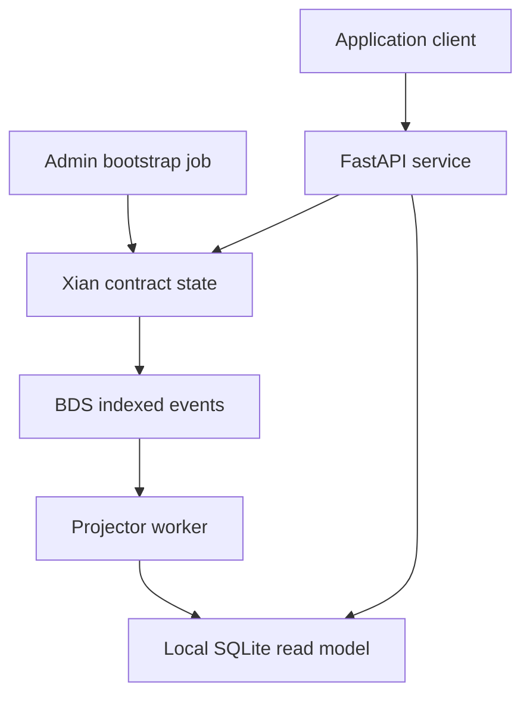

# xian-py

`xian-py` is the external Python SDK for talking to a Xian node from
applications, services, wallets, and automation workflows.

If you want shell-first automation instead of Python code, use
[`xian-cli`](/tools/xian-cli). The `xian client ...` namespace in `xian-cli`
wraps the same SDK model for command-line usage.

## Installation

Base install:

```bash
uv add xian-tech-py
```

The published PyPI package name is `xian-tech-py`. The import package remains
`xian_py`.

Optional extras:

```bash
uv add "xian-tech-py[hd]"   # mnemonic / HD wallet support
uv add "xian-tech-py[eth]"  # Ethereum wallet helpers
```

## Public API

The intended top-level imports include:

```python
from xian_py import (
    AbciError,
    AsyncContractClient,
    AsyncEventClient,
    AsyncStateKeyClient,
    AsyncTokenClient,
    BdsStatus,
    ContractClient,
    DeveloperRewardSummary,
    EventClient,
    EventProjector,
    EventProjectorError,
    EventSource,
    IndexedBlock,
    IndexedEvent,
    IndexedTransaction,
    LiveEvent,
    NodeStatus,
    PAYMENT_IDENTIFIER,
    PAYMENT_REQUIRED_HEADER,
    PAYMENT_RESPONSE_HEADER,
    PAYMENT_SIGNATURE_HEADER,
    PerformanceStatus,
    RetryEvent,
    RetryPolicy,
    RpcError,
    ShieldedOutputTag,
    ShieldedRelayerAsyncClient,
    ShieldedRelayerAsyncPoolClient,
    ShieldedRelayerCatalogEntry,
    ShieldedRelayerClient,
    ShieldedRelayerInfo,
    ShieldedRelayerInfoPolicy,
    ShieldedRelayerInfoResult,
    ShieldedRelayerJob,
    ShieldedRelayerJobResult,
    ShieldedRelayerPoolClient,
    ShieldedRelayerQuote,
    ShieldedRelayerQuoteResult,
    SimulationError,
    SQLiteProjectionState,
    StateKeyClient,
    StateEntry,
    SubmissionConfig,
    TokenBalance,
    TokenBalancePage,
    TokenClient,
    TransactionError,
    TransactionReceipt,
    TransactionSubmission,
    TransportConfig,
    TransportError,
    TxTimeoutError,
    Wallet,
    WatcherConfig,
    Xian,
    XianAsync,
    XianClientConfig,
    XianException,
    XianX402Facilitator,
    XianX402HTTPResponse,
    XianX402PaymentPayload,
    XianX402PaymentRequirement,
    XianX402SettlementResult,
    XianX402VerificationResult,
    amount_for_contract,
    canonical_amount,
    canonical_permit_amount,
    chain_id_from_xian_network,
    construct_payment_message,
    construct_permit_authorizer_message,
    contract_deadline,
    decode_json_header,
    encode_json_header,
    generate_payment_id,
    indexed_event_sort_key,
    is_valid_payment_id,
    merged_event_payload,
    run_sync,
    sign_xian_x402_payment,
    to_contract_time,
    verify_xian_x402_payment,
    x402_request,
    xian_network_id,
)
```

`HDWallet` and `EthereumWallet` live in `xian_py.wallet`; they are optional
helpers, not part of the top-level API.

`Xian` and `XianAsync` require an Ed25519 Xian signer. `EthereumWallet` is a
separate helper for Ethereum-style account workflows and is not valid for
signing Xian transactions.

## Wallets

### Basic Wallet

```python
from xian_py import Wallet

wallet = Wallet()
print(wallet.public_key)
print(wallet.private_key)
```

Restore from an existing private key:

```python
wallet = Wallet(private_key="your_private_key_hex")
```

Restore from a browser/mobile recovery phrase:

```python
wallet = Wallet.from_mnemonic("your twelve or twenty four words")
second_account = Wallet.from_mnemonic(
    "your twelve or twenty four words",
    account_index=1,
)
```

### HD Wallet

```python
from xian_py.wallet import HDWallet

wallet = HDWallet()
print(wallet.mnemonic_str)
child = wallet.get_wallet([0, 0])
print(child.public_key)
```

HD wallet support requires `xian-tech-py[hd]`.

### Ethereum Wallet

```python
from xian_py.wallet import EthereumWallet

wallet = EthereumWallet()
print(wallet.address)
```

Ethereum wallet helpers require `xian-tech-py[eth]`.

## Synchronous Client

```python
from xian_py import Wallet, Xian

wallet = Wallet()
with Xian("http://127.0.0.1:26657", wallet=wallet) as client:
    balance = client.get_balance(wallet.public_key)
```

Constructor parameters:

- `node_url`
- optional `chain_id`
- optional `wallet`

If `chain_id` is omitted, the client fetches it from the node.
If you pass `chain_id` explicitly, it must be a non-empty string.

`Xian` keeps a persistent background event loop and HTTP session for the life of
the client. Prefer using it as a context manager or calling `close()` when you
are done.

## Client Configuration

The SDK exposes explicit config types for transport, retry, submission, and
watcher defaults:

```python
from xian_py import (
    RetryPolicy,
    SubmissionConfig,
    TransportConfig,
    WatcherConfig,
    Xian,
    XianClientConfig,
)

config = XianClientConfig(
    transport=TransportConfig(total_timeout_seconds=20.0),
    retry=RetryPolicy(max_attempts=3, initial_delay_seconds=0.25),
    submission=SubmissionConfig(wait_for_tx=True),
    watcher=WatcherConfig(poll_interval_seconds=0.5, batch_limit=200),
)

with Xian("http://127.0.0.1:26657", config=config) as client:
    status = client.get_node_status()
```

Retry policy applies only to read-side operations such as status queries,
ABCI reads, tx lookup, and watcher polling. Transaction broadcasts are not
retried automatically.

If you need retry visibility, attach `RetryPolicy(on_retry=...)`. The callback
receives a typed `RetryEvent` with the operation kind, the failed attempt
number, the next backoff delay, and the triggering exception.

## Async Client

```python
import asyncio
from xian_py import Wallet, XianAsync

async def main():
    wallet = Wallet()
    async with XianAsync("http://127.0.0.1:26657", wallet=wallet) as client:
        return await client.get_balance(wallet.public_key)

asyncio.run(main())
```

Use `XianAsync` directly inside async code. The sync wrapper intentionally
raises if you call it from an already-running event loop.

## Common Methods

### get_balance

```python
balance = client.get_balance(address=wallet.public_key)
balance = client.get_balance(contract="currency")
```

### get_state

`get_state` takes the contract name, variable name, and zero or more key parts:

```python
value = client.get_state("currency", "balances", wallet.public_key)
allowance = client.get_state("currency", "approvals", wallet.public_key, "con_dex")
```

### get_contract_source

```python
source = client.get_contract_source("currency")
vm_ir = client.get_contract_ir("currency")
```

### send_tx

```python
result = client.send_tx(
    contract="currency",
    function="transfer",
    kwargs={"amount": 100, "to": "recipient_public_key"},
    chi=50_000,
    mode="checktx",
    wait_for_tx=True,
)
```

Transaction broadcast modes are explicit:

- `"async"`: submit to the node and return immediately
- `"checktx"`: wait for mempool admission / `CheckTx`
- `"commit"`: use CometBFT `broadcast_tx_commit`

Returned fields distinguish the lifecycle:

- `submitted`
- `accepted`
- `finalized`
- `tx_hash`
- `response`
- `receipt`

The return type is `TransactionSubmission`, so these values are available as
attributes:

```python
result = client.send_tx(...)
print(result.submitted)
print(result.accepted)
print(result.tx_hash)
print(result.receipt)
```

If `chi` is omitted, the SDK simulates the transaction first and adds a
small configurable headroom to the estimated chi usage before submission.

You can set default submission behavior once through
`XianClientConfig.submission` instead of repeating the same options on every
call.

### send

`send` is a convenience wrapper for token transfers:

```python
result = client.send(
    amount=100,
    to_address="recipient_public_key",
    token="currency",
    mode="checktx",
    wait_for_tx=True,
)
```

### approve

`approve` is a convenience wrapper that approves another contract to spend a
token on behalf of the wallet:

```python
result = client.approve(
    contract="con_dex",
    token="currency",
    amount=1_000,
    mode="checktx",
)
```

### get_approved_amount

```python
amount = client.get_approved_amount("con_dex", token="currency")
```

### simulate

```python
result = client.simulate(
    contract="currency",
    function="transfer",
    kwargs={"amount": 100, "to": "recipient_public_key"},
)

print(result["status"])
print(result["chi_used"])
print(result["state"])
```

The dry-run result currently comes from the node simulator and uses:

- `status`
- `chi_used`
- `state`
- `result`
- `payload`

The simulator is a readonly preview, not a consensus transaction. If you expose
it to end users, treat it as free but rate-limited compute at the infrastructure
layer rather than an unrestricted public endpoint.

Node operators can also refuse or cap simulations through
`simulation_enabled`, `simulation_max_concurrency`, `simulation_timeout_ms`,
and `simulation_max_chi`, so client code should expect structured failures
when a node disables or limits the simulator.

### call

Use `call` when you want the decoded readonly contract return value instead of
the raw simulation envelope:

```python
proposal = client.call(
    "con_registry_approval",
    "get_proposal",
    {"proposal_id": 1},
)
```

`call` runs through the same readonly simulation path, but it unwraps the
successful return value and raises if the readonly execution itself fails.

### deploy_contract / submit_contract

Use `deploy_contract` when you have contract source. It submits source to the
network; validators compile and persist canonical VM IR:

```python
code = """
counter = Variable()

@construct
def seed():
    counter.set(0)

@export
def increment() -> int:
    counter.set(counter.get() + 1)
    return counter.get()
"""

result = client.deploy_contract(
    name="con_counter",
    source=code,
    args={},
    chi=500_000,
)
```

Use `submit_contract(name, code, args=...)` for the same source-backed
deployment path when you do not want the `deploy_contract` alias.

`name` must use lowercase ASCII letters, digits, and underscores only. For
user contracts, keep the standard `con_` prefix.

## Other Helpers

Also available:

- `get_tx(tx_hash)`
- `wait_for_tx(tx_hash)`
- `refresh_nonce()`
- `estimate_chi(contract, function, kwargs)`
- `get_nodes()`
- `get_genesis()`
- `get_chain_id()`
- `get_node_status()`
- `get_perf_status()`
- `get_bds_status()`
- `get_developer_rewards(recipient_key)`
- `get_token_balances(address=None, limit=..., offset=..., include_zero=False)`
- `list_blocks(limit=..., offset=...)`
- `get_block(height)`
- `get_block_by_hash(block_hash)`
- `get_indexed_tx(tx_hash)`
- `list_txs_for_block(block_ref)`
- `list_txs_by_sender(sender, limit=..., offset=...)`
- `list_txs_by_contract(contract, limit=..., offset=...)`
- `list_shielded_wallet_history(tag_value, kind=..., limit=..., after_note_index=...)`
- `list_shielded_output_tags(tag_value, kind=..., limit=..., offset=..., after_id=...)`
- `get_events_for_tx(tx_hash)`
- `list_events(contract, event, limit=..., offset=..., after_id=...)`
- `get_state_history(key, limit=..., offset=...)`
- `get_state_for_tx(tx_hash)`
- `get_state_for_block(block_ref)`
- `watch_blocks(start_height=..., poll_interval_seconds=...)`
- `watch_events(contract, event, after_id=..., limit=..., poll_interval_seconds=...)`
- `watch_live_events(contract, event, poll_interval_seconds=...)`

`get_developer_rewards(recipient_key)` uses the BDS aggregate query surface and
returns the cumulative indexed `developer_reward` total for that recipient,
along with reward row count, distinct transaction count, distinct contract
count, and first/last indexed reward metadata. The contract count here is the
count of distinct source contracts that actually earned developer rewards for
that recipient, including called contracts when a transaction spans multiple
contracts.

```python
summary = client.get_developer_rewards("alice")
print(summary.total_rewards, summary.tx_count, summary.contract_count)
```

`get_tx(tx_hash)` and `wait_for_tx(tx_hash)` return a `TransactionReceipt`
that exposes the two important pieces separately:

- `result.tx` is the original submitted transaction
- `result.tx_result.data` is the decoded execution output
- for convenience, `xian-py` also surfaces these as typed attributes:
  `receipt.transaction`, `receipt.execution`, and `receipt.chi_used`

`wait_for_tx(tx_hash)` first uses the normal node `/tx` lookup path. If that
index lags briefly on a live node, `xian-py` falls back to recent block
inspection so a just-finalized transaction can still be recovered by hash.

`get_bds_status()` returns a typed `BdsStatus` model. The main high-signal
fields are `indexed_height`, `current_block_height`, `height_lag`,
`catching_up`, `spool_pending_count`, and `alerts`.

`get_token_balances(address=None, ...)` returns the BDS-backed token portfolio
for an address. If `address` is omitted, the client uses the active wallet
address. Set `include_zero=True` when you need zero-balance indexed tokens too.

`list_shielded_wallet_history(tag_value, ...)` is the higher-level shielded
light-wallet recovery feed. It returns the canonical note-commitment sequence
in note-index order and only exposes `output_payload` for outputs whose indexed
tag matches the requested wallet tag. Use `after_note_index` as the resumable
cursor.

`list_shielded_output_tags(tag_value, ...)` exposes the lower-level tagged
output index directly. Prefer `list_shielded_wallet_history(...)` for wallet
sync and recovery unless you specifically need tag-index rows.

## Shielded Relayer Clients

Use the dedicated relayer clients when you are working with proof-bound
shielded submission flows instead of hand-rolling raw HTTP calls:

```python
from xian_py import ShieldedRelayerAsyncClient

async with ShieldedRelayerAsyncClient(
    "http://127.0.0.1:8090",
    auth_token="secret",
) as relayer:
    info = await relayer.get_info()
    quote = await relayer.get_quote(
        kind="shielded_note_relay_transfer",
        contract="con_shielded_note_token",
    )
```

Use `ShieldedRelayerAsyncPoolClient` or `ShieldedRelayerPoolClient` when you
have a catalog of candidate relayers and want priority-ordered failover across
them.

If you inject your own `aiohttp` session, the SDK leaves that session under
caller ownership. If the relayer client creates the session itself, `close()`
or the async context manager cleans it up.

## Watching Blocks And Events

`xian-py` includes polling-based watcher helpers for long-running
application processes.

### watch_blocks

`watch_blocks` uses raw node RPC and does not require BDS:

```python
async for block in client.watch_blocks(start_height=101):
    print(block.height, block.tx_count)
```

If `start_height` is omitted, the watcher begins at the next block after the
current node head. Persist the last seen height if you want resumable block
consumers.

The default poll interval comes from `XianClientConfig.watcher`.

### watch_events

`watch_events` uses the indexed BDS event surface and a stable event cursor:

```python
async for event in client.watch_events(
    "currency",
    "Transfer",
    after_id=500,
):
    print(event.id, event.tx_hash, event.data)
```

Resume by storing the last seen event `id` and passing it back as `after_id`.

Event watching requires BDS to be enabled on the node because the event stream
comes from indexed reads rather than direct raw state queries.

For raw live WebSocket delivery without the indexed catch-up cursor, use
`watch_live_events(contract, event, ...)`. Application workers that need
resumability should prefer `watch_events(...)`.

The default watcher batch size and poll interval come from
`XianClientConfig.watcher`.

## Application Helper Clients

`xian-py` includes thin helper clients that reduce repetitive application
boilerplate without hiding the underlying network model.

Available factories:

- `client.contract("name")`
- `client.token("currency")`
- `client.events("contract", "EventName")`
- `client.state_key("contract", "variable", *keys)`

These work on both `Xian` and `XianAsync`.

### Contract Client

```python
ledger = client.contract("con_ledger")

await ledger.send("add_entry", account="alice", amount=5)
balance = await ledger.get_state("balances", "alice")
history = await ledger.state_key("balances", "alice").history(limit=20)
```

The contract client keeps the contract name fixed and lets you focus on the
function call or state path you actually care about.

It also exposes `call(...)` for authoritative readonly hydration when the
contract returns structured objects.

### Token Client

```python
currency = client.token()

balance = await currency.balance_of()
await currency.transfer("bob", 10)
await currency.approve("con_dex", amount=100)
```

The token client is just a thin layer over the existing currency-style helper
methods, but it keeps the token contract fixed and provides a cleaner
application-facing shape.

### Event Client

```python
transfers = client.events("currency", "Transfer")
recent = transfers.list(after_id=500, limit=50)
```

You can also watch from the same fixed event source:

```python
async for transfer in transfers.watch(after_id=500):
    print(transfer.data)
```

### State Key Client

```python
balance_key = client.state_key("currency", "balances", "alice")

current = balance_key.get()
history = balance_key.history(limit=20)
```

This is useful when an application works with one exact state key repeatedly
and wants both the current value and the indexed history view.

## Reusable Projector Primitives

`xian-py` includes a small reusable layer for event-driven read
models and projector workers.

Available primitives:

- `merged_event_payload(event)`: merge BDS `data_indexed` and `data` once at
  the SDK boundary
- `SQLiteProjectionState`: persist integer cursors in SQLite-backed read models
- `EventSource`: describe one indexed event stream
- `EventProjector`: poll one or more indexed event streams, sort events
  deterministically, optionally hydrate authoritative state, and call your
  apply handler
- `EventProjectorError`: surface hydrate/apply failures together with the
  failing event context

These primitives are intentionally thin. The SDK owns the repetitive event
polling, ordering, and cursor plumbing; application code still owns its own
projection tables, hydration strategy, and domain-specific apply logic.

The three deeper reference-app slices build on these shared primitives
instead of each carrying their own event-loop and cursor implementation.

## Service Integration Examples

The `xian-py` repo includes application-facing examples under
`examples/` that show how the SDK fits into ordinary backend workflows.

The `examples/credits_ledger/` slice turns the generic SDK primitives into a
concrete credits-ledger backend pattern.

The `examples/registry_approval/` slice turns the same SDK
primitives into a shared registry with proposal and approval flow.

The `examples/workflow_backend/` slice turns the SDK into a
job-style workflow backend with a service/write path and an event-driven
worker.

### FastAPI Service

`examples/fastapi_service.py` shows an async API service shape with:

- shared `XianAsync` lifecycle management
- typed node health reads
- token balance reads
- indexed transfer reads
- token transfer submission

Typical run:

```bash
uv run uvicorn examples.fastapi_service:app --reload --app-dir .
```

This example expects normal app dependencies such as `fastapi` and `uvicorn`;
install them with the SDK app extra:

```bash
uv sync --group dev --extra app
```

### Event Worker

`examples/event_worker.py` shows a resumable background worker that:

- watches indexed BDS events
- stores the last seen `after_id` cursor locally
- resumes cleanly after restart

Typical run:

```bash
uv run python examples/event_worker.py
```

### Admin / Automation Job

`examples/admin_job.py` shows a synchronous operator-facing automation task
that reads:

- node health
- peer count
- performance status
- optional BDS lag

and exits nonzero when a configured threshold is violated.

Typical run:

```bash
uv run python examples/admin_job.py
```

### Credits Ledger Example Set

`examples/credits_ledger/` adds an example-specific set of code for the
first credits-ledger workflow and the first deeper reference-app slice:

- `admin_job.py`: bootstrap or administer `con_credits_ledger`
- `api_service.py`: expose authoritative balances plus projected activity and
  summary views through a small FastAPI service
- `projector_worker.py`: rebuild a local SQLite read model from indexed
  `Issue`, `Transfer`, and `Burn` events
- `event_worker.py`: compatibility wrapper around `projector_worker.py`

Typical runs:

```bash
uv sync --group dev --extra app
uv run python examples/credits_ledger/admin_job.py
uv run uvicorn examples.credits_ledger.api_service:app --reload --app-dir .
uv run python examples/credits_ledger/projector_worker.py
```

This is the first example set that demonstrates the full backend pattern:

- Xian as the authoritative ledger
- BDS-backed indexed events as the integration feed
- a local projected read model for application-specific queries



## Xian x402 Payments

`xian_py.x402` provides helpers for Xian-native exact x402 payments. The wallet
signs two messages:

- the x402 payment intent, bound to network, asset, amount, resource, payer,
  payment id, deadline, and settlement contract
- the XSC-0002 permit authorizer message, bound to the same asset, payer,
  settlement contract, deadline, chain id, authorizer contract, and permit
  nonce

```python
from xian_py import (
    XianX402PaymentRequirement,
    sign_xian_x402_payment,
    verify_xian_x402_payment,
    xian_network_id,
)

requirement = XianX402PaymentRequirement(
    network=xian_network_id("xian-local-1"),
    asset="currency",
    amount="0.001",
    pay_to="seller_public_key",
    resource="https://api.example.test/data",
)

payload = sign_xian_x402_payment(
    requirement,
    wallet,
    permit_nonce=0,
)
result = verify_xian_x402_payment(payload, requirement)
```

The serialized payment payload includes `permitSignature` and `permitNonce`.
For repeated payments from the same payer, callers should read or track the
current `permit_authorizer.nonces[payer]` value and pass it as `permit_nonce`.

### Registry / Approval Example Set

`examples/registry_approval/` adds the second reference example and the second
deeper reference-app slice:

- `admin_job.py`: deploy `con_registry_records` and `con_registry_approval`,
  configure signers, top up approvers with native balance for the reference
  flow, and submit an initial proposal
- `api_service.py`: combine authoritative proposal/record reads with projected
  workflow views for pending approvals and audit activity
- `projector_worker.py`: rebuild a local SQLite workflow projection from
  indexed events and hydrate rich proposal/record state from authoritative
  contract reads
- `event_worker.py`: compatibility wrapper around `projector_worker.py`

Typical runs:

```bash
uv sync --group dev --extra app
uv run python examples/registry_approval/admin_job.py
uv run uvicorn examples.registry_approval.api_service:app --reload --app-dir .
uv run python examples/registry_approval/projector_worker.py
```

This is the second example set that demonstrates the deeper backend pattern:

- indexed events as workflow triggers
- authoritative decoded readonly contract calls as hydration
- a local projected read model for application-oriented approval queries

### Workflow Backend Example Set

`examples/workflow_backend/` adds the third reference example and the third
deeper reference-app slice:

- `admin_job.py`: deploy `con_job_workflow`, add workers, and optionally
  submit an initial workflow item
- `api_service.py`: combine authoritative item reads with projected queue and
  workflow activity views
- `processor_worker.py`: claim submitted items and complete or fail them
- `projector_worker.py`: rebuild a local SQLite queue/activity projection from
  indexed events and authoritative `get_item` reads
- `event_worker.py`: compatibility wrapper around `processor_worker.py`

Typical runs:

```bash
uv sync --group dev --extra app
uv run python examples/workflow_backend/admin_job.py
uv run uvicorn examples.workflow_backend.api_service:app --reload --app-dir .
uv run python examples/workflow_backend/processor_worker.py
uv run python examples/workflow_backend/projector_worker.py
```

This is the third example set that demonstrates the deeper backend pattern:

- a separate processor and projector worker model
- indexed events as workflow and projection triggers
- authoritative decoded readonly `get_item` calls for projection hydration
- a local projected read model for queue state and workflow activity

The workflow bootstrap tops up configured workers with native balance
by default so the documented processor path can actually claim and complete
items in local/reference networks.

### x402 Exact Example Set

`examples/x402_exact/` demonstrates a native-Xian x402-style paid HTTP
request:

- `admin_job.py`: deploy `con_x402_settlement`
- `paid_api_service.py`: a seller API that answers `402 Payment Required`
  until a valid signed payment payload arrives
- `facilitator_service.py`: an optional separate settlement facilitator
- `buyer_client.py`: sign the payment + permit payloads and fetch the
  protected resource

Each example set ships its own contract sources under
`examples/<name>/contracts/`, so the SDK examples are self-contained and do
not depend on any external contract catalog.

## Structured Errors

The SDK exposes more precise error classes:

- `TransportError`
- `RpcError`
- `AbciError`
- `SimulationError`
- `TransactionError`
- `TxTimeoutError`

All of them inherit from `XianException`.

See the repo README for package-level development and compatibility notes.
