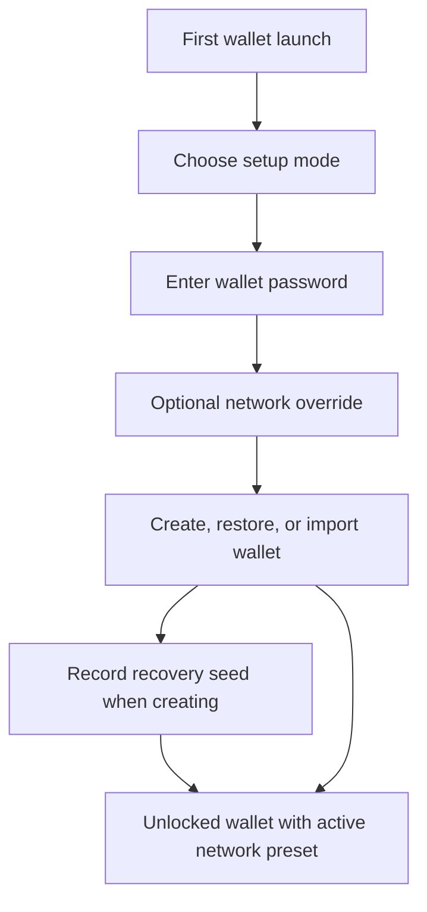

# Xian Wallet - Browser Extension

The Xian browser wallet is a Manifest V3 Chrome extension for self-custody of
Xian tokens. It runs in Chrome, Brave, Edge, and other Chromium-based browsers.

**Repository:** [xian-technology/xian-wallet-browser](https://github.com/xian-technology/xian-wallet-browser)

## Installation

### From GitHub Release

1. Download the `xian-wallet-extension-X.Y.Z.zip` artifact for the version you want from
   [Releases](https://github.com/xian-technology/xian-wallet-browser/releases).
2. Unzip the archive.
3. Open `chrome://extensions` in your browser.
4. Enable **Developer mode**.
5. Click **Load unpacked**.
6. Select the `dist/` folder from the unzipped archive.

### Build From Source

#### Prerequisites

- Node.js 18+
- npm 9+
- A sibling checkout of `xian-js`
- Chrome, Brave, Edge, or another Chromium-based browser

Expected local layout:

```text
.../xian/
  xian-js/
  xian-wallet-browser/
```

Build the SDK workspace first so the local file dependencies are ready:

```bash
cd xian-js
npm install
npm run build
```

Then build the wallet:

```bash
cd xian-wallet-browser
npm install
npm run build --workspace xian-wallet-extension
```

The unpacked extension output is written to:

```text
apps/wallet-extension/dist/
```

Load it in Chrome or Chromium using the same steps as above, pointing to that
`dist/` folder.

## Validation And Testing

### Automated validation

From the repo root:

```bash
cd xian-wallet-browser
npm run validate
```

For browser-level checks:

```bash
npx playwright install chromium
npm run test:browser --workspace xian-wallet-extension
npm run test:visual --workspace xian-wallet-extension
```

### Manual smoke testing

After loading the unpacked extension:

- create a new wallet and record the seed phrase
- import a wallet from an existing seed phrase
- lock and unlock the wallet
- add or edit a network preset and verify the status indicator
- connect a sample dApp such as the [xian-js Playground](/tools/playground)
- approve and reject connect / sign / send flows
- export a backup and restore it into a clean browser profile

### Dapp Auto-Approval Rules

For transaction requests, the browser wallet can save a temporary auto-approval
rule for the connected site, active account, network, method, contract, and
function.

The default rule is exact-argument auto-approval: the later request must keep
the same transaction arguments, such as recipient, amount, swap route, and
liquidity fields. The chi value is treated as a per-transaction fee/compute
budget cap, not as a token amount cap.

Users can also choose broad auto-approval for a contract function. Broad rules
allow the same site to change transaction arguments without another prompt for
the rule lifetime. The wallet shows a second in-app confirmation before saving
that broader rule, and users can revoke rules from the connected-apps view.

### Approval and network context

Every approval is tied to the account and network details shown during review,
including the active preset, RPC URL, and chain ID. If the account or network
changes before approval, the wallet rejects the request instead of signing or
sending it under the new context. This binding is stored with pending approvals,
so the same rule applies after the extension service worker or browser restarts.
Pending approvals created by wallet versions that did not store this binding
must be requested again.

A dApp can request `xian_switchChain` only after it is connected. Switching to a
different configured chain opens a dedicated approval that shows the current and
requested networks. Rejecting it leaves the active network unchanged. Approving
it changes the wallet-wide active network and emits `chainChanged` to connected
pages.

## Initial Wallet Setup

On first launch the extension shows three setup modes:

- **Create** - generates a new 12-word BIP39 recovery seed and derives the first account
- **Seed** - restores from an existing 12 or 24-word BIP39 recovery phrase
- **Key** - imports a single 32-byte hex private-key seed without HD-account support

The setup form always asks for a wallet password. In **Create** mode the seed is
shown only after the wallet is created, so the normal flow is:

1. choose **Create**
2. enter a wallet password
3. optionally expand **Network settings**
4. create the wallet
5. record the recovery seed before closing the screen



The **Network settings** disclosure on the setup screen lets you override:

- network label
- expected chain ID
- RPC URL
- dashboard URL
- whether to allow HTTP data transfers for that preset

If you leave those fields on the local defaults, the built-in **Local node**
preset stays active. If you change them during setup, the wallet creates a
custom preset and makes it active immediately.

Remote `http://` RPC endpoints are blocked unless the selected preset has
**Allow HTTP data transfers** enabled. Leave that off for public networks and
prefer HTTPS. Use the HTTP opt-in only for trusted local or private endpoints.
Loopback development URLs such as `http://127.0.0.1` are treated as local
development endpoints; IPv6 loopback URLs use brackets, for example
`http://[::1]:26657` and `http://[::1]:18080`.

## Release Flow

The end-user artifact is a GitHub release zip that contains the unpacked
extension bundle.

For maintainers, release automation is tag-based:

1. update repo and package versions to `X.Y.Z`
2. update `release-manifest.json` with the exact `xian-js` and
   `xian-contracting` commit SHAs and matching package versions
3. refresh and commit the lockfile, then validate the release manifest
4. run locked install, audit, workspace validation, and the Playwright browser
   and visual suites
5. create and push the matching tag `vX.Y.Z` from a clean tree

On tag builds, CI resolves one immutable wallet source SHA, checks out sibling
sources at the manifest's exact SHAs, and verifies source, package, lockfile,
and extension-manifest versions before building. Publishing consumes only the
validated uploaded artifacts: `@xian-tech/wallet-core` goes to npm and the
browser-wallet zip is attached to the GitHub release. An existing npm version
is accepted only when its registry integrity matches the validated tarball.

## Architecture

The workspace is split into two packages:

| Package | Purpose |
|---------|---------|
| `packages/wallet-core/` | UI-agnostic wallet domain logic - key derivation, encryption, controller, approvals, network presets |
| `apps/wallet-extension/` | Manifest V3 browser extension - popup, side panel, background worker, content script, provider bridge |

### wallet-core

`@xian-tech/wallet-core` owns:

- **Key derivation** - BIP39 seed phrase generation and custom indexed derivation
- **Encryption** - AES-256-GCM with PBKDF2 (250,000 iterations) for private key and mnemonic storage
- **Multi-account** - derive multiple addresses from a single seed, each with its own encrypted private key
- **Controller** - wallet state management, account switching, approval lifecycle, network presets, transaction flow
- **Approvals** - structured approval views for connect, sign, and send requests from dApps

It does not own browser-specific transport, popup rendering, or injected-page
bridges.

### wallet-extension

The extension provides:

- **Popup / Side panel** - full wallet UI rendered as raw DOM (no framework)
- **Background worker** - key custody, approval handling, provider request routing
- **Content script + inpage bridge** - injects `window.xian` provider for dApps
- **Storage** - `chrome.storage.local` for wallet state, `chrome.storage.session` for unlocked sessions

## Features

### Wallet Management

- **Create wallet** - generates a 12-word BIP39 seed phrase and derives the first account
- **Import from seed** - restore from an existing 12 or 24-word phrase
- **Import from private key** - single-account wallet without multi-account support
- **Lock / unlock** - password-based with 5-minute session timeout
- **Remove wallet** - inline confirmation, clears all data

### Multi-Account (HD Wallet)

Seed-backed wallets support multiple derived accounts:

- **Add account** - derives the next key from the seed (no password prompt needed while unlocked)
- **Switch account** - seamless switching, notifies connected dApps via `accountsChanged`
- **Rename account** - inline editing, duplicate names rejected (case-insensitive)
- **Remove account** - non-primary accounts only, with inline confirmation

Key derivation is deterministic:

- Index N >= 0: `SHA256(bip39_seed + "xian-wallet-seed-v2" + uint32BE(N))`

### Sending Tokens

**Simple send:**

1. Select a token from the dropdown (defaults to XIAN)
2. Enter recipient address (or pick from contacts)
3. Enter amount (or tap MAX)
4. Review - chi are estimated automatically via `/simulate`
5. Send - shows result with TX hash linked to the explorer

The popup validates obviously malformed recipient and amount inputs before
submission and keeps node-side failures visible in the result flow instead of
failing silently.

**Advanced transaction:**

- Enter contract name - functions auto-load from the node
- Select function - arguments auto-populate with typed fields
- Set chi manually or auto-estimate
- Review and send

### Swap

When the active network has the DEX router (`con_dex`) deployed, the wallet
shows a **Swap** surface:

- pick a from-token and to-token from the tracked asset list
- quotes are computed from on-chain pair reserves, including multi-hop routes
- the review summary shows rate, price impact, and minimum received
- slippage (0.5% / 1% / 3% / 5%, default 1%) and deadline (10-60 min, default
  20 min) are selectable per swap
- if the router allowance is insufficient, the wallet runs the approve step
  first, then the swap

On networks without a deployed DEX router, the Swap card explains that swaps
become available once the DEX is deployed.

### Activity

Transaction history fetched from the node's `/txs_by_sender` ABCI endpoint:

- Classified rows for sends, approvals, token creation, DEX buys/sells/swaps,
  liquidity add/remove, and generic contract calls
- Success / fail badges plus distinct icons and color accents per activity type
- Tap for details - decoded arguments, hash, block, chi, time, and explorer link
- Clear fetch-error state with retry when the history query fails

### Asset Management

- **Token list** - shows tracked assets with balances
- **Manage assets** - drag to reorder, hide / show toggle per token
- **Token detail** - balance, contract info, decimal places adjustment
- **Auto-detection** - discovers on-chain tokens missing from the local token list

### Contacts

- Save recipient addresses with names
- Pick from contacts when sending
- Address validation warns on non-hex or wrong-length addresses
- After a successful send, offer to save the recipient

### Networks

- **Built-in presets** - Local node configured by default
- **Custom presets** - add, edit, delete RPC endpoints with optional chain ID,
  dashboard URL, and HTTP data-transfer opt-in
- **Switch** - change active network, all state updates accordingly
- **Status indicator** - green (ready), yellow (unreachable), red (chain mismatch), with refresh on click

### Backup

- **Export** - enter a backup password, downloads encrypted JSON containing the
  seed/key, account names, active account, network presets, watched assets, and
  shielded wallet state snapshots when present
- **Import** - select a backup file or paste encrypted backup JSON, then enter
  the backup password; the restored wallet state is encrypted again for local
  storage

### Shielded Wallet Snapshots

- Store shielded wallet state snapshots from settings
- Export, import, or remove stored snapshots without replacing the whole wallet
- Include stored snapshots in full wallet backup exports
- Check indexed `shielded_wallet_history` after a snapshot when the connected
  node exposes the BDS shielded-history surface

### Security

- **Reveal seed** - password-protected, click to copy
- **Reveal private key** - password-protected, click to copy
- **Session** - while unlocked, `chrome.storage.session` holds only the public
  key, the session expiry, and a derived session key; the decrypted private key
  and mnemonic stay in background-worker memory, and a worker restart restores
  them from the encrypted store via the session key. The raw password is not
  persisted

### dApp Integration

The extension registers a default provider at `window.xian.provider` and in the
`window.xian.providers` / `window.xianProviders` registries, conforming to
`@xian-tech/provider`:

- `xian_requestAccounts` - connect and get accounts
- `xian_accounts` - list connected accounts
- `xian_getWalletInfo` - wallet capabilities and state
- `xian_watchAsset` - add a token to the wallet's tracked asset list
- `xian_prepareTransaction` - create an explicit-nonce transaction snapshot
- `xian_sendCall` - intent-first ordered prepare + sign + broadcast; concurrent
  calls use distinct sequential nonces
- `xian_sendTransaction` / `xian_signTransaction` - prepared transaction flows;
  concurrent same-chain/account/nonce broadcasts are rejected
- `xian_signMessage` - version-1, chain/account-bound Xian message signing

Approval requests are shown inline in the wallet (side panel mode) or in a
dedicated popup window.

Events: `accountsChanged`, `chainChanged`, `connect`, `disconnect`.

Trusted dApp policies can auto-approve narrowly scoped repeated transaction
requests for 30 days. The wallet surfaces those policies in the connected-apps
view and lets the user revoke them.

## Development

### Commands

```bash
# Type-check
npm run typecheck --workspace xian-wallet-extension

# Build
npm run build --workspace xian-wallet-extension

# Run tests
npx vitest run

# Browser tests (requires Playwright)
npx playwright install chromium
npm run test:browser --workspace xian-wallet-extension
```

### Project Structure

```text
xian-wallet-browser/
  packages/
    wallet-core/
      src/
        controller.ts    # Main wallet controller
        crypto.ts        # Key derivation, encryption
        types.ts         # All type definitions
        approvals.ts     # Approval view builders
        constants.ts     # Default presets, timeouts
  apps/
    wallet-extension/
      src/
        background/      # Service worker
        content/         # Content script
        inpage/          # Injected provider bridge
        popup/           # Main wallet UI
        shared/          # Storage, messages, preferences
      public/
        base.css         # All styles
        popup.html       # Popup entry
        approval.html    # Approval window entry
```

## Relationship To xian-js

The wallet consumes `@xian-tech/client` and `@xian-tech/provider` from the
sibling `xian-js` repo. Local development uses a sibling checkout model:

```text
xian/
  xian-js/
  xian-wallet-browser/
```

Both release independently.
