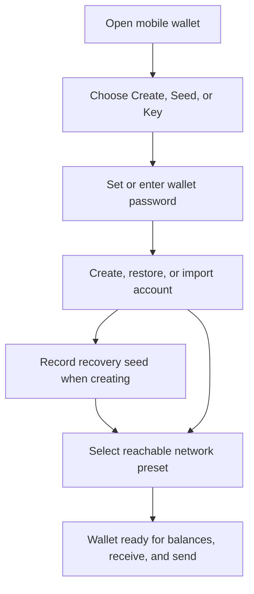

# Xian Wallet - Mobile

The Xian mobile wallet is a React Native / Expo app for self-custody of Xian
tokens. Android and iOS come from the same codebase. Android packaging is the
current released path; iOS can be generated, built, and tested from the same
repo with Xcode.

**Repository:** [xian-technology/xian-wallet-mobile](https://github.com/xian-technology/xian-wallet-mobile)

The wallet shares the same seed derivation scheme as the browser wallet, so the
same mnemonic can be used in both. Encrypted backup files are re-encrypted on
import, because the mobile wallet uses a lower PBKDF2 iteration count than the
browser wallet for device performance reasons.

## Platform Status

| Platform | Status | Distribution / test path |
|----------|--------|--------------------------|
| Android | Supported | GitHub release APK or local Expo / Gradle build |
| iOS | Same codebase, local build and test path available | Local Expo / Xcode build, simulator, device, TestFlight |

## Installation And Local Development

### Android From GitHub Release

1. Download the latest `xian-wallet-mobile-vX.Y.Z.apk` from
   [Releases](https://github.com/xian-technology/xian-wallet-mobile/releases).
2. On your Android device, enable **Install from unknown sources** in system
   settings.
3. Open the downloaded APK to install it.

### Shared Prerequisites

- Node.js 18+
- npm 9+
- A sibling checkout of `xian-js`
- A local checkout of `xian-wallet-mobile`

Expected local layout:

```text
.../xian/
  xian-js/
  xian-wallet-mobile/
```

Build the shared client once before installing the mobile app:

```bash
cd xian-js
npm install
npm run build
```

Install dependencies once from the repo root:

```bash
cd xian-wallet-mobile
npm install
```

The app uses Expo prebuild. Native folders may be generated or refreshed from
`app.json` when needed.

### Android Build And Test

#### Android prerequisites

- Java 17
- Android Studio with Android SDK, platform tools, and an emulator image
- A physical Android device with USB debugging enabled, or an Android emulator

#### Android environment

```bash
export ANDROID_HOME=$HOME/Library/Android/sdk   # macOS
export JAVA_HOME=$(/usr/libexec/java_home)      # macOS
# Linux: adjust paths accordingly
```

#### Android local run

```bash
cd xian-wallet-mobile

# Generate or refresh the native Android project if needed
npx expo prebuild --platform android

# Build and install on a connected device or running emulator
npx expo run:android
```

`npx expo run:android` starts the native build, installs the app, and launches
Metro for a development build. The first run takes several minutes because all
native modules are compiled.

For iterative development with hot reload:

```bash
# In one terminal
npx expo start --dev-client

# In another terminal, for a USB-connected physical device
adb reverse tcp:8081 tcp:8081
```

The mobile repo is configured to watch the sibling workspace so the Expo dev
client can resolve the local `@xian-tech/client` package. If you change code in
`xian-js/packages/client`, rebuild that package before reloading the app.

#### Android smoke testing

At minimum, verify:

- create a wallet and record the seed phrase
- import a wallet from seed phrase
- lock and unlock with the wallet password
- connect to the intended network preset and refresh balances
- receive by copying the address or scanning the QR code
- send a small transaction and confirm the result screen / explorer link
- export a backup and re-import it on a fresh install

## Initial Wallet Setup

The setup screen has three modes:

- **Create** - generates a fresh 12-word BIP39 recovery seed
- **Seed** - restores from a 12 or 24-word BIP39 recovery phrase
- **Key** - imports a single 32-byte hex private-key seed

The normal create flow is:

1. choose **Create**
2. enter and confirm a wallet password
3. create the wallet
4. record the generated recovery seed before continuing



For seed-backed wallets, additional accounts can be derived later while the
wallet is unlocked. Private-key imports are single-account only.

### Network setup on real devices

The built-in **Local node** preset uses `http://127.0.0.1:26657` and
`http://127.0.0.1:8080`. That is useful for emulators or special local
tunneling, but on a physical phone `127.0.0.1` points to the phone itself.

When testing against a dev node running on your computer, add or switch to a
custom network preset in **Settings > Networks** that uses your computer's LAN
address instead, for example:

```text
RPC: http://192.168.x.y:26657
Dashboard: http://192.168.x.y:8080
```

Use the same Wi-Fi network for the phone and the dev machine. Remote `http://`
RPC endpoints are blocked unless the network preset has **Allow HTTP data
transfers** enabled. Leave that off for public networks and prefer HTTPS; only
enable it for local or private endpoints you trust. Loopback development URLs
such as `http://127.0.0.1` are treated as local development endpoints.

#### Android release APK

For a locally signed release build:

```bash
# One-time: create your own signing key
keytool -genkeypair -v \
  -keystore android/app/release.keystore \
  -alias xian-wallet \
  -keyalg RSA -keysize 2048 -validity 10000 \
  -storepass <password> -keypass <password>

# Then build the release APK
cd xian-wallet-mobile/android
./gradlew app:assembleRelease
```

The output is written to:

```text
android/app/build/outputs/apk/release/app-release.apk
```

Use your own release signing material before shipping a public APK. Do not rely
on any local or placeholder signing config from a development checkout.

### iOS Build And Test

#### iOS prerequisites

- macOS
- Xcode
- CocoaPods
- At least one installed iOS Simulator runtime in Xcode
- Apple Developer account if you want to run on a physical iPhone or distribute
  via TestFlight / App Store

If `xcrun simctl list runtimes` shows no iOS runtimes, open Xcode and install
one under `Settings > Components` before running the app.

#### iOS local run

```bash
cd xian-wallet-mobile

# Generate the native iOS project if ios/ does not exist yet
npx expo prebuild --platform ios

# Build and launch in the iOS simulator
npx expo run:ios
```

You can usually skip the explicit prebuild step and run `npx expo run:ios`
directly. Expo will generate `ios/` if it is missing.

If you want a specific simulator:

```bash
npx expo run:ios --simulator "iPhone 16"
```

#### iOS physical device

```bash
cd xian-wallet-mobile
npx expo run:ios --device
```

For device installs, open the generated Xcode workspace, choose a development
team, and let Xcode manage signing:

```text
ios/XianWallet.xcworkspace
```

The generated workspace name follows the app name, so check the `ios/`
directory if the exact filename changes after a rename.

#### iOS simulator and device smoke testing

Run the same functional checks as Android:

- create and import wallets
- lock and unlock
- switch networks
- receive and send a small transaction
- export and re-import a backup
- verify screens with iOS keyboard handling such as setup, unlock, send, and
  advanced transaction entry

#### iOS TestFlight / App Store packaging

The current repo is configured for local Expo / Xcode builds. There is no EAS
configuration in this repo today, so the iOS release path is the standard Xcode
archive flow:

1. Generate the iOS project with `npx expo prebuild --platform ios`.
2. Open `ios/XianWallet.xcworkspace` in Xcode.
3. Set a valid Apple team and a unique bundle identifier if needed.
4. Choose **Product > Archive**.
5. Distribute the archive through App Store Connect / TestFlight.

For TestFlight or App Store submission, make sure app metadata, signing, and
bundle identifier ownership are configured in Apple Developer and App Store
Connect.

## Architecture

```text
xian-wallet-mobile/
  src/
    lib/
      crypto-polyfill.ts   # React Native crypto adapter around Noble + native RNG
      wallet-controller.ts # Portable business logic
      wallet-context.tsx   # React context for state management
      rpc-client.ts        # Shared xian-js client wrapper + extra ABCI helpers
      storage.ts           # AsyncStorage + SecureStore adapter
      biometrics.ts        # Biometric unlock support
      dex.ts               # DEX quoting and swap helpers
      walletconnect.ts     # WalletConnect session handling
      wallet-backup.ts     # Encrypted backup parsing and validation
      haptics.ts           # Haptic feedback utility
      preferences.ts       # User preferences (layout, labels)
    screens/
      SetupScreen.tsx      # Create / import wallet
      LockScreen.tsx       # Password + biometric unlock
      HomeScreen.tsx       # Balances, assets, quick actions
      SendScreen.tsx       # Simple token transfer
      TradeScreen.tsx      # In-wallet DEX swap
      AdvancedTxScreen.tsx # Contract call builder
      ReceiveScreen.tsx    # QR code + address
      ActivityScreen.tsx   # Transaction history
      TokenDetailScreen.tsx # Asset details + decimals
      SettingsScreen.tsx   # Accounts, networks, security, backup
      NetworksScreen.tsx   # Network CRUD
      AppsScreen.tsx       # WalletConnect dApp sessions
    components/
      Button.tsx           # Styled button variants
      Input.tsx            # Styled text input
      Card.tsx             # Card container
      Toast.tsx            # Notification overlay
      SwipeableRow.tsx     # Swipe-to-act on token rows
      DraggableList.tsx    # Drag-to-reorder in manage mode
      NetworkBadge.tsx     # Connection status indicator
    theme/
      colors.ts            # Color palette
      typography.ts        # Text styles
```

### Crypto Layer

The mobile wallet cannot use the Web Crypto API directly. Instead it uses a
small adapter around audited Noble crypto libraries plus the native random-byte
source exposed by `react-native-get-random-values`:

| Primitive | Implementation |
|-----------|---------------|
| SHA-256 | `@noble/hashes/sha2` |
| PBKDF2-HMAC-SHA256 | `@noble/hashes/pbkdf2`, 10,000 iterations for mobile wallet state and mobile-created backups |
| AES-256-GCM | `@noble/ciphers/aes` |
| Ed25519 | `@xian-tech/client` signer (`tweetnacl` under the hood) |
| BIP39 | `@scure/bip39` (pure JS) |
| Random | `react-native-get-random-values` (native RNG) |

**Key derivation is identical** to the browser wallet:

- Index N >= 0: `SHA256(bip39_seed + "xian-wallet-seed-v2" + uint32BE(N))`

Seeds are interchangeable between browser and mobile wallets.

**Note:** PBKDF2 uses 10,000 iterations for mobile wallet state vs 250,000 in
the browser wallet to keep unlock responsive on mobile devices. Backup files
carry their own encryption parameters, so imports decrypt the backup with the
backup password and then re-encrypt wallet state for the target platform.

### Storage

| Data | Backend | Purpose |
|------|---------|---------|
| Wallet state | `AsyncStorage` | Encrypted keys, accounts, presets, assets |
| Unlocked session | `expo-secure-store` | Active private key, mnemonic when available, and a derived session key while unlocked |
| Contacts | `AsyncStorage` | Saved recipient addresses |
| Preferences | `AsyncStorage` | Layout, label visibility |

Android automatic app-data backup is disabled for wallet data. Use the wallet's
manual encrypted backup export when you need a portable recovery file.

### RPC Client

The mobile wallet uses `@xian-tech/client` as its canonical transaction and RPC
layer. A thin wrapper adds a few direct ABCI helpers for endpoints that are not
yet modeled there.

Current important calls include:

- `getBalance` - `/get/{contract}.balances:{address}` ABCI query
- `getChainId` - shared `@xian-tech/client` chain-id read from `/genesis`
- `estimateChi` - `/simulate` ABCI query
- `sendTransaction` - builds, signs, and broadcasts through the shared Xian JS client
- `getTransactionHistory` - `/txs_by_sender/{address}` ABCI query
- `waitForTx` - polls `/tx?hash=` until finalized

## Features

### Wallet Management

- **Create** - generates 12-word BIP39 seed, shows it for backup
- **Import from seed** - 12 or 24-word phrase
- **Import from private key** - single-account, no multi-account
- **Lock / unlock** - password-based, 5-minute session
- **Biometric unlock** - optional fingerprint / Face ID unlock with automatic
  prompt on the lock screen and password fallback after repeated failures
- **Remove wallet** - with native alert confirmation

### Multi-Account

Same as browser wallet:

- Add (instant, no password prompt while unlocked)
- Switch, rename (inline with check / x icons), remove
- Duplicate names rejected (case-insensitive)

### Sending Tokens

**Simple send:**

- Token selector - bottom sheet picker with icon, symbol, name
- Recipient - inline contacts icon button, opens contact picker modal
- Amount - inline MAX badge
- Chi estimation before review
- Local validation before review so obviously malformed sends are blocked early
- Result with TX hash + explorer link

**Advanced transaction:**

- Contract input - auto-loads available functions as scrollable chips
- Function selection - auto-populates typed arguments
- Manual or auto chi estimation

### Swap

When the active network has the DEX router (`con_dex`) deployed, the wallet
offers an in-wallet **Swap** screen:

- from / to token selection from the tracked asset list
- quotes computed from on-chain pair reserves, including multi-hop routes
- review summary with rate, price impact, and minimum received
- selectable slippage (0.5% / 1% / 3% / 5%, default 1%) and deadline
  (default 20 min)
- automatic approve step when the router allowance is insufficient

### WalletConnect (Apps Tab)

The Apps tab manages WalletConnect dApp sessions:

- pair by scanning a WalletConnect QR code (preferred) or pasting a `wc:` URI
- review and approve session proposals
- approve or reject per-request signing and transaction prompts
- list and disconnect active sessions

Transaction prompts can also create temporary auto-approval rules. Exact rules
repeat the same request arguments for the same dApp session, account, network,
method, contract, and function. Broad rules allow changed arguments for that
contract function and require a second in-app confirmation before they are
saved. Chi limits cap transaction fee/compute budget; they are not token amount
limits. Revoke saved rules from the Apps tab when they are no longer needed.

### Gestures

- **Swipe left** on a token - opens Send with that token pre-selected
- **Swipe right** on a token - hides it from the list
- **Long-press** a token - enters manage mode
- **Pull down** - refresh balances
- **Drag** (in manage mode) - reorder tokens by grabbing the handle

### Activity

Transaction history with:

- Classified rows for sends, approvals, token creation, DEX buys/sells/swaps,
  liquidity add/remove, and generic contract calls
- Success / fail badges with distinct icons and accents per activity type
- Tap for detail view with decoded arguments, chi, block, error text, and explorer link
- Clear retry path when the transaction-history fetch fails
- Pull-to-refresh

### Settings

- **Accounts** - add, switch, rename (inline), remove
- **Networks** - full CRUD, tap to switch, long-press to edit, optional HTTP
  data-transfer opt-in per preset
- **Security** - reveal seed / key (tap to copy), hide, biometric unlock toggle
- **Contacts** - add, delete
- **Appearance** - quick actions position (top / bottom), hide labels
- **Backup** - export encrypted backup JSON via Share sheet, import an
  encrypted backup file (or pasted JSON) with the backup password
- **Shielded snapshots** - save, export, import, remove, and compare stored
  shielded wallet snapshots against indexed `shielded_wallet_history` when the
  connected node exposes that BDS surface
- **Explorer** - open in browser
- **Lock / Remove** wallet

### UI

- **Dark theme** matching the browser wallet
- **Feather icons** throughout
- **Haptic feedback** on buttons, tab switches, gestures
- **Toast notifications** - opaque, auto-dismiss
- **Network badge** - top-right, auto-checks every 30s, tap to refresh
- **Xian logo** on setup, lock, loading screens, and app icon

## Navigation

Bottom tab bar with four tabs:

| Tab | Screen | Purpose |
|-----|--------|---------|
| Home | HomeScreen | Balances, quick actions, asset list |
| Activity | ActivityScreen | Transaction history |
| Apps | AppsScreen | WalletConnect dApp sessions and approvals |
| Settings | SettingsScreen | All wallet configuration |

Stack screens: Send, Trade (Swap), Receive, TokenDetail, Networks, AdvancedTx.

## Compatibility

- **Android** - supported for emulator, device, and locally signed APK builds
- **iOS** - same codebase; simulator, device, and Xcode archive flow are
  available from the Expo project
- **Seed compatibility** - same derivation as browser wallet, seeds work in both
- **Backup compatibility** - encrypted backup JSON includes account metadata,
  network presets, watched assets, and stored shielded wallet state snapshots
  when present; imports re-encrypt wallet state for the target platform
